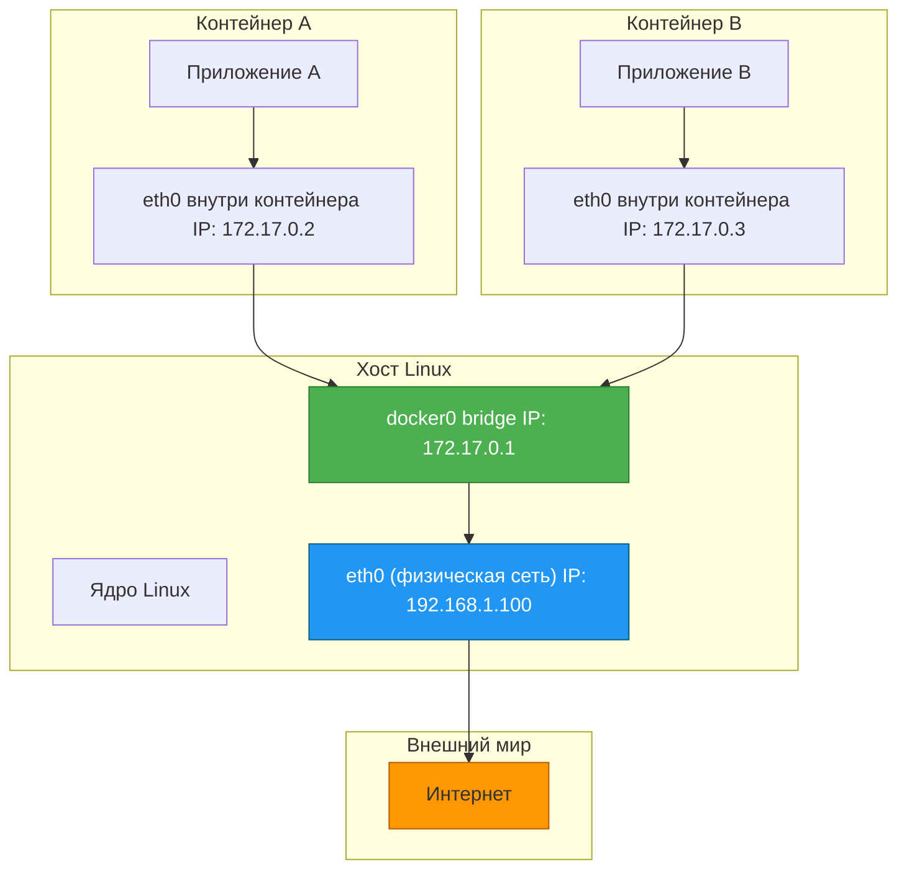
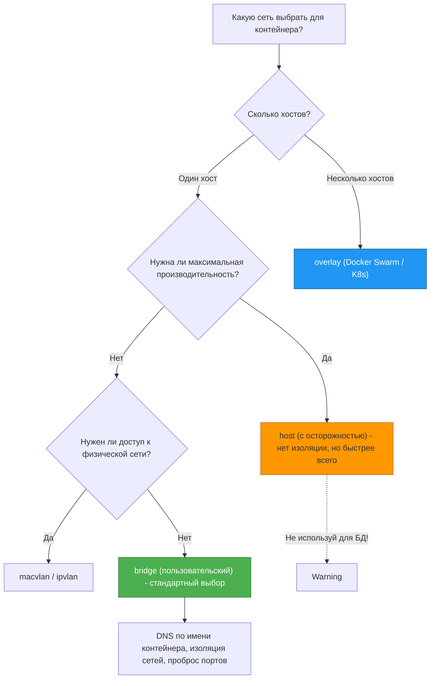

## **Сетевые технологии Docker: как контейнеры общаются друг с другом и с миром**

## **Реальная проблема**

<note type="quote">

«Я запустил контейнер с базой данных и контейнер с приложением. Приложение не может подключиться к БД по [localhost](http://localhost) -- почему? А по IP-адресу контейнера подключается, но после перезапуска IP меняется. Как сделать так, чтобы они всегда находили друг друга?»

</note>

<note type="quote">

«У нас микросервисная архитектура из 10 контейнеров. Одни должны видеть друг друга, другие -- быть изолированными. Как организовать сети так, чтобы это было и безопасно, и удобно?»

</note>

Инженеры, которые не разбираются в сетях Docker, сталкиваются с:

-  Контейнерами, которые не могут общаться друг с другом.

-  Проблемами с пробросом портов и доступом с хоста.

-  Непониманием, почему [`localhost`](http://localhost) внутри контейнера -- это не тот [`localhost`](http://localhost), который снаружи.

-  Случайными утечками трафика между разными приложениями.

## **Типовые задачи (чек-лист)**

-  ✅ Понять, как Docker изолирует сети контейнеров от хоста и друг от друга.

-  ✅ Настроить связь между несколькими контейнерами с помощью пользовательских сетей.

-  ✅ Организовать доступ к контейнеру с хоста и из внешнего мира (проброс портов).

-  ✅ Изолировать разные группы контейнеров друг от друга (например, frontend-сеть и backend-сеть).

-  ✅ Диагностировать сетевые проблемы с помощью команд `docker network` и `nsenter`.

## **Краткое определение (простыми словами)**

**Сетевая подсистема Docker** -- это механизм, который создаёт для каждого контейнера свой «кусочек сети» (сетевой стек), изолированный от хоста. Контейнер может иметь свой IP-адрес, свои порты и свои правила маршрутизации.

<note type="quote">

**Аналогия:** Представьте многоквартирный дом (хост). У каждой квартиры (контейнера) есть своя входная дверь, свой почтовый ящик (порты) и своё имя (DNS). Квартиры могут общаться через внутренний домофон (пользовательская сеть), а могут выходить в город через общий подъезд (проброс портов на хост).

</note>

🎯 **Главная идея:** Docker не использует «магию». Всё, что он делает, -- это создаёт и настраивает стандартные механизмы Linux: **network namespaces** (изолированные стеки), **veth-пары** (виртуальные сетевые кабели), **bridge** (виртуальный коммутатор) и **iptables** (маршрутизация и NAT).

---

## **📚 Оглавление**

-  🧠 **1\. Основы сетей в Linux: namespace, veth, bridge, iptables**

-  🔌 **2\. Типы сетей Docker: bridge, host, none, overlay, macvlan, ipvlan**

-  🌉 **3\. Сеть bridge по умолчанию vs пользовательский bridge**

-  🔗 **4\. Проброс портов (-p) и доступ к контейнерам извне**

-  🌍 **5\. Связь контейнеров через пользовательские сети (на примере)**

-  🛠️ **6\. Сетевые команды Docker: network, inspect, nsenter**

-  🗺️ **7\. Схема работы сети bridge (Mermaid)**

-  📊 **8\. Сравнение типов сетей**

-  💡 **9\. Ключевые выводы и чек-лист**

<note type="quote">

Наливайте кофе -- мы начинаем! ☕

</note>

---

## **🧠 1. Основы сетей в Linux: namespace, veth, bridge, iptables**

Чтобы понять сети Docker, нужно знать 4 базовых механизма Linux. Docker их просто использует -- не изобретает ничего нового.

### **1\.1 Network namespace (сетевой неймспейс)**

Это изолированный экземпляр сетевого стека: свои интерфейсы, свои IP-адреса, свои таблицы маршрутизации, свои правила iptables.

**Создание вручную:**

bash

```
# Создать новый network namespace
sudo ip netns add myns

# Запустить bash внутри этого неймспейса
sudo ip netns exec myns bash

# Внутри: видим только loopback, нет eth0
ip link list
# 1: lo: <LOOPBACK> ...

# Выход
exit
```

**Что делает Docker:** При создании контейнера Docker создаёт новый network namespace и помещает туда процесс контейнера.

### **1\.2 veth pair (виртуальная Ethernet-пара)**

Это «виртуальный сетевой кабель» с двумя концами. Один конец помещается в контейнер (выглядит как eth0), другой -- подключается к мосту (bridge) на хосте.

**Создание вручную:**

bash

```
# Создать veth-пару
sudo ip link add veth0 type veth peer name veth1

# Поместить veth1 в неймспейс
sudo ip link set veth1 netns myns

# Поднять интерфейсы
sudo ip link set veth0 up
sudo ip netns exec myns ip link set veth1 up

# Назначить IP
sudo ip addr add 10.0.0.1/24 dev veth0
sudo ip netns exec myns ip addr add 10.0.0.2/24 dev veth1
```

**Что делает Docker:** Для каждого контейнера создаёт veth-пару. Один конец -- `eth0` внутри контейнера, другой -- с именем типа `veth...` на хосте, подключённый к мосту `docker0` или пользовательскому bridge.

### **1\.3 Linux Bridge (виртуальный коммутатор)**

Это виртуальный сетевой коммутатор (как L2-свитч), который объединяет несколько интерфейсов в одну сеть.

**Посмотреть мосты:**

bash

```
# Показать все мосты
brctl show
# или
ip link show type bridge
```

**Что делает Docker:** Создаёт мост `docker0` по умолчанию. Все контейнеры подключаются к этому мосту через veth-пары и могут общаться друг с другом.

### **1\.4 iptables (маршрутизация и NAT)**

Набор правил в ядре Linux для маршрутизации пакетов, NAT (маскарадинга) и фильтрации.

**Что делает Docker:** Добавляет правила в iptables для:

-  NAT трафика из контейнеров в интернет (маскарадинг).

-  Проброса портов (`-p 8080:80`) -- DNAT-правила.

-  Изоляции пользовательских сетей друг от друга.

**Посмотреть правила Docker:**

bash

```
sudo iptables -t nat -L -n
sudo iptables -t filter -L -n
```

### **Ключевая мысль**

<note type="quote">

Docker не создаёт новую сетевую магию. Он автоматизирует настройку network namespaces, veth-пар, bridge и iptables -- стандартных механизмов Linux.

</note>

---

## **🔌 2. Типы сетей Docker: bridge, host, none, overlay, macvlan, ipvlan**

Docker поддерживает несколько драйверов сетей (network drivers). Выбор драйвера определяет, как контейнер будет подключён к сети.

### **Список драйверов и их назначение**

| **Драйвер**               | **Назначение**                                                              | **Когда использовать**                                                         |
|---------------------------|-----------------------------------------------------------------------------|--------------------------------------------------------------------------------|
| **bridge** (по умолчанию) | Изолированная сеть на одном хосте                                           | Стандартный вариант для контейнеров на одном сервере                           |
| **host**                  | Контейнер использует сетевой стек хоста напрямую                            | Для максимальной производительности (не используется с БД!)                    |
| **none**                  | Полная изоляция от сети                                                     | Для задач, где сеть не нужна (batch-обработка)                                 |
| **overlay**               | Связывает контейнеры на разных хостах (Docker Swarm, K8s)                   | Кластеры, мультихостовая среда                                                 |
| **macvlan**               | Контейнер получает свой MAC-адрес, выглядит как физическое устройство в LAN | Для приложений, которым нужен прямой доступ к физической сети (например, DHCP) |
| **ipvlan**                | Как macvlan, но без дублирования MAC-адресов                                | Экономия MAC-адресов в крупных сетях                                           |

### **Команды для работы с сетями**

bash

```
# Показать все сети
docker network ls

# Создать сеть
docker network create --driver bridge my-bridge

# Удалить сеть
docker network rm my-bridge

# Подключить контейнер к сети
docker network connect my-bridge my-container

# Отключить контейнер от сети
docker network disconnect my-bridge my-container

# Посмотреть детали сети
docker network inspect my-bridge
```

### **Ключевая мысль**

<note type="quote">

Драйвер `bridge` -- выбор по умолчанию для одного хоста. `overlay` -- для кластеров. `host` и `none` -- для специальных случаев. `macvlan`/`ipvlan` -- для прямого подключения к физической сети.

</note>

---

## **🌉 3. Сеть bridge по умолчанию vs пользовательский bridge**

У Docker есть **мост по умолчанию** (`docker0`) и **пользовательские мосты**, которые вы создаёте сами.

### **Сравнение: bridge по умолчанию vs пользовательский bridge**

| **Характеристика**                       | **Мост по умолчанию (docker0)**       | **Пользовательский bridge**                              |
|------------------------------------------|---------------------------------------|----------------------------------------------------------|
| **DNS между контейнерами**               | ❌ Нет (только по IP)                  | ✅ Да (по имени контейнера)                               |
| **Изоляция**                             | 🟡 Все контейнеры видят друг друга    | ✅ Контейнеры в разных пользовательских сетях изолированы |
| **Проброс портов**                       | ✅ `-p` работает                       | ✅ `-p` работает                                          |
| **Встроенные сети**                      | Одна (`docker0`)                      | Можно создать сколько угодно                             |
| **Подключение существующего контейнера** | `docker network connect`              | `docker network connect`                                 |
| **Настройка параметров**                 | Ограничена (нужно менять daemon.json) | Полный контроль при создании                             |

### **Пример: контейнеры на пользовательском мосту видят друг друга по имени**

**Создаём пользовательский мост:**

bash

```
docker network create my-app-network
```

**Запускаем два контейнера в этой сети:**

bash

```
docker run -d --name postgres --network my-app-network -e POSTGRES_PASSWORD=secret postgres:15
docker run -d --name app --network my-app-network -e DB_HOST=postgres my-app-image
```

**Внутри контейнера** `app` **работает подключение к** `postgres:5432` -- Docker DNS разрешает имя `postgres` в IP-адрес контейнера с БД.

### **Почему пользовательский bridge лучше?**

1. **Автоматический DNS:** Контейнеры находят друг друга по имени, а не по IP (который меняется).

2. **Изоляция:** Если у вас два приложения, каждое со своей БД, можно создать две сети -- контейнеры из разных сетей не будут видеть друг друга.

3. **Гибкость:** Можно настроить IP-пулы, драйверы, параметры.

### **Ключевая мысль**

<note type="quote">

Не используйте мост по умолчанию (`docker0`) для серьёзных проектов. Всегда создавайте пользовательские bridge-сети -- они дают изоляцию и DNS-резолвинг по имени контейнера.

</note>

---

## **🔗 4. Проброс портов (-p) и доступ к контейнерам извне**

### **Как это работает**

Проброс порта (`-p 8080:80`) означает: всё, что приходит на хост на порт 8080 (TCP), перенаправить в контейнер на порт 80. Docker реализует это через **DNAT-правила в iptables**.

### **Форматы проброса порта**

| **Формат**                        | **Пример**             | **Значение**                                                          |
|-----------------------------------|------------------------|-----------------------------------------------------------------------|
| `hostPort:containerPort`          | `-p 8080:80`           | Пробросить порт 8080 хоста на порт 80 контейнера (TCP)                |
| `ip:hostPort:containerPort`       | `-p 127.0.0.1:8080:80` | Пробросить только на [localhost](http://localhost) (недоступно извне) |
| `ip::containerPort`               | `-p 127.0.0.1::80`     | Docker выберет случайный порт на хосте                                |
| `hostPort:containerPort/protocol` | `-p 8080:80/udp`       | Пробросить UDP вместо TCP                                             |

### **Примеры**

bash

```
# Веб-сервер: порт 80 контейнера доступен на порту 8080 хоста
docker run -d -p 8080:80 nginx

# PostgreSQL: только localhost (не из локальной сети)
docker run -d -p 127.0.0.1:5432:5432 -e POSTGRES_PASSWORD=secret postgres

# MongoDB: пробросить случайный порт (узнать через docker port)
docker run -d -p 27017 mongo
docker port <container_id> 27017  # 0.0.0.0:32768
```

### **Проверка проброшенных портов**

bash

```
# Посмотреть порты контейнера
docker port my-nginx
# 80/tcp -> 0.0.0.0:8080

# Посмотреть все правила NAT
sudo iptables -t nat -L -n | grep 8080
```

### **Ограничение: не работает для связи контейнеров между собой**

Если два контейнера на одном хосте, не нужно пробрасывать порты для их общения. Используйте пользовательскую сеть и подключайтесь по имени контейнера.

**Плохо:**

bash

```
docker run -d --name db -p 5432:5432 postgres
docker run --name app -e DB_HOST=localhost app   # НЕ РАБОТАЕТ
```

**Хорошо:**

bash

```
docker network create mynet
docker run -d --name db --network mynet postgres
docker run --name app --network mynet -e DB_HOST=db app   # РАБОТАЕТ
```

### **Ключевая мысль**

<note type="quote">

`-p` нужен только для доступа к контейнеру **с хоста или извне**. Для связи контейнеров между собой на одном хосте используйте пользовательские сети, а не проброс портов.

</note>

---

## **🌍 5. Связь контейнеров через пользовательские сети (на примере)**

### **Задача**

Есть приложение на Python (Flask), которое должно:

-  Писать в PostgreSQL.

-  Читать из Redis.

-  Быть доступным с хоста на порту 5000.

### **Решение: пользовательская сеть + проброс порта для приложения**

**Шаг 1. Создаём сеть:**

bash

```
docker network create my-app-net
```

**Шаг 2. Запускаем PostgreSQL и Redis в этой сети (без проброса портов на хост -- они не нужны):**

bash

```
docker run -d --name postgres --network my-app-net \
  -e POSTGRES_PASSWORD=secret -e POSTGRES_DB=mydb \
  postgres:15

docker run -d --name redis --network my-app-net \
  redis:7-alpine
```

**Шаг 3. Запускаем приложение в той же сети, но с пробросом порта (чтобы было доступно с хоста):**

bash

```
docker run -d --name app --network my-app-net \
  -p 5000:5000 \
  -e DB_HOST=postgres \
  -e REDIS_HOST=redis \
  my-flask-app
```

### **Проверка**

bash

```
# Приложение видит БД и Redis по их именам
docker exec -it app bash
curl http://localhost:5000/health

# PostgreSQL не виден с хоста (порт не проброшен) — так и задумано
```

### **Многосетевая архитектура (frontend + backend + БД)**

Можно создать **две сети**:

-  `frontend-net` -- доступна извне (проброс портов).

-  `backend-net` -- изолирована, только для внутренних сервисов.

bash

```
docker network create frontend-net
docker network create backend-net

# БД только в backend-сети
docker run -d --name postgres --network backend-net -e POSTGRES_PASSWORD=secret postgres

# API в обеих сетях (принимает запросы из фронта, ходит в БД)
docker run -d --name api --network backend-net --network frontend-net my-api

# Nginx (frontend) только в frontend-сети, с пробросом порта
docker run -d --name nginx --network frontend-net -p 80:80 nginx
```

Теперь:

-  `nginx` не может напрямую обратиться к `postgres` (разные сети) -- безопасно.

-  `api` может общаться и с `nginx`, и с `postgres`.

-  Если злоумышленник взломает `nginx`, он не получит доступ к БД.

### **Ключевая мысль**

<note type="quote">

Пользовательские сети -- это не только удобство, но и безопасность. Разносите сервисы по разным сетям, если они не должны общаться напрямую.

</note>

---

## **🛠️ 6. Сетевые команды Docker: network, inspect, nsenter**

### **Команды** `docker network`

bash

```
# Список сетей
docker network ls

# Создать сеть
docker network create --driver bridge --subnet 10.5.0.0/16 --gateway 10.5.0.1 my-net

# Удалить сеть (должны быть отключены все контейнеры)
docker network rm my-net

# Подключить работающий контейнер к сети
docker network connect my-net my-container

# Отключить контейнер от сети
docker network disconnect my-net my-container

# Показать детали сети (контейнеры, подсеть, шлюз, драйвер)
docker network inspect my-net
```

### **Команда** `docker inspect` **для сетей**

bash

```
# Посмотреть IP-адрес контейнера
docker inspect my-container | jq '.[].NetworkSettings.IPAddress'

# Посмотреть все сети контейнера
docker inspect my-container | jq '.[].NetworkSettings.Networks'
```

### **Диагностика: залезть в network namespace контейнера**

Самый мощный способ диагностики -- войти в сетевой неймспейс контейнера и выполнить команды `ip`, `tcpdump`, `ping` как изнутри.

**С помощью** `nsenter` **(Linux):**

bash

```
# Найти PID контейнера
PID=$(docker inspect -f '{{.State.Pid}}' my-container)

# Зайти в его network namespace
sudo nsenter -t $PID -n

# Теперь вы внутри сети контейнера
ip addr show
ip route show
ping 8.8.8.8
```

**С помощью** `docker exec` **(ограниченно):**

bash

```
docker exec -it my-container bash
# Но внутри контейнера может не быть утилит ip, ping, tcpdump
```

**Альтернатива:** Использовать образ `nicolaka/netshoot` (содержит все сетевые утилиты):

bash

```
docker run -it --network container:my-container nicolaka/netshoot
```

### **Ключевая мысль**

<note type="quote">

`docker network` и `nsenter` -- главные инструменты для диагностики сетей Docker. `netshoot` -- ваш лучший друг, если в контейнере нет `ping` и `tcpdump`.

</note>

---

## **🗺️ 7. Схема работы сети bridge (Mermaid)**



### **Пояснение схемы**

1. **docker0 bridge** -- виртуальный коммутатор на хосте.

2. **veth-пары** -- соединяют каждый контейнер с мостом.

3. **eth0 физическая** -- сетевой интерфейс хоста.

4. **NAT (iptables)** -- позволяет контейнерам выходить в интернет через IP хоста.

---

## **📊 8. Сравнение типов сетей**

| **Драйвер**                   | **Изоляция** | **Производительность** | **DNS между контейнерами** | **Мультихост** | **Сложность** |
|-------------------------------|--------------|------------------------|----------------------------|----------------|---------------|
| **bridge (пользовательский)** | ✅ Высокая    | 🟡 Средняя             | ✅ Да                       | ❌ Нет          | 🟢 Низкая     |
| **bridge (default)**          | 🟡 Средняя   | 🟡 Средняя             | ❌ Нет                      | ❌ Нет          | 🟢 Низкая     |
| **host**                      | ❌ Нет        | ✅ Макс                 | ❌ Нет                      | ❌ Нет          | 🟢 Низкая     |
| **none**                      | N/A          | N/A                    | N/A                        | N/A            | 🟢 Низкая     |
| **overlay**                   | ✅ Высокая    | 🟡 Средняя             | ✅ Да                       | ✅ Да           | 🟡 Средняя    |
| **macvlan**                   | 🟡 Средняя   | ✅ Высокая              | ❌ Нет                      | ✅ Да           | 🔴 Высокая    |

### **Когда что выбирать**

| **Сценарий**                                                        | **Рекомендуемый драйвер**   |
|---------------------------------------------------------------------|-----------------------------|
| Один хост, несколько контейнеров                                    | **Пользовательский bridge** |
| Максимальная производительность                                     | **host** (с осторожностью)  |
| Контейнерам не нужна сеть                                           | **none**                    |
| Кластер из нескольких хостов (Swarm/K8s)                            | **overlay**                 |
| Контейнер должен выглядеть как физический сервер в LAN (DHCP, VLAN) | **macvlan**                 |

### **Ключевая мысль**

<note type="quote">

Для 90% задач на одном хосте выбирайте **пользовательский bridge**. `overlay` -- для мультихостовых кластеров. `macvlan` -- для специфических случаев, когда контейнеру нужен прямой доступ к физической сети.

</note>

---

## **💡 9. Ключевые выводы и чек-лист**

### **Что важно запомнить**

| **Понятие**                 | **Суть**                                            |
|-----------------------------|-----------------------------------------------------|
| **Network namespace**       | Изолированный сетевой стек контейнера               |
| **veth pair**               | Виртуальный кабель между контейнером и мостом       |
| **bridge**                  | Виртуальный коммутатор на хосте                     |
| **Пользовательский bridge** | Даёт DNS-резолвинг по имени контейнера и изоляцию   |
| **Проброс портов (-p)**     | DNAT-правило в iptables для доступа с хоста         |
| **overlay**                 | Соединяет контейнеры на разных хостах               |
| **macvlan**                 | Контейнер получает свой MAC-адрес в физической сети |

### **Чек-лист «Вы освоили тему, если:»**

-  ✅ Вы создали пользовательскую bridge-сеть и запустили в ней два контейнера, которые пингуют друг друга по имени.

-  ✅ Вы пробросили порт контейнера на хост и проверили доступ снаружи.

-  ✅ Вы использовали `docker network inspect` и нашли IP-адреса контейнеров.

-  ✅ Вы понимаете, почему [`localhost`](http://localhost) внутри контейнера -- это не [`localhost`](http://localhost) на хосте.

-  ✅ Вы знаете разницу между `bridge`, `host` и `overlay`.

-  ✅ Вы залезли в network namespace контейнера через `nsenter` и посмотрели интерфейсы.

### **Что изучить дальше**

1. **Docker network security** -- изоляция трафика, политики сети (Calico, Cilium).

2. **Load balancing в Docker** -- встроенный LB в Swarm, внешние решения (Traefik, Nginx).

3. **Сетевые плагины** -- Weave, Flannel, Calico для Kubernetes.

4. **tcpdump в контейнерах** -- как отлаживать сетевой трафик.

---

## **🧪 Бонус: интерактивная Mermaid-диаграмма «Выбор драйвера сети»**

