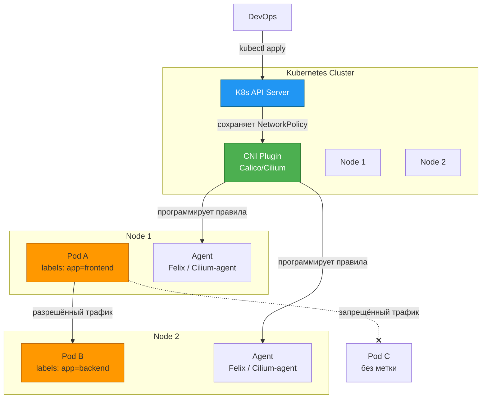
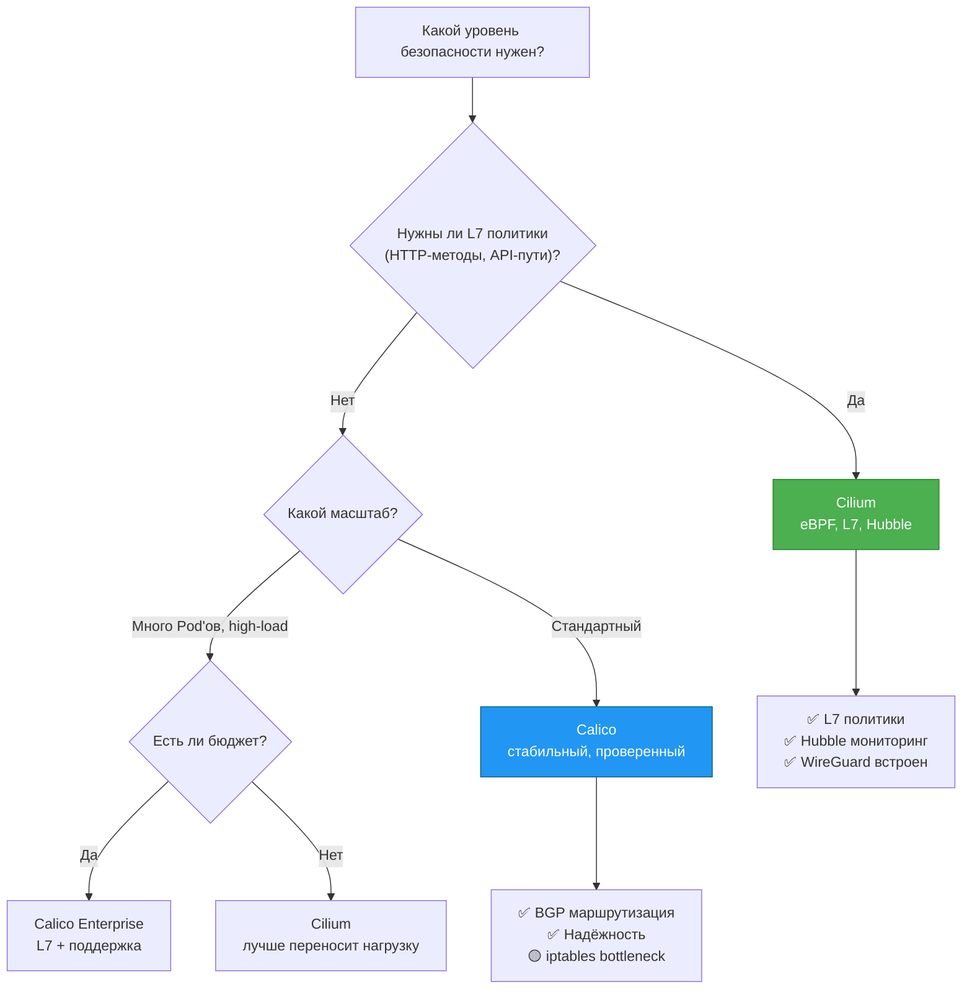

## **Docker Network Security: от изоляции контейнеров до продвинутых политик с Calico и Cilium**

## **Реальная проблема**

<note type="quote">

«Мы запустили 20 микросервисов в контейнерах. Все они видят друг друга, потому что Docker по умолчанию открывает доступ между контейнерами. Как сделать так, чтобы платёжный сервис общался только с БД, а не с фронтендом?»

</note>

<note type="quote">

«Злоумышленник получил доступ к одному контейнеру через уязвимость в приложении. Сможет ли он "гулять" по всей вашей инфраструктуре? В Docker по умолчанию -- да!»

</note>

Без настройки сетевой безопасности контейнеры находятся в состоянии «все видят всех» -- это огромный риск для multi-tenant сред и production-проектов.

## **Типовые задачи (чек-лист)**

-  ✅ Изолировать трафик между разными группами контейнеров (например, frontend и backend).

-  ✅ Ограничить доступ к контейнеру с базами данных только для конкретных сервисов.

-  ✅ Настроить правила iptables вручную для тонкой фильтрации трафика.

-  ✅ Внедрить Kubernetes NetworkPolicy для управления доступом между Pod'ами.

-  ✅ Использовать Calico для продвинутой сетевой политики (Layer 3/4).

-  ✅ Использовать Cilium с eBPF для Layer 7 политик (HTTP-методы, API-пути).

## **Краткое определение (простыми словами)**

**Сетевая безопасность Docker** -- это набор механизмов (iptables, NetworkPolicy, CNI-плагины), которые контролируют, какие контейнеры и сервисы могут обмениваться данными друг с другом и с внешним миром.

<note type="quote">

**Аналогия:** Представьте, что ваш кластер контейнеров -- это офисное здание. По умолчанию двери между всеми кабинетами открыты (Docker default). **NetworkPolicy** -- это система пропусков, которая решает, кому в какой отдел можно заходить. **Calico** и **Cilium** -- это современные системы контроля доступа со сканером сетчатки глаза и журналом посещений.

</note>

🎯 **Главная идея:** Zero Trust Network -- не доверяй ни одному контейнеру по умолчанию. Даже если контейнер находится внутри вашего кластера, он должен иметь доступ только к строго определённым ресурсам.

---

## **📚 Оглавление**

-  🧱 **1\. Изоляция трафика встроенными средствами Docker (iptables)**

-  📜 **2\. Kubernetes NetworkPolicy: стандарт безопасности**

-  🦊 **3\. Calico: маршрутизация и политики на уровне L3/L4**

-  🐝 **4\. Cilium: eBPF и Layer 7 политики (HTTP/gRPC)**

-  ⚔️ **5\. Calico vs Cilium: битва CNI-плагинов**

-  🗺️ **6\. Схема работы NetworkPolicy (Mermaid)**

-  📊 **7\. Сравнение CNI по безопасности**

-  💡 **8\. Ключевые выводы и чек-лист**

<note type="quote">

Наливайте кофе -- мы начинаем! ☕

</note>

---

## **🧱 1. Изоляция трафика встроенными средствами Docker (iptables)**

### **Как Docker управляет трафиком по умолчанию**

Docker на Linux создаёт правила `iptables`, которые определяют, как трафик движется между контейнерами, хостом и внешним миром.

**Ключевые цепочки iptables Docker:**

| **Цепочка**                    | **Назначение**                                                            |
|--------------------------------|---------------------------------------------------------------------------|
| **DOCKER-USER**                | Для пользовательских правил (обрабатывается ДО стандартных правил Docker) |
| **DOCKER-FORWARD**             | Маршрутизация трафика между контейнерами и внешним миром                  |
| **DOCKER**                     | Правила порт-форвардинга                                                  |
| **DOCKER-ISOLATION-STAGE-1/2** | Изоляция разных bridge-сетей друг от друга                                |

### **Проблема: контейнеры видят друг друга по умолчанию**

Контейнеры в одной пользовательской bridge-сети могут общаться без ограничений. Это удобно для разработки, но опасно для продакшена.

### **Решение 1: Изоляция через разные сети**

Самый простой способ изоляции -- разнести сервисы по разным сетям:

bash

```
# Создаём две изолированные сети
docker network create frontend-net
docker network create backend-net

# Запускаем Nginx только во frontend-сети
docker run -d --name nginx --network frontend-net -p 80:80 nginx

# Запускаем БД только в backend-сети (недоступна из frontend-сети!)
docker run -d --name postgres --network backend-net -e POSTGRES_PASSWORD=secret postgres
```

Теперь `nginx` не может подключиться к `postgres` -- они в разных сетях.

### **Решение 2: Ручные правила iptables через DOCKER-USER**

Если нужно более тонкое управление (например, разрешить доступ к контейнеру только с определённого IP), используйте цепочку **DOCKER-USER**.

**Пример: запретить всё, кроме IP 192.168.1.100**

bash

```
# Разрешить установленные соединения (чтобы не разорвать ответы)
iptables -I DOCKER-USER -m state --state ESTABLISHED,RELATED -j ACCEPT

# Запретить доступ к контейнеру с портом 8080 для всех, кроме 192.168.1.100
iptables -I DOCKER-USER -i eth0 ! -s 192.168.1.100 -p tcp --dport 8080 -j DROP
```

**Важно:** Правила в `DOCKER-USER` обрабатываются до стандартных правил Docker, поэтому они не будут перезаписаны при перезапуске контейнера.

### **Ключевая мысль**

<note type="quote">

Docker даёт базовую изоляцию через разные сети и ручные iptables. Но для production с десятками сервисов этого катастрофически мало -- нужны декларативные политики.

</note>

---

## **📜 2. Kubernetes NetworkPolicy: стандарт безопасности**

### **Что такое NetworkPolicy?**

В Kubernetes встроен ресурс `NetworkPolicy` -- это декларативный способ сказать: «какие Pod'ы могут общаться с какими». Это стандартный интерфейс, который реализуют все CNI-плагины.

### **Базовая структура NetworkPolicy**

yaml

```
apiVersion: networking.k8s.io/v1
kind: NetworkPolicy
metadata:
  name: allow-frontend-to-backend
spec:
  podSelector:          # К кому применяем политику
    matchLabels:
      app: backend
  policyTypes:
  - Ingress             # Обрабатываем входящий трафик
  ingress:
  - from:               # Откуда разрешаем
    - podSelector:
        matchLabels:
          app: frontend
    ports:
    - protocol: TCP
      port: 8080
```

### **Пример 1: deny-all (самая важная политика!)**

По умолчанию в Kubernetes, если нет ни одной NetworkPolicy, Pod'ы видят друг друга. Первым делом включите **"запрещено всё"**:

yaml

```
apiVersion: networking.k8s.io/v1
kind: NetworkPolicy
metadata:
  name: deny-all
spec:
  podSelector: {}       # Применяем ко всем Pod'ам в namespace
  policyTypes:
  - Ingress
  - Egress
  # Нет правил ingress/egress → весь трафик запрещён
```

После применения этой политики ни один Pod в namespace не сможет принимать или отправлять трафик, пока вы явно не разрешите.

### **Пример 2: разрешить только из фронтенда в бэкенд**

yaml

```
apiVersion: networking.k8s.io/v1
kind: NetworkPolicy
metadata:
  name: backend-policy
spec:
  podSelector:
    matchLabels:
      tier: backend
  ingress:
  - from:
    - podSelector:
        matchLabels:
          tier: frontend
    ports:
    - port: 3306
```

Теперь Pod'ы с меткой `tier: frontend` могут обращаться к Pod'ам с меткой `tier: backend` по порту 3306 (MySQL). Остальные -- нет.

### **Ключевая мысль**

<note type="quote">

`NetworkPolicy` -- это встроенный в Kubernetes стандарт безопасности. Но сам по себе он не работает -- нужен CNI-плагин, который его реализует (Calico, Cilium, WeaveNet).

</note>

---

## **🦊 3. Calico: маршрутизация и политики на уровне L3/L4**

### **Что такое Calico?**

**Calico** -- это один из самых популярных CNI-плагинов. Он использует классический подход: **iptables + BGP-маршрутизация**. Не требует оверлейных сетей (VXLAN), если позволяет сетевая инфраструктура.

**Ключевые компоненты Calico:**

| **Компонент** | **Что делает**                                      |
|---------------|-----------------------------------------------------|
| **Felix**     | Агент на каждой ноде. Программирует iptables/routes |
| **BIRD**      | BGP-клиент. Обменивается маршрутами с соседями      |
| **Typha**     | Оптимизирует общение Felix с Kubernetes API         |

### **Пример: политика Calico (GlobalNetworkPolicy)**

Calico расширяет стандартную NetworkPolicy дополнительными возможностями: глобальные политики (на весь кластер), отрицание (deny), логирование.

yaml

```
apiVersion: projectcalico.org/v3
kind: NetworkPolicy
metadata:
  name: database-security
spec:
  selector: role == 'database'
  types:
  - Ingress
  - Egress
  ingress:
  - action: Allow
    protocol: TCP
    source:
      selector: role == 'frontend'
    destination:
      ports:
      - 3306
  - action: Deny
    source:
      selector: role == 'untrusted'
  egress:
  - action: Allow
    destination:
      selector: role == 'backup-server'
```

### **Как Calico работает с Docker (legacy)**

До эры Kubernetes Calico умел работать напрямую с Docker через свой драйвер сети.

bash

```
# Создание сети Calico
docker network create --driver calico --ipam-driver calico-ipam frontend

# Запуск контейнера с лейблами для политик
docker run --net frontend --label org.projectcalico.label.role=frontend -d nginx
```

<note type="quote">

**Важно:** Современный Calico почти всегда используется с Kubernetes. Прямая интеграция с Docker считается устаревшей.

</note>

### **Ключевая мысль**

<note type="quote">

Calico -- зрелый, проверенный временем CNI. Отлично подходит для L3/L4 политик, но не имеет нативной поддержки L7 (HTTP-методов). Это выбор для тех, кому нужна надёжность и простота.

</note>

---

## **🐝 4. Cilium: eBPF и Layer 7 политики (HTTP/gRPC)**

### **Что такое Cilium?**

**Cilium** -- это современный CNI-плагин, который использует технологию **eBPF** (Extended Berkeley Packet Filter). Вместо iptables Cilium загружает микро-программы прямо в ядро Linux, что даёт огромный прирост производительности и гибкости.

**Что даёт eBPF:**

-  Обработка пакетов без копирования данных между ядром и пользовательским пространством.

-  Динамическое обновление правил без потери соединений.

-  Возможность анализировать **содержимое** пакетов (Layer 7).

### **Layer 7 политики: контроль API-методов**

Это "киллер-фича" Cilium. Вы можете запретить не только доступ к Pod'у, но и конкретные HTTP-методы.

**Пример: разрешить только GET /healthz**

yaml

```
apiVersion: cilium.io/v2
kind: CiliumNetworkPolicy
metadata:
  name: l7-policy
spec:
  endpointSelector:
    matchLabels:
      app: my-api
  ingress:
  - toPorts:
    - ports:
      - port: '8080'
        protocol: TCP
      rules:
        http:
        - method: GET
          path: '/healthz'
```

Теперь никто не может отправить POST, PUT, DELETE или обратиться к `/admin` -- только `GET /healthz`.

### **Мониторинг и observability (Hubble)**

**Hubble** -- это built-in инструмент Cilium для мониторинга трафика. Он показывает, кто к кому ходил, какие политики сработали, и даже рисует карту сервисов.

bash

```
# Включение Hubble
cilium hubble enable

# Просмотр потоков
hubble observe
```

### **Производительность: Cilium vs iptables**

По данным исследований, при высоких нагрузках (много Pod'ов) iptables-решения (включая Calico в некоторых режимах) теряют до 60-70% пропускной способности, в то время как Cilium на eBPF сохраняет более 90% базовой производительности.

| **Тип политики**   | **Cilium (eBPF)** | **iptables (Calico по умолчанию)** |
|--------------------|-------------------|------------------------------------|
| L3/L4 политики     | Падение \<10%     | Падение 60-70% при масштабировании |
| L7 политики (HTTP) | 94 Mbps           | Не поддерживается                  |

### **Ключевая мысль**

<note type="quote">

Cilium -- это выбор для future-proof инфраструктуры. Если вам нужны L7 политики, встроенный мониторинг и высокая производительность под нагрузкой -- берите Cilium. Но будьте готовы к более крутой кривой обучения.

</note>

---

## **⚔️ 5. Calico vs Cilium: битва CNI-плагинов**

Сравнительная таблица безопасности и возможностей на 2025 год:

| **Характеристика**             | **Calico**                          | **Cilium**                            |
|--------------------------------|-------------------------------------|---------------------------------------|
| **Базовая технология**         | iptables, BGP, eBPF (режим Express) | eBPF                                  |
| **L3/L4 политики**             | ✅ Отлично                           | ✅ Отлично                             |
| **L7 политики (HTTP/gRPC)**    | ❌ Нет (только в enterprise)         | ✅ Да, нативно                         |
| **DNS / FQDN политики**        | ❌ Нет (только платно)               | ✅ Да                                  |
| **Шифрование трафика**         | WireGuard (ручная настройка)        | WireGuard (встроен)                   |
| **Observability (мониторинг)** | Ограниченный (Prometheus метрики)   | Hubble (графы, потоки, логи)          |
| **Service Mesh**               | ❌ Нет                               | ✅ Да (без sidecar)                    |
| **Поддержка Kubernetes**       | ✅ Стабильная                        | ✅ Растущая                            |
| **Сложность настройки**        | 🟡 Средняя                          | 🔴 Высокая                            |
| **Когда выбирать**             | Стандартные задачи, on-prem, BGP    | L7 политики, observability, high-load |

**По данным исследований:**

-  **Cilium** показывает стабильную производительность при росте числа политик (падение в пределах 10%).

-  **Calico (iptables)** на высоких нагрузках (100+ политик) может терять до 70% пропускной способности.

### **Ключевая мысль**

<note type="quote">

Нет единственно верного решения. Для небольших проектов и классических задач хватит Calico. Если вы строите платформу для сотен микросервисов и хотите контролировать API-вызовы -- смотрите в сторону Cilium.

</note>

---

## **🗺️ 6. Схема работы NetworkPolicy (Mermaid)**



---

## **📊 7. Сравнение CNI по безопасности**

| **CNI**                  | **L3/L4** | **L7 (HTTP)** | **Шифрование**      | **Наблюдаемость** | **Сложность** |
|--------------------------|-----------|---------------|---------------------|-------------------|---------------|
| **Flannel**              | ❌ Нет     | ❌ Нет         | ❌ Нет               | ❌ Нет             | 🟢 Низкая     |
| **Calico (Open Source)** | ✅ Да      | ❌ Нет         | WireGuard (руч.)    | 🟡 Базовая        | 🟡 Средняя    |
| **Calico (Enterprise)**  | ✅ Да      | ✅ Да          | WireGuard (авто)    | ✅ Да              | 🟡 Средняя    |
| **Cilium**               | ✅ Да      | ✅ Да          | WireGuard (встроен) | ✅ Hubble          | 🔴 Высокая    |
| **Weave Net**            | ✅ Да      | ❌ Нет         | ❌ Нет               | 🟡 Базовая        | 🟢 Низкая     |

<note type="quote">

**Важно:** Flannel не поддерживает NetworkPolicy вообще -- он нужен только для соединения Pod'ов. Не используйте его в production без дополнительных средств безопасности.

</note>

---

## **💡 8. Ключевые выводы и чек-лист**

### **Что важно запомнить**

| **Уровень**           | **Инструменты**       | **Назначение**                          |
|-----------------------|-----------------------|-----------------------------------------|
| **Базовый (Docker)**  | iptables, DOCKER-USER | Простая изоляция, фильтрация по IP      |
| **Стандарт (K8s)**    | NetworkPolicy         | Декларативные правила L3/L4             |
| **Продвинутый (CNI)** | Calico, Cilium        | Масштабируемые политики, L7, шифрование |

### **Чек-лист «Вы освоили тему, если:»**

-  ✅ Вы знаете, что по умолчанию все контейнеры в одной bridge-сети видят друг друга -- и это опасно.

-  ✅ Вы можете написать iptables-правило в цепочке DOCKER-USER для ограничения доступа к контейнеру по IP.

-  ✅ Вы создали Kubernetes NetworkPolicy с политикой `deny-all` и `allow-specific`.

-  ✅ Вы понимаете разницу между Calico (BGP/iptables) и Cilium (eBPF).

-  ✅ Вы знаете, что Cilium может блокировать `POST /admin`, а iptables -- нет.

### **Что изучить дальше**

1. **Cilium Hubble** -- визуализация трафика в реальном времени.

2. **Calico eBPF mode** -- Calico тоже начинает внедрять eBPF для повышения производительности.

3. **Istio + Cilium** -- service mesh без sidecar-прокси.

4. **NetworkPolicy в разных CNI** -- нюансы синтаксиса у Calico, Cilium и Antrea.

---

## **🧪 Бонус: интерактивная Mermaid-диаграмма «Выбор CNI для безопасности»**



---

Надеюсь, этот материал поможет вам навести порядок в сетевой безопасности контейнеров. Если нужен разбор следующей темы (например, **Docker Content Trust**, **секреты в Docker**, **сканирование уязвимостей**) -- просто напишите.