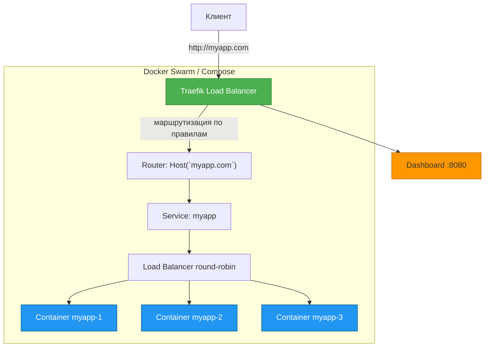
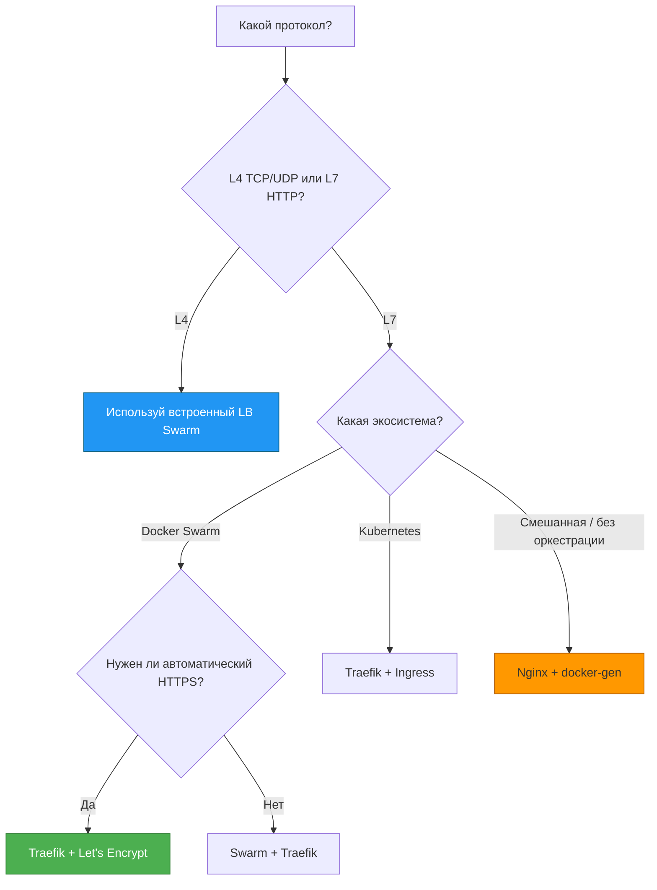

## **Load Balancing в Docker: от Swarm до Traefik и Nginx**

## **Реальная проблема**

<note type="quote">

«У нас 5 реплик одного микросервиса. Как распределить запросы равномерно между ними? Раньше мы ставили Nginx вручную и переписывали конфиг при каждом добавлении реплики -- это утомительно и чревато ошибками.»

</note>

<note type="quote">

«Мы запустили 3 экземпляра приложения на разных портах. Клиенты подключаются к одному, а когда он падает -- всё ломается. Нужен единый вход, который проверяет здоровье и автоматически убирает мертвые инстансы.»

</note>

Без балансировщика нагрузки вы получаете:

-  **Единую точку отказа** -- если контейнер упал, весь сервис недоступен.

-  **Неравномерную нагрузку** -- один контейнер работает на 100% CPU, другие простаивают.

-  **Сложное масштабирование** -- добавили новый контейнер -> надо вручную обновлять прокси.

## **Типовые задачи (чек-лист)**

-  ✅ Распределять трафик между несколькими репликами одного сервиса автоматически.

-  ✅ Проверять здоровье контейнеров (healthcheck) и исключать мёртвые из балансировки.

-  ✅ Динамически добавлять/удалять контейнеры в балансировку без перезагрузки.

-  ✅ Терминировать SSL/TLS на балансировщике, а не на каждом контейнере.

-  ✅ Маршрутизировать запросы на разные бэкенды по доменам или путям (virtual hosting).

## **Краткое определение (простыми словами)**

**Балансировщик нагрузки (Load Balancer)** -- это «умный диспетчер», который принимает входящие запросы и направляет их к одному из доступных контейнеров (бэкендов), стараясь распределить нагрузку равномерно и не отправлять запросы на сломанные инстансы.

<note type="quote">

**Аналогия:** Представьте call-центр с 10 операторами (контейнеры). Звонок поступает на единый номер (балансировщик), который переводит его на свободного оператора. Если оператор заболел (статус unhealthy), на него не направляют звонки, пока он не поправится.

</note>

🎯 **Главная идея:** Балансировщик делает ваше приложение отказоустойчивым и масштабируемым. Клиент подключается к одному адресу, а за его спиной могут работать 1, 10 или 100 контейнеров.

---

## **📚 Оглавление**

-  🐝 **1\. Встроенный балансировщик Docker Swarm**

-  🎛️ **2\. Балансировка вручную (docker-compose, --link) -- исторический контекст**

-  🚪 **3\. Nginx как балансировщик: статика и динамика (nginx-gen, docker-gen)**

-  🧩 **4\. Traefik: современный reverse proxy с автоматическим discovery**

-  ⚔️ **5\. Сравнение решений: Swarm vs Nginx vs Traefik**

-  🗺️ **6\. Схема работы балансировки (Mermaid)**

-  💡 **7\. Ключевые выводы и чек-лист**

<note type="quote">

Наливайте кофе -- мы начинаем! ☕

</note>

---

## **🐝 1. Встроенный балансировщик Docker Swarm**

### **Что это и как работает**

Docker Swarm имеет **встроенный балансировщик нагрузки** на уровне L4 (транспортный уровень). Когда вы создаёте сервис с несколькими репликами, Swarm автоматически распределяет входящие запросы между ними.

**Ключевые особенности:**

-  **Работает "из коробки"** -- не требует дополнительных настроек.

-  **Использует IPVS** (IP Virtual Server) в ядре Linux для распределения нагрузки.

-  **Поддерживает healthcheck** -- если реплика нездорова, Swarm перестаёт направлять ей трафик.

-  **Только L4** (TCP/UDP) -- не может маршрутизировать по HTTP-заголовкам, путям или доменам.

### **Пример: запуск сервиса с балансировкой**

bash

```
# Создаём сеть для сервиса
docker network create --driver overlay my-app-net

# Запускаем сервис с 3 репликами
docker service create \
  --name my-web \
  --network my-app-net \
  --replicas 3 \
  --publish published=8080,target=80 \
  nginx:alpine
```

**Что произошло:**

-  Swarm создал 3 реплики Nginx на разных нодах кластера.

-  Любой запрос на `http://<любая_нода_кластера>:8080` будет направлен на **один из трёх** контейнеров Nginx.

-  Swarm сам решает, на какую ноду пришёл запрос, и направляет его к подходящему контейнеру.

### **Healthcheck в Swarm**

Swarm учитывает статус здоровья реплик. Если `healthcheck` внутри контейнера начинает падать, Swarm исключает его из балансировки.

yaml

```
# docker-compose.yml для Swarm
services:
  app:
    image: myapp
    healthcheck:
      test: ["CMD", "curl", "-f", "http://localhost/health"]
      interval: 10s
      timeout: 2s
      retries: 3
    deploy:
      replicas: 3
```

### **Ограничения встроенного балансировщика Swarm**

| **Возможность**                    | **Поддержка** |
|------------------------------------|---------------|
| L4 (TCP/UDP)                       | ✅ Да          |
| Распределение по IP (source IP)    | ✅ Да          |
| Healthcheck                        | ✅ Да          |
| L7 (HTTP-методы, пути, домены)     | ❌ Нет         |
| SSL termination                    | ❌ Нет         |
| Маршрутизация на основе заголовков | ❌ Нет         |

### **Ключевая мысль**

<note type="quote">

Встроенный LB Swarm -- идеальное решение для простых TCP/UDP-сервисов. Как только вам понадобился L7 (разные домены на одном порту, SSL, маршрутизация по путям), нужно подключать внешний reverse proxy.

</note>

---

## **🎛️ 2. Балансировка вручную (docker-compose, --link) -- исторический контекст**

### **Старый способ:** `--link` **(устарел)**

Раньше Docker позволял связывать контейнеры через `--link`. Это добавляло переменные окружения и правила iptables, но не давало балансировки.

bash

```
docker run -d --name db postgres
docker run -d --name app --link db:db myapp   # УСТАРЕЛО!
```

**Почему плохо:** при перезапуске контейнера `db` его IP менялся, и `--link` не обновлялся.

### **docker-compose с** `links` **(тоже устарело)**

docker-compose поддерживает `links`, но это почти то же самое -- нет балансировки, только "магическая" запись в `/etc/hosts`.

yaml

```
services:
  web:
    build: .
    links:
      - db   # УСТАРЕЛО!
  db:
    image: postgres
```

### **Что пришло на смену?**

В современных версиях Docker `--link` заменён на **пользовательские сети** и **DNS-резолвинг**. Контейнеры в одной сети видят друг друга по имени сервиса, но это всё ещё не балансировка:

bash

```
docker network create mynet
docker run -d --name db --network mynet postgres
docker run -d --name app --network mynet -e DB_HOST=db myapp
```

**Важно:** здесь только один контейнер `db`. Если запустить два контейнера с одинаковым именем, DNS не будет балансировать -- вернёт IP первого попавшегося.

### **Ключевая мысль**

<note type="quote">

Ручная балансировка через `--link` или `links` -- история. Не используйте это. Вместо этого: пользовательские сети + DNS для простых случаев, а для балансировки -- Swarm, Nginx или Traefik.

</note>

---

## **🚪 3. Nginx как балансировщик: статика и динамика (nginx-gen, docker-gen)**

### **Статическая конфигурация Nginx**

Классический способ -- прописать бэкенды вручную в конфиге Nginx.

nginx

```
upstream backend {
    server 172.17.0.2:8080;   # Контейнер 1
    server 172.17.0.3:8080;   # Контейнер 2
    server 172.17.0.4:8080;   # Контейнер 3
}

server {
    listen 80;
    location / {
        proxy_pass http://backend;
    }
}
```

**Проблема:** при добавлении/удалении контейнера нужно вручную редактировать конфиг и перезагружать Nginx.

### **Динамическая конфигурация через docker-gen**

**docker-gen** -- утилита, которая следит за событиями Docker и генерирует конфиги для Nginx (или других сервисов) на основе шаблонов.

**Пример: запуск Nginx + docker-gen**

yaml

```
# docker-compose.yml
services:
  nginx:
    image: nginx:alpine
    ports:
      - "80:80"
    volumes:
      - /var/run/docker.sock:/tmp/docker.sock:ro
      - ./nginx.tmpl:/etc/nginx/conf.d/default.conf.tmpl:ro

  docker-gen:
    image: jwilder/docker-gen
    volumes:
      - /var/run/docker.sock:/tmp/docker.sock:ro
      - ./nginx.tmpl:/etc/docker-gen/templates/nginx.tmpl:ro
    command: -notify-sighup nginx -watch /etc/docker-gen/templates/nginx.tmpl /etc/nginx/conf.d/default.conf
```

**Шаблон** `nginx.tmpl`**:**

nginx

```
upstream backend {
{{ range $container := . }}
    server {{ $container.IP }}:{{ $container.Port }};
{{ end }}
}

server {
    listen 80;
    location / {
        proxy_pass http://backend;
    }
}
```

Теперь при запуске нового контейнера с определёнными лейблами, docker-gen обновит конфиг Nginx и перезагрузит его.

### **Готовое решение: nginx-proxy (jwilder/nginx-proxy)**

Популярный образ `jwilder/nginx-proxy` объединяет Nginx и docker-gen в одном контейнере.

bash

```
# Запускаем nginx-proxy
docker run -d -p 80:80 \
  -v /var/run/docker.sock:/tmp/docker.sock:ro \
  jwilder/nginx-proxy

# Запускаем контейнер с лейблом VIRTUAL_HOST
docker run -d -e VIRTUAL_HOST=myapp.local \
  --name myapp \
  myapp-image
```

nginx-proxy автоматически добавит `myapp.local` в свой конфиг и начнёт балансировать, если запустить несколько контейнеров с одним `VIRTUAL_HOST`.

### **Ключевая мысль**

<note type="quote">

Nginx + docker-gen (или nginx-proxy) -- проверенное решение для L7-балансировки. Оно работает, но требует дополнительных компонентов и заботы о перезагрузках.

</note>

---

## **🧩 4. Traefik: современный reverse proxy с автоматическим discovery**

### **Что такое Traefik?**

**Traefik** -- это reverse proxy и балансировщик нагрузки, созданный специально для контейнерных сред. Он **сам** следит за Docker API и динамически обновляет маршрутизацию без перезагрузки.

**Ключевые фичи:**

-  **Автоматическое обнаружение сервисов** -- через Docker labels, файлы, Consul, etcd, Kubernetes.

-  **Горячая перезагрузка** -- обновление конфигов без потери соединений.

-  **Поддержка L7** (HTTP, gRPC, WebSocket, TCP).

-  **Встроенный SSL (Let's Encrypt)** -- автоматическое получение и обновление сертификатов.

-  **Панель мониторинга** (Dashboard) с картой маршрутизации.

-  **Проверка здоровья (healthcheck)** -- исключение мёртвых бэкендов.

### **Пример: Traefik + Docker Compose**

`docker-compose.yml`**:**

yaml

```
version: '3.8'

services:
  traefik:
    image: traefik:v3.0
    command:
      - "--api.insecure=true"           # Включаем dashboard (только для dev!)
      - "--providers.docker=true"       # Включаем Docker провайдер
      - "--providers.docker.exposedbydefault=false"
      - "--entrypoints.web.address=:80"
    ports:
      - "80:80"
      - "8080:8080"                     # Dashboard
    volumes:
      - /var/run/docker.sock:/var/run/docker.sock:ro

  whoami1:
    image: traefik/whoami
    labels:
      - "traefik.enable=true"
      - "traefik.http.routers.whoami.rule=Host(`whoami.localhost`)"
      - "traefik.http.services.whoami.loadbalancer.server.port=80"

  whoami2:
    image: traefik/whoami
    labels:
      - "traefik.enable=true"
      - "traefik.http.routers.whoami.rule=Host(`whoami.localhost`)"
      - "traefik.http.services.whoami.loadbalancer.server.port=80"
```

**Что произошло:**

-  Traefik подхватил оба контейнера `whoami1` и `whoami2` с одинаковым правилом `Host('whoami.`[`localhost`](http://localhost)`')`.

-  Traefik автоматически создал балансировку между ними (round-robin).

-  Запросы на [`http://whoami.localhost`](http://whoami.localhost) будут распределяться между двумя контейнерами.

### **Пример: Traefik + Docker Swarm**

В Swarm Traefik работает ещё лучше, потому что он видит сервисы, а не контейнеры.

**Лейблы для сервиса в Swarm:**

yaml

```
services:
  app:
    image: myapp
    deploy:
      replicas: 3
    labels:
      - "traefik.enable=true"
      - "traefik.http.routers.app.rule=Host(`myapp.example.com`)"
      - "traefik.http.services.app.loadbalancer.server.port=3000"
```

### **Dashboard Traefik**

Откройте [`http://localhost:8080`](http://localhost:8080) и вы увидите:

-  Все маршруты (routers).

-  Все сервисы (бэкенды).

-  Состояние здоровья каждого контейнера.

-  Схему маршрутизации в реальном времени.

### **Traefik + Let's Encrypt (автоматический HTTPS)**

yaml

```
services:
  traefik:
    image: traefik:v3.0
    command:
      - "--certificatesresolvers.myresolver.acme.tlschallenge=true"
      - "--certificatesresolvers.myresolver.acme.email=admin@example.com"
      - "--certificatesresolvers.myresolver.acme.storage=/letsencrypt/acme.json"
      - "--entrypoints.websecure.address=:443"
    ports:
      - "443:443"
    volumes:
      - ./letsencrypt:/letsencrypt
```

Traefik автоматически получит сертификат для домена из правила `Host()` и будет обновлять его.

### **Ключевая мысль**

<note type="quote">

Traefik -- это современный стандарт для балансировки в контейнерных средах. Минимум настроек, максимум автоматизации. Если вам нужен L7 + SSL + автодискавери -- берите Traefik.

</note>

---

## **⚔️ 5. Сравнение решений: Swarm vs Nginx vs Traefik**

| **Характеристика**                 | **Swarm LB**                 | **Nginx + docker-gen**      | **Traefik**          |
|------------------------------------|------------------------------|-----------------------------|----------------------|
| **Уровень**                        | L4 (TCP/UDP)                 | L7 (HTTP/HTTPS)             | L7 (HTTP, gRPC, TCP) |
| **Автоматическое обнаружение**     | ✅ Встроено                   | ✅ Через docker-gen          | ✅ Встроено           |
| **Горячая перезагрузка**           | ✅ Да                         | 🟡 Требуется reload         | ✅ Да                 |
| **SSL termination**                | ❌ Нет                        | ✅ Да (ручная настройка)     | ✅ Да + Let's Encrypt |
| **Маршрутизация по доменам/путям** | ❌ Нет                        | ✅ Да                        | ✅ Да                 |
| **Healthcheck**                    | ✅ Да                         | ❌ Нет (только через Docker) | ✅ Да                 |
| **Dashboard / мониторинг**         | ❌ Нет                        | ❌ Нет                       | ✅ Да                 |
| **Сложность настройки**            | 🟢 Низкая                    | 🟡 Средняя                  | 🟡 Средняя           |
| **Поддержка Swarm**                | ✅ Нативная                   | ✅ Да                        | ✅ Да                 |
| **Поддержка Kubernetes**           | ❌ Нет                        | ❌ Нет                       | ✅ Да                 |
| **Промышленный стандарт**          | 🟡 Только для простых кейсов | 🟡 Легаси                   | ✅ Да                 |

### **Когда что выбирать?**

| **Сценарий**                                                       | **Рекомендация**          |
|--------------------------------------------------------------------|---------------------------|
| Простой TCP/UDP сервис внутри Swarm                                | **Swarm LB** (встроенный) |
| Веб-приложение с HTTP, нужен HTTPS, много сервисов                 | **Traefik**               |
| Legacy-инфраструктура, уже есть Nginx, нужно минимальное изменение | **Nginx + docker-gen**    |
| Уже используете Kubernetes                                         | **Ingress + Traefik**     |
| Хотите пробросить порты вручную (1-2 контейнера)                   | **docker run -p**         |

### **Ключевая мысль**

<note type="quote">

Swarm LB -- для простоты и скорости. Nginx -- для legacy и кастомизации. Traefik -- для современной автоматизации. Выбирайте по задачам.

</note>

---

## **🗺️ 6. Схема работы балансировки (Mermaid)**



---

## **💡 7. Ключевые выводы и чек-лист**

### **Что важно запомнить**

| **Решение**            | **Лучшее для**                           |
|------------------------|------------------------------------------|
| **Swarm LB**           | Простые TCP/UDP сервисы, "из коробки"    |
| **Nginx + docker-gen** | Legacy, сложные кастомные конфиги        |
| **Traefik**            | HTTP/HTTPS, автодискавери, Let's Encrypt |

### **Чек-лист «Вы освоили тему, если:»**

-  ✅ Вы запустили сервис в Swarm с 3 репликами и проверили, что запросы распределяются.

-  ✅ Вы настроили nginx-proxy с `VIRTUAL_HOST` и запустили два контейнера с одним доменом.

-  ✅ Вы подняли Traefik с Docker провайдером и добавили лейблы для двух сервисов.

-  ✅ Вы зашли в Traefik Dashboard и увидели маршруты и сервисы.

-  ✅ Вы понимаете разницу между L4 и L7 балансировкой.

### **Что изучить дальше**

1. **Traefik + Kubernetes Ingress** -- стандарт для K8s.

2. **Traefik TCP Middleware** -- для не-HTTP протоколов (MySQL, PostgreSQL).

3. **Nginx Unit** -- альтернатива от Nginx для контейнеров.

4. **HAProxy** -- мощный балансировщик для сложных сценариев (но сложнее в настройке).

---

## **🧪 Бонус: интерактивная Mermaid-диаграмма «Выбор балансировщика»**

