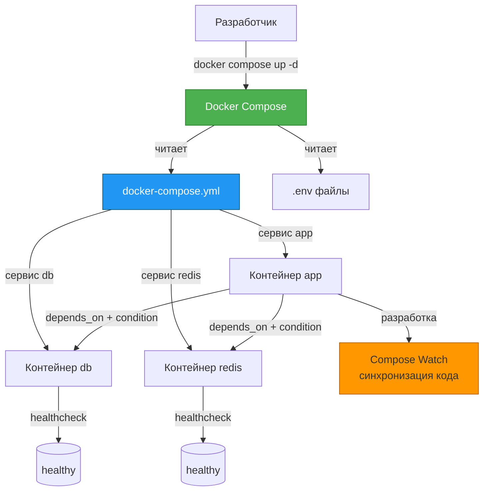
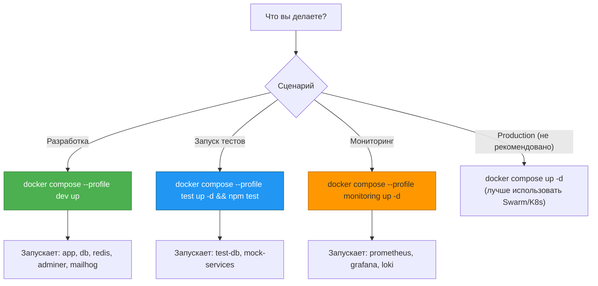

**Docker Compose: основы и продвинутые техники (depends_on, healthcheck, profiles, extensions, .env, watch**

## **🧩 Docker Compose: от основ до продвинутых техник**

## **Реальная проблема**

<note type="quote">

«У меня есть приложение на Node.js, база данных PostgreSQL и Redis. Раньше я запускал три контейнера тремя разными командами `docker run` с кучей флагов. Каждый раз при старте проекта нужно вспоминать эти команды или искать их в истории терминала. А если я захочу запустить ещё и тестовую среду с отдельной БД? Или отключить Redis для локальной разработки?»

</note>

Вот типичные боли разработчиков:

-  **Сложные команды** -- `docker run` с 10 флагами невозможно запомнить.

-  **Зависимости** -- БД должна запуститься ДО приложения, иначе приложение падает.

-  **Разные окружения** -- для разработки нужны одни сервисы, для тестов -- другие, для продакшена -- третьи.

-  **Повторение конфигурации** -- одни и те же настройки дублируются в нескольких сервисах.

-  **Перезагрузка кода** -- при изменении файлов приходится пересобирать образ и перезапускать контейнер.

## **Типовые задачи (чек-лист)**

-  ✅ Заменить длинные `docker run` команды на декларативный `docker-compose.yml`.

-  ✅ Настроить порядок запуска сервисов (БД -> кэш -> приложение).

-  ✅ Организовать проверку здоровья сервисов (healthcheck) и ожидание готовности БД.

-  ✅ Включать и выключать целые группы сервисов (например, `dev`, `test`, `monitoring`).

-  ✅ Переиспользовать общие настройки через `x-` поля (DRY).

-  ✅ Переключать конфигурацию между окружениями через `.env` файлы.

-  ✅ Автоматически перезагружать приложение при изменении кода (горячая перезагрузка).

## **Краткое определение (простыми словами)**

**Docker Compose** -- это инструмент для описания и запуска многоконтейнерных приложений. Вместо того чтобы вручную вводить `docker run ...` для каждого контейнера, вы описываете всё в одном файле `docker-compose.yml`, а затем одной командой поднимаете всё окружение.

<note type="quote">

**Аналогия:** Представьте, что вы шеф-повар. Раньше вы давали каждому повару инструкции отдельно: «Вася, свари борщ, Петя, нарежь салат». **Compose** -- это общее меню, где прописаны все блюда и порядок их приготовления. Вы просто говорите: «Готовьте!» -- и всё запускается само.

</note>

🎯 **Главная идея:** Docker Compose делает многоконтейнерную разработку **повторяемой, документированной и удобной**. Всё окружение проекта -- в одном файле.

---

## **📚 Оглавление**

-  📄 **1\. Основы Docker Compose (структура, версии, базовые сервисы)**

-  ⏳ **2\. depends_on и condition: управление порядком запуска**

-  ❤️ **3\. Healthcheck: проверка готовности сервисов**

-  🎚️ **4\. Profiles: включаем/выключаем группы сервисов**

-  🔁 **5\. Extensions (x-поля): DRY для docker-compose.yml**

-  🔐 **6\. Переменные окружения и .env файлы**

-  🔄 **7\. Compose Watch: горячая перезагрузка в разработке**

-  🗺️ **8\. Схема работы Compose (Mermaid)**

-  💡 **9\. Ключевые выводы и чек-лист**

<note type="quote">

Наливайте кофе -- мы начинаем! ☕

</note>

---

## **📄 1. Основы Docker Compose (структура, версии, базовые сервисы)**

### **Что такое docker-compose.yml**

Это YAML-файл, в котором описываются:

-  **Сервисы** (контейнеры) -- что запускать, из какого образа, с какими портами, томами, переменными.

-  **Сети** (networks) -- как контейнеры общаются друг с другом.

-  **Тома** (volumes) -- где хранятся данные.

### **Базовая структура (минимальный пример)**

yaml

```
version: '3.8'           # Формат файла (зависит от версии Docker Compose)

services:                # Список сервисов (контейнеров)
  web:                   # Имя сервиса (используется как hostname в сети)
    image: nginx:alpine  # Какой образ использовать
    ports:               # Проброс портов
      - "8080:80"
    networks:
      - my-network

  redis:
    image: redis:alpine
    networks:
      - my-network

networks:                # Создаём пользовательскую сеть
  my-network:
    driver: bridge
```

**Запуск:**

bash

```
# Запустить все сервисы в фоне
docker compose up -d

# Остановить и удалить контейнеры
docker compose down
```

### **Структура сервиса: основные поля**

| **Поле**      | **Назначение**                  | **Пример**                          |
|---------------|---------------------------------|-------------------------------------|
| `image`       | Какой образ использовать        | `postgres:15`                       |
| `build`       | Собирать образ из Dockerfile    | `build: ./app`                      |
| `ports`       | Проброс портов (хост:контейнер) | `"5432:5432"`                       |
| `volumes`     | Монтирование томов              | `- ./data:/var/lib/postgresql/data` |
| `environment` | Переменные окружения            | `- POSTGRES_PASSWORD=secret`        |
| `env_file`    | Загрузить переменные из файла   | `- .env.db`                         |
| `networks`    | Подключить к сетям              | `- backend`                         |
| `command`     | Переопределить команду запуска  | `command: npm run dev`              |
| `depends_on`  | Зависимость от других сервисов  | `- db`                              |

### **Версии формата docker-compose.yml**

| **Версия** | **Docker Compose** | **Особенности**              |
|------------|--------------------|------------------------------|
| `3.8`      | 1\.27.0+           | Актуальная стабильная версия |
| `3.9`      | 2\.0.0+            | Поддержка `extends`          |
| `2.x`      | Старые             | Устарела, но встречается     |
| `1.x`      | Очень старые       | Не используйте               |

<note type="quote">

**Современный стандарт:** Используйте `version: '3.8'` или выше. В новых версиях Docker Compose V2 файл без `version` тоже работает, но лучше указывать.

</note>

### **Пример: полный стек (Node.js + PostgreSQL + Redis)**

yaml

```
version: '3.8'

services:
  app:
    build: .
    ports:
      - "3000:3000"
    environment:
      - DB_HOST=postgres
      - REDIS_HOST=redis
      - NODE_ENV=development
    volumes:
      - .:/app                    # Монтируем код для разработки
      - /app/node_modules         # Исключаем node_modules из монтирования
    networks:
      - app-network
    depends_on:
      - postgres
      - redis

  postgres:
    image: postgres:15-alpine
    environment:
      POSTGRES_USER: myuser
      POSTGRES_PASSWORD: secret
      POSTGRES_DB: mydb
    ports:
      - "5432:5432"
    volumes:
      - postgres_data:/var/lib/postgresql/data
    networks:
      - app-network

  redis:
    image: redis:7-alpine
    ports:
      - "6379:6379"
    volumes:
      - redis_data:/data
    networks:
      - app-network

networks:
  app-network:
    driver: bridge

volumes:
  postgres_data:
  redis_data:
```

### **Ключевая мысль**

<note type="quote">

Docker Compose превращает хаос из `docker run` команд в один читаемый файл. Всё окружение проекта -- в одном месте.

</note>

---

## **⏳ 2. depends_on и condition: управление порядком запуска**

### **Проблема: порядок важен**

Приложение может требовать, чтобы БД запустилась раньше него. `depends_on` говорит Compose: «запусти этот сервис перед другим».

### **Базовый depends_on (не дожидается готовности)**

yaml

```
services:
  app:
    build: .
    depends_on:
      - postgres      # postgres запустится ДО app, но не факт, что он уже принял подключения
      - redis

  postgres:
    image: postgres:15
```

**Ограничение:** `depends_on` ждёт только **запуска** контейнера, а не его **готовности** принимать соединения. PostgreSQL может стартовать 5 секунд, а приложение попытается подключиться на 2-й секунде и упадёт.

### **Решение: condition: service_healthy**

Compose V2 (версия 3.8+) поддерживает `condition`, который дожидается, пока сервис не станет `healthy`.

yaml

```
services:
  app:
    build: .
    depends_on:
      postgres:
        condition: service_healthy   # Ждём, пока healthcheck postgres не пройдёт
      redis:
        condition: service_healthy
    restart: on-failure

  postgres:
    image: postgres:15-alpine
    healthcheck:
      test: ["CMD-SHELL", "pg_isready -U postgres"]
      interval: 5s
      timeout: 3s
      retries: 5
    # ... остальные настройки

  redis:
    image: redis:7-alpine
    healthcheck:
      test: ["CMD", "redis-cli", "ping"]
      interval: 5s
      timeout: 3s
      retries: 5
```

Теперь `app` запустится только после того, как `postgres` и `redis` успешно пройдут свои healthcheck'и.

### **Типы condition в depends_on**

| **Тип**                          | **Значение**                                                     |
|----------------------------------|------------------------------------------------------------------|
| `service_started`                | Ждёт запуска контейнера (по умолчанию)                           |
| `service_healthy`                | Ждёт, пока healthcheck не переведёт сервис в состояние `healthy` |
| `service_completed_successfully` | Ждёт, пока контейнер завершится с кодом 0 (для задач-однодневок) |

### **Пример с миграциями (service_completed_successfully)**

yaml

```
services:
  db:
    image: postgres:15
    healthcheck:
      test: ["CMD-SHELL", "pg_isready -U postgres"]

  migrations:
    image: flyway/flyway
    command: -url=jdbc:postgresql://db:5432/mydb -user=postgres -password=secret migrate
    depends_on:
      db:
        condition: service_healthy
    restart: "no"   # Запускается один раз и завершается

  app:
    build: .
    depends_on:
      migrations:
        condition: service_completed_successfully   # Ждём, пока миграции не завершатся успешно
```

### **Ключевая мысль**

<note type="quote">

`depends_on` без `condition` бесполезен для БД. Всегда используйте `condition: service_healthy` в паре с `healthcheck` в зависимом сервисе.

</note>

---

## **❤️ 3. Healthcheck: проверка готовности сервисов**

### **Что такое healthcheck**

Healthcheck -- это команда, которую Docker периодически выполняет внутри контейнера, чтобы понять, жив ли сервис и готов ли принимать трафик.

### **Параметры healthcheck**

| **Параметр**   | **Назначение**                                                          | **Пример**                                                          |
|----------------|-------------------------------------------------------------------------|---------------------------------------------------------------------|
| `test`         | Команда для проверки (должна возвращать 0 = здоров)                     | `["CMD", "curl", "-f", "`[`http://localhost`](http://localhost)`"]` |
| `interval`     | Как часто проверять                                                     | `30s`                                                               |
| `timeout`      | Таймаут выполнения команды                                              | `10s`                                                               |
| `retries`      | Сколько неудачных попыток до перевода в `unhealthy`                     | `3`                                                                 |
| `start_period` | Время, после которого начинаются проверки (даёт сервису время на старт) | `60s`                                                               |

### **Примеры healthcheck для популярных сервисов**

**PostgreSQL:**

yaml

```
healthcheck:
  test: ["CMD-SHELL", "pg_isready -U postgres"]
  interval: 10s
  timeout: 5s
  retries: 5
```

**Redis:**

yaml

```
healthcheck:
  test: ["CMD", "redis-cli", "ping"]
  interval: 10s
  timeout: 3s
  retries: 5
```

**MySQL:**

yaml

```
healthcheck:
  test: ["CMD", "mysqladmin", "ping", "-h", "localhost", "-u", "root", "-p$$MYSQL_ROOT_PASSWORD"]
  interval: 10s
  timeout: 5s
  retries: 5
```

**Node.js / Express:**

yaml

```
healthcheck:
  test: ["CMD", "curl", "-f", "http://localhost:3000/health"]
  interval: 30s
  timeout: 10s
  retries: 3
  start_period: 40s   # Даём приложению время на старт
```

**В своём Dockerfile:**

dockerfile

```
HEALTHCHECK --interval=30s --timeout=3s --start-period=5s --retries=3 \
  CMD curl -f http://localhost:3000/health || exit 1
```

### **Проверка статуса здоровья**

bash

```
# Посмотреть статус контейнера
docker ps --filter "health=healthy"

# Детальная информация о healthcheck
docker inspect <container_id> | jq '.[].State.Health'
```

### **Ключевая мысль**

<note type="quote">

Healthcheck -- это не просто "приятно иметь". Это критически важно для `depends_on: service_healthy` и для балансировщиков (Swarm, Traefik), которые исключают unhealthy-контейнеры.

</note>

---

## **🎚️ 4. Profiles: включаем/выключаем группы сервисов**

### **Проблема**

У вас есть сервисы:

-  **Основные** (app, db, redis) -- нужны всегда.

-  **Вспомогательные** (adminer, pgadmin, mailhog) -- нужны только для разработки.

-  **Мониторинг** (prometheus, grafana) -- нужны иногда.

Раньше приходилось иметь несколько файлов: `docker-compose.yml`, [`docker-compose.dev`](http://docker-compose.dev)`.yml`, `docker-compose.monitoring.yml`.

### **Решение: profiles**

С `profiles` вы можете пометить сервисы, которые запускаются **только когда указан профиль**.

yaml

```
version: '3.8'

services:
  app:
    build: .
    # ... без профиля — запускается всегда

  db:
    image: postgres:15
    # ... без профиля — запускается всегда

  adminer:                      # Веб-интерфейс для БД
    image: adminer:latest
    ports:
      - "8081:8080"
    profiles:
      - dev                     # Запускается только с профилем dev
      - tools                   # Или с профилем tools

  mailhog:                      # Локальный SMTP-сервер для тестов
    image: mailhog/mailhog
    ports:
      - "8025:8025"
    profiles:
      - dev

  prometheus:
    image: prom/prometheus
    profiles:
      - monitoring

  grafana:
    image: grafana/grafana
    profiles:
      - monitoring
```

### **Запуск с профилями**

bash

```
# Запустить только сервисы без профилей (app, db)
docker compose up -d

# Запустить сервисы без профилей + сервисы с профилем dev
docker compose --profile dev up -d

# Запустить несколько профилей
docker compose --profile dev --profile monitoring up -d

# Запустить все сервисы со всеми профилями
docker compose --profile "*" up -d
```

### **Полезные профили для реальных проектов**

| **Профиль**  | **Что включает**               | **Когда использовать** |
|--------------|--------------------------------|------------------------|
| `dev`        | adminer, mailhog, pgadmin      | Локальная разработка   |
| `test`       | test-db, mock-сервисы          | Автотесты              |
| `monitoring` | prometheus, grafana, loki      | Наблюдаемость          |
| `tools`      | redis-commander, mongo-express | Администрирование      |

### **Ключевая мысль**

<note type="quote">

Profiles избавляют от множества Compose-файлов. Один файл -- много сценариев запуска.

</note>

---

## **🔁 5. Extensions (x-поля): DRY для docker-compose.yml**

### **Проблема: дублирование конфигурации**

У вас есть 5 микросервисов, и у каждого:

-  Одинаковый `restart: unless-stopped`

-  Одинаковые `logging` настройки

-  Одинаковые `networks`

-  Одинаковые `healthcheck`

Без DRY вы будете копировать эти 10 строк в каждый сервис.

### **Решение: x-поля (YAML anchors + extensions)**

Compose позволяет определять **расширения** (поля, начинающиеся с `x-`), которые можно использовать как "шаблоны".

yaml

```
version: '3.8'

# Определяем шаблоны (x-поля)
x-logging: &default-logging
  logging:
    driver: "json-file"
    options:
      max-size: "10m"
      max-file: "3"

x-restart: &default-restart
  restart: unless-stopped

x-healthcheck: &default-healthcheck
  healthcheck:
    test: ["CMD", "curl", "-f", "http://localhost:8080/health"]
    interval: 30s
    timeout: 5s
    retries: 3

services:
  app1:
    build: ./app1
    <<: *default-restart
    <<: *default-logging
    <<: *default-healthcheck
    ports:
      - "8081:8080"

  app2:
    build: ./app2
    <<: *default-restart
    <<: *default-logging
    <<: *default-healthcheck
    ports:
      - "8082:8080"

  app3:
    build: ./app3
    <<: *default-restart
    <<: *default-logging
    <<: *default-healthcheck
    ports:
      - "8083:8080"
```

### **Синтаксис YAML anchors**

| **Синтаксис**      | **Значение**                                              |
|--------------------|-----------------------------------------------------------|
| `&default-restart` | Создаёт якорь (anchor) с именем `default-restart`         |
| `*default-restart` | Вставляет содержимое якоря                                |
| `<<:`              | Оператор слияния (merge) -- добавляет/переопределяет поля |

### **Расширенный пример: шаблон для микросервиса**

yaml

```
x-microservice: &microservice
  restart: unless-stopped
  networks:
    - app-network
  logging:
    driver: "json-file"
    options:
      max-size: "10m"
  deploy:
    resources:
      limits:
        memory: 512M
      reservations:
        memory: 256M

services:
  auth-service:
    <<: *microservice
    build: ./auth
    ports:
      - "8001:8000"

  payment-service:
    <<: *microservice
    build: ./payment
    ports:
      - "8002:8000"
    deploy:
      resources:
        limits:
          memory: 1G   # Переопределяем лимит для этого сервиса
```

### **Ключевая мысль**

<note type="quote">

x-поля и YAML anchors -- это ваш лучший друг для поддержания docker-compose.yml в чистоте. Не повторяйтесь.

</note>

---

## **🔐 6. Переменные окружения и .env файлы**

### **Проблема: конфигурация в коде**

Нельзя хранить пароли, API-ключи, хосты в самом `docker-compose.yml` -- они попадут в Git.

### **Решение: .env файлы и переменные окружения**

**Шаг 1. Создайте** `.env` **файл (не коммитить в Git!)**

env

```
# .env
POSTGRES_USER=myuser
POSTGRES_PASSWORD=supersecret
POSTGRES_DB=mydb
REDIS_PASSWORD=redispass
NODE_ENV=production
API_KEY=12345-abcde
```

**Шаг 2. Используйте переменные в docker-compose.yml**

yaml

```
version: '3.8'

services:
  postgres:
    image: postgres:15
    environment:
      POSTGRES_USER: ${POSTGRES_USER}
      POSTGRES_PASSWORD: ${POSTGRES_PASSWORD}
      POSTGRES_DB: ${POSTGRES_DB}
    env_file:
      - .env.postgres   # Можно загрузить из отдельного файла
    ports:
      - "5432:5432"

  app:
    build: .
    environment:
      DB_USER: ${POSTGRES_USER}
      DB_PASSWORD: ${POSTGRES_PASSWORD}
      DB_NAME: ${POSTGRES_DB}
      REDIS_PASSWORD: ${REDIS_PASSWORD}
      NODE_ENV: ${NODE_ENV:-development}   # Значение по умолчанию
    ports:
      - "${APP_PORT:-3000}:3000"            # Порт из .env или 3000 по умолчанию
```

### **Подстановка переменных: синтаксис**

| **Синтаксис**     | **Значение**                                       |
|-------------------|----------------------------------------------------|
| `${VAR}`          | Значение переменной VAR из .env (ошибка, если нет) |
| `${VAR:-default}` | Значение VAR или `default`, если VAR не задана     |
| `${VAR:?error}`   | Ошибка, если VAR не задана                         |

### **Несколько .env файлов**

bash

```
# Использовать другой .env файл
docker compose --env-file .env.production up -d
```

### **Порядок подстановки (приоритет)**

1. Переменные окружения оболочки (shell) -- **самый высокий приоритет**

2. Переменные из файла `--env-file`

3. Переменные из `.env` в текущей директории

4. Значения по умолчанию (`${VAR:-default}`)

### **Пример: переопределение для production**

bash

```
# Запуск с production-конфигом
export POSTGRES_PASSWORD=prodsecret
docker compose --env-file .env.prod up -d
```

### **Ключевая мысль**

<note type="quote">

.env файлы отделяют конфигурацию от кода. Никогда не коммитьте .env с паролями. Добавьте `.env` в `.gitignore`.

</note>

---

## **🔄 7. Compose Watch: горячая перезагрузка в разработке**

### **Проблема: медленный цикл разработки**

Вы меняете код -> пересобираете образ (`docker build`) -> перезапускаете контейнер. Это занимает 10-30 секунд.

### **Решение: Compose Watch (экспериментальная фича, Docker Compose 2.22+)**

Compose Watch отслеживает изменения файлов на хосте и **синхронизирует их с контейнером** без перезапуска (или с перезапуском для некоторых действий).

**docker-compose.yml:**

yaml

```
version: '3.8'

services:
  app:
    build: .
    ports:
      - "3000:3000"
    develop:
      watch:
        - action: sync         # Синхронизировать изменённые файлы
          path: ./src
          target: /app/src
        - action: rebuild      # Пересобрать образ при изменении package.json
          path: ./package.json
        - action: sync+restart # Синхронизировать и перезапустить контейнер
          path: ./config
          target: /app/config
```

### **Типы actions в watch**

| **Action**     | **Что делает**                                          | **Когда использовать**                                                       |
|----------------|---------------------------------------------------------|------------------------------------------------------------------------------|
| `sync`         | Копирует изменённые файлы в контейнер (без перезапуска) | Для кода, который перезагружается сам (Node.js с nodemon, Python с --reload) |
| `rebuild`      | Пересобирает образ и пересоздаёт контейнер              | При изменении зависимостей (`package.json`, `requirements.txt`)              |
| `sync+restart` | Синхронизирует файлы и перезапускает контейнер          | Для изменений, требующих рестарта (конфиги, статика)                         |

### **Запуск с watch**

bash

```
# Запустить сервисы с активным watch
docker compose up --watch

# Или в фоне
docker compose up -d --watch
```

### **Пример для Node.js (с nodemon)**

yaml

```
services:
  app:
    build: .
    command: npm run dev   # nodemon app.js
    develop:
      watch:
        - action: sync
          path: ./src
          target: /app/src
        - action: rebuild
          path: ./package.json
    ports:
      - "3000:3000"
```

### **Пример для Python (с --reload)**

yaml

```
services:
  app:
    build: .
    command: uvicorn main:app --reload --host 0.0.0.0 --port 8000
    develop:
      watch:
        - action: sync
          path: ./app
          target: /app
    ports:
      - "8000:8000"
```

### **Ключевая мысль**

<note type="quote">

Compose Watch -- это game-changer для разработки. Забудьте о ручной пересборке. Изменили код -- увидели результат через секунду.

</note>

---

## **🗺️ 8. Схема работы Compose (Mermaid)**



---

## **💡 9. Ключевые выводы и чек-лист**

### **Что важно запомнить**

| **Понятие**                | **Суть**                                            |
|----------------------------|-----------------------------------------------------|
| **docker-compose.yml**     | Декларативное описание всех сервисов, сетей и томов |
| **depends_on + condition** | Управление порядком запуска с ожиданием готовности  |
| **healthcheck**            | Команда, проверяющая, жив ли сервис                 |
| **profiles**               | Включают/выключают группы сервисов                  |
| **x-поля + anchors**       | DRY (Don't Repeat Yourself) для Compose             |
| **.env**                   | Отделение конфигурации от кода                      |
| **Compose Watch**          | Горячая синхронизация кода при разработке           |

### **Чек-лист «Вы освоили тему, если:»**

-  ✅ Вы заменили свои `docker run` команды на `docker-compose.yml`.

-  ✅ Вы настроили `depends_on` с `condition: service_healthy` для БД.

-  ✅ Вы добавили `healthcheck` в свои сервисы.

-  ✅ Вы используете `profiles` для отделения dev-инструментов от основных сервисов.

-  ✅ Вы вынесли повторяющиеся настройки в `x-` поля.

-  ✅ Вы храните пароли и конфигурацию в `.env` (и не коммитите их).

-  ✅ Вы попробовали `docker compose up --watch` и ускорили цикл разработки.

### **Что изучить дальше**

1. **Docker Compose в production** -- ограничения (не рекомендуется).

2. **Compose V2** -- отличия от V1.

3. **Команды Compose** (`logs`, `exec`, `ps`, `top`, `events`).

4. **Интеграция Compose с CI/CD** (GitLab CI, GitHub Actions).

---

## **🧪 Бонус: интерактивная Mermaid-диаграмма «Выбор профиля Compose»**

