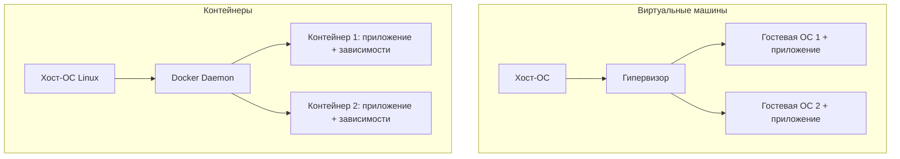

## **Краткое определение (простыми словами)**

**Контейнер** -- это «упаковка» приложения вместе со всем, что ему нужно для работы: кодом, библиотеками, настройками, файловой системой.

Такая упаковка запускается в изолированном окружении на любом компьютере, где установлен контейнерный движок (например, Docker).

<note type="quote">

🎯 **Главная идея:** «Напиши один раз -- запусти где угодно».

</note>

---

## **📚 Оглавление**

-  🧠 **1\. Зачем нужны контейнеры (история боли)**

-  🐣 **2\. Что такое контейнер на самом деле**

-  ⚙️ **3\. Как работают контейнеры под капотом**

-  🖥️ **4\. Контейнеры vs Виртуальные машины: главная битва**

-  🔄 **5\. Жизненный цикл контейнера**

-  🧩 **6\. Где контейнеры используются в реальности**

-  💡 **7\. Ключевые выводы и чек-лист для старта**

<note type="quote">

Наливайте кофе -- мы начинаем! ☕

</note>

---

## **🧠 1. Зачем нужны контейнеры (история боли)**

### **Проблема, которую никто не планировал**

Раньше приложение разрабатывали на одном сервере. Потом понадобилось ещё одно -- разработчик вручную ставил все зависимости. Потом тестирование, staging, production -- и в каждом месте окружение отличалось. Версии библиотек разъезжались, файлы конфигурации жили своей жизнью.

### **Конкретный пример из жизни**

Вы пишете бэкенд на **Python 3.11** с использованием `libssl 1.1`. В продакшене стоит **Ubuntu 20.04**, где по умолчанию `libssl 1.0`. Приложение падает с ошибкой `SSL module is not available`.

Инженер тратит **4 часа** на выяснение, что нужно обновить библиотеку в системе, но она конфликтует с другим сервисом.

### **Как контейнеры решают это**

Контейнер берёт с собой **свою версию** `libssl` и даже свою файловую систему. Он не трогает хост-систему.

### **Ключевая мысль**

<note type="quote">

Контейнеры решают проблему «у меня работает, а на сервере нет», упаковывая приложение со всем его окружением.

</note>

---

## **🐣 2. Что такое контейнер на самом деле**

Простая аналогия:

<note type="quote">

**Контейнер -- это как холодильник в общежитии.**

У каждого своя полка (изоляция), свои продукты (зависимости), но электричество общее (ядро ОС).

</note>

### **Фактически контейнер -- это:**

-  Процесс (или группа процессов), запущенный в изолированном пространстве.

-  Имеет свою файловую систему (образ).

-  Использует ядро хоста, но не видит другие процессы.

### **Основные компоненты (из чего состоит контейнер)**

| **Компонент**     | **Что делает**                                        |
|-------------------|-------------------------------------------------------|
| Образ (image)     | «Чертеж» контейнера: слои файлов + инструкции запуска |
| Реестр (registry) | Хранилище образов (Docker Hub, частный registry)      |
| Движок (docker)   | Служба, которая управляет контейнерами                |
| Том (volume)      | Данные, которые живут дольше контейнера               |

### **Ключевая мысль**

<note type="quote">

Контейнер -- это лёгкий, изолированный процесс, который упакован вместе со своими зависимостями, но использует ядро хост-ОС.

</note>

---

## **⚙️ 3. Как работают контейнеры под капотом**

Технологии Linux, которые делают контейнеризацию возможной (именно они есть в Docker):

| **Механизм**   | **Назначение**                          | **Аналогия**                          |
|----------------|-----------------------------------------|---------------------------------------|
| **namespaces** | Изоляция процессов, сети, пользователей | Каждому контейнеру -- своя «квартира» |
| **cgroups**    | Ограничение ресурсов (CPU, RAM, диска)  | Лимит на коммунальные услуги          |
| **union FS**   | Слоёная файловая система (overlay)      | Стопка прозрачных плёнок              |

### **Как запускается контейнер (последовательность Mermaid)**

### **Ключевая мысль**

<note type="quote">

Контейнер -- это не виртуализация, а изоляция процессов средствами ядра Linux.

</note>

---

## **🖥️ 4. Контейнеры vs Виртуальные машины: главная битва**

### **Сравнительная таблица (Mutating vs Validating -- здесь «что лучше»)**

| **Характеристика**          | **🐳 Контейнер**          | **💿 Виртуальная машина**   |
|-----------------------------|---------------------------|-----------------------------|
| **Время запуска**           | Секунды (быстрее)         | Минуты (медленнее)          |
| **Размер**                  | МБ (образ \~100 МБ)       | ГБ (образ \~1–10 ГБ)        |
| **Изоляция**                | Процессная (ядро общее)   | Полная (своё ядро)          |
| **Ресурсная эффективность** | Очень высокая             | Низкая (накладные расходы)  |
| **Совместимость ОС**        | Только Linux (ядро хоста) | Любая (Windows, Linux, BSD) |
| **Миграция**                | Легко (образ + реестр)    | Тяжело (образ + гипервизор) |





<mermaid path="./konteynery-opredelenie-naznachenie-sravnenie-s.mermaid" width="780px" height="247px"/>


### **Ключевая мысль**

<note type="quote">


Контейнеры делят ядро хоста, поэтому они лёгкие и быстрые, но менее изолированы.

ВМ дают полную изоляцию, но за счёт тяжеловесности.

</note>

---

## **🔄 5. Жизненный цикл контейнера (текстовая блок-схема)**

text

```
[Образ в реестре] 
    ↓
docker pull
    ↓
[Образ локально]
    ↓
docker create
    ↓
[Остановленный контейнер]
    ↓
docker start
    ↓
[Работающий контейнер] ←→ docker pause
    ↓
docker stop
    ↓
[Остановлен]
    ↓
docker rm
    ↓
[Удалён]
```

### **Команды, которые меняют состояние**

-  `docker run` = create + start (вместе)

-  `docker restart` = stop + start

-  `docker kill` = немедленная остановка (SIGKILL)

### **Ключевая мысль**

<note type="quote">

Контейнер -- это процесс, который можно остановить, запустить, приостановить и удалить, не теряя код (образ остаётся).

</note>

---

## **🧩 6. Где контейнеры используются в реальности**

| **Сценарий**           | **Пример**                                | **Почему контейнеры**                                      |
|------------------------|-------------------------------------------|------------------------------------------------------------|
| **Разработка**         | Локальное окружение, не пачкающее систему | `docker-compose up` поднимает БД, кэш, бэкенд за 1 команду |
| **CI/CD**              | GitLab CI, GitHub Actions                 | Запуск тестов в свежем контейнере -- воспроизводимость     |
| **Микросервисы**       | Каждый сервис в своём контейнере          | Независимое развертывание, изоляция                        |
| **Оркестрация**        | Kubernetes, Nomad                         | Автоматическое масштабирование, восстановление после сбоев |
| **Песочница для кода** | Выполнение непроверенного кода            | Изоляция от хоста                                          |

### **Реальный пример из жизни**

Интернет-магазин на **Чёрную пятницу** получает в 20 раз больше трафика.

Без контейнеров: нужно заранее купить 20 серверов и надеяться.

С контейнерами: Kubernetes автоматом поднимает дополнительные контейнеры за минуты, используя те же серверы.

### **Ключевая мысль**

<note type="quote">

Контейнеры -- основа современных DevOps-практик: от локальной разработки до масштабирования на тысячи серверов.

</note>

---

## **💡 7. Ключевые выводы и чек-лист для старта**

### **Что важно запомнить**

-  🐳 Контейнер -- это изолированный процесс, а не виртуальная машина.

-  ⚡ Контейнеры запускаются за секунды и потребляют мало ресурсов.

-  📦 Образ -- это неизменяемый «слепок» контейнера.

-  🔗 Контейнеры легко соединять в сети и управлять ими через Docker Compose / Kubernetes.

### **Чек-лист «Вы готовы использовать контейнеры, если:»**

-  ✅ Ваше приложение работает на Linux (или WSL2 на Windows).

-  ✅ Вы устали настраивать окружение на каждом сервере вручную.

-  ✅ Вы хотите тестировать в точности то, что попадёт в продакшен.

-  ✅ Вы планируете масштабироваться горизонтально.