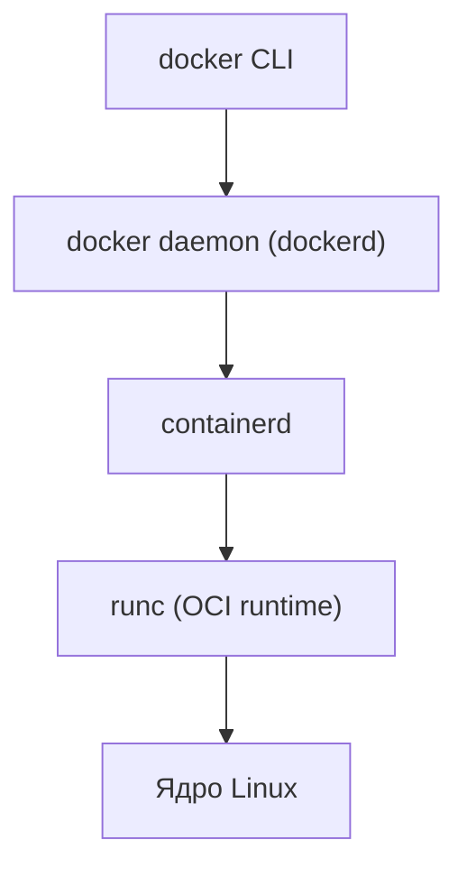
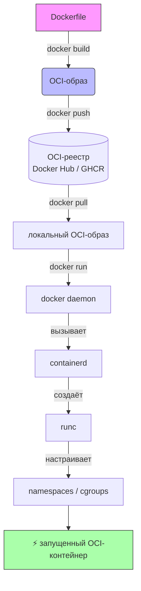
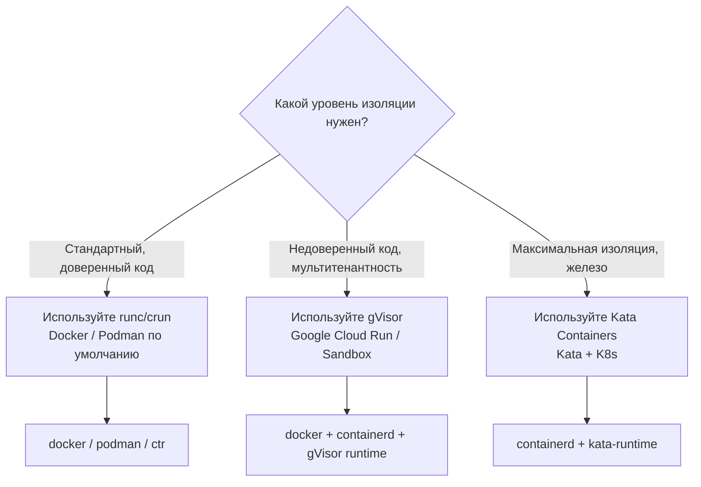

## **Краткое определение (простыми словами)**

**OCI (Open Container Initiative)** -- это набор открытых стандартов, которые описывают:

-  **Как должен выглядеть образ контейнера** (формат, слои, метаданные).

-  **Как его запускать** (runtime-спецификация).

Docker -- это одна из реализаций этих стандартов. Podman, containerd, cri-o -- другие.

<note type="quote">

**Аналогия:** OCI -- это USB-C. Docker и Podman -- разные зарядные устройства, но оба подходят к одному разъёму.

</note>

<note type="quote">

🎯 **Главная идея:** Стандарты OCI позволяют не зависеть от одного вендора. Ваш образ будет работать везде, где есть OCI-совместимый runtime.

</note>

---

## **📚 Оглавление**

-  📜 **1\. Что такое OCI и зачем он нужен**

-  🔌 **2\. Как Docker связан с OCI**

-  ⚙️ **3\. Базовые технологии OCI: runtime, image spec, distribution spec**

-  🐚 **4\. Команды оболочки: Docker vs containerd vs Podman**

-  🗺️ **5\. Карта взаимодействия: от Dockerfile до запущенного контейнера**

-  🔄 **6\. Жизненный цикл контейнера в OCI-совместимой среде**

-  📊 **7\. Сравнение OCI-рантаймов**

-  🧠 **8\. Реальный пример: как перенести образ из Docker в Podman**

<note type="quote">

Наливайте кофе -- мы начинаем! ☕

</note>

---

## **📜 1. Что такое OCI и зачем он нужен**

### **История появления**

В 2015 году Docker стал доминирующим игроком. Компании боялись vendor lock-in (привязки к одному вендору).

OCI была создана, чтобы разделить:

-  **Формат образа** (может быть любой инструмент сборки)

-  **Runtime** (может быть любой исполнитель)

### **OCI = три спецификации**

| **Спецификация**      | **Что описывает**                                     | **Кому нужно**                                      |
|-----------------------|-------------------------------------------------------|-----------------------------------------------------|
| **Image Spec**        | Как устроен образ: слои, конфиг, хэши                 | Инструментам сборки (buildah, kaniko, docker build) |
| **Runtime Spec**      | Как запустить контейнер: процессы, сети, монтирования | Рантаймам (runc, gVisor)                            |
| **Distribution Spec** | Как хранить и передавать образы (реестры)             | Реестрам (Docker Hub, GHCR, ECR)                    |

### **Ключевая мысль**

<note type="quote">

OCI -- это «USB-C для контейнеров». Любой OCI-образ запускается любым OCI-рантаймом.

</note>

---

## **🔌 2. Как Docker связан с OCI**

### **Эволюция Docker**

-  До 2015: Docker делал всё сам -- свой формат, свой runtime.

-  2015: Docker пожертвовал `runc` (свой runtime) в OCI.

-  Сегодня: Docker **использует OCI-компоненты**, но добавляет свой слой удобства.

### **Слои Docker (упрощённо)**



### **Что дал OCI Docker?**

-  Docker образы теперь совместимы с Podman, containerd, cri-o.

-  Можно заменить `runc` на другой OCI-рантайм (например, `gVisor` для песочницы).

### **Ключевая мысль**

<note type="quote">

Docker -- это не единственный OCI-клиент, а просто самый популярный. Его образы работают везде.

</note>

---

## **⚙️ 3. Базовые технологии OCI: runtime, image spec, distribution spec**

### **3\.1 OCI Runtime (**`runc`**)**

**Что это:**

Низкоуровневый инструмент, который непосредственно создаёт контейнер (настраивает namespaces, cgroups, корневую ФС).

**Как работает:**

Получает на вход `config.json` (спецификация runtime) и запускает процесс в изоляции.

**Пример:**

bash

```
# Создать корневую ФС
mkdir rootfs
docker export $(docker create alpine) | tar -C rootfs -xf -

# Сгенерировать config.json
runc spec

# Запустить контейнер
runc run mycontainer
```

### **3\.2 OCI Image Spec**

**Что описывает:**

-  Многослойная файловая система (tar + gzip)

-  Манифест (список слоёв)

-  Конфигурация (CMD, ENV, WORKDIR)

**Инструменты, работающие с OCI-образами:**

-  `docker save` / `docker load`

-  `skopeo` (копирование образов между реестрами)

-  `crane` (Google) -- утилита для работы с OCI-образами без Docker.

### **3\.3 OCI Distribution Spec**

**Что описывает:**

-  API для push/pull образов (HTTP)

-  Аутентификацию (Bearer tokens)

-  Реестры (Docker Hub, GitHub Container Registry, Amazon ECR)

**Пример запроса (через curl):**

bash

```
# Получить токен
curl -u "user:pass" https://auth.docker.io/token?service=registry.docker.io

# Скачать манифест образа
curl -H "Authorization: Bearer $TOKEN" \
     https://registry-1.docker.io/v2/library/alpine/manifests/latest
```

### **Ключевая мысль**

<note type="quote">

OCI -- это три стандарта: как упаковать образ (Image Spec), как его запустить (Runtime Spec) и как передать (Distribution Spec).

</note>

---

## **🐚 4. Команды оболочки: Docker vs containerd vs Podman**

### **Таблица сравнения (выполнение одной и той же задачи)**

| **Задача**                 | **Docker**                 | **containerd (ctr)**                                                                                   | **Podman**                 |
|----------------------------|----------------------------|--------------------------------------------------------------------------------------------------------|----------------------------|
| Запустить контейнер        | `docker run -it alpine sh` | `ctr run --rm` [`docker.io/library/alpine:latest`](http://docker.io/library/alpine:latest) `alpine sh` | `podman run -it alpine sh` |
| Список контейнеров         | `docker ps`                | `ctr container list`                                                                                   | `podman ps`                |
| Остановить контейнер       | `docker stop <id>`         | `ctr task kill <id>`                                                                                   | `podman stop <id>`         |
| Удалить контейнер          | `docker rm <id>`           | `ctr container rm <id>`                                                                                | `podman rm <id>`           |
| Собрать образ              | `docker build -t myapp .`  | ❌ (не умеет)                                                                                           | `podman build -t myapp .`  |
| Загрузить образ из реестра | `docker pull alpine`       | `ctr image pull` [`docker.io/library/alpine:latest`](http://docker.io/library/alpine:latest)           | `podman pull alpine`       |

### **Особенности каждого инструмента**

| **Инструмент**       | **Daemon?**     | **Rootless?** | **Сборка образов** | **Совместимость с Docker CLI** |
|----------------------|-----------------|---------------|--------------------|--------------------------------|
| **Docker**           | Да (dockerd)    | Да (с 2019)   | Да                 | ✅ Родной                       |
| **containerd (ctr)** | Да (containerd) | ❌             | Нет                | ❌ (свой CLI)                   |
| **Podman**           | Нет (fork/exec) | Да            | Да                 | ✅ `alias docker=podman`        |

### **Ключевая мысль**

<note type="quote">

Docker -- самый удобный для человека, containerd -- низкоуровневый инструмент для интеграции, Podman -- беc-daemonная альтернатива Docker.

</note>

---

## **🗺️ 5. Карта взаимодействия: от Dockerfile до запущенного контейнера (Mermaid)**

### **Пояснение этапов**

1. **Dockerfile -> OCI-образ** (`docker build`) -- создаётся многослойный образ по OCI Image Spec.

2. **Push в реестр** -- образ передаётся по OCI Distribution Spec.

3. **Pull на другой хост** -- образ загружается.

4. **Run** -- Docker CLI общается с dockerd -> containerd -> runc.

5. **runc** стартует процесс в изоляции.

### **Ключевая мысль**

<note type="quote">

Весь путь от Dockerfile до контейнера -- это OCI-совместимые шаги, даже если вы не знаете об OCI.

</note>



---

## **🔄 6. Жизненный цикл контейнера в OCI-совместимой среде**

### **Блок-схема текстом**

text

```
[Образ OCI] 
    ↓
runc spec (создание config.json)
    ↓
runc create (создание контейнера без запуска)
    ↓
[Контейнер в состоянии "created"]
    ↓
runc start
    ↓
[Контейнер в состоянии "running"]
    ↓
runc pause (приостановка)
    ↓
[Контейнер в состоянии "paused"]
    ↓
runc resume
    ↓
runc kill / runc delete
    ↓
[Контейнер удалён]
```

### **Состояния контейнера по OCI Runtime Spec**

| **Состояние** | **Описание**                         | **Команда перехода**       |
|---------------|--------------------------------------|----------------------------|
| `creating`    | Инициализация (настройка namespaces) | `runc create`              |
| `created`     | Создан, но не запущен                | `runc start` -> `running`  |
| `running`     | Процессы выполняются                 | `runc kill` -> `stopped`   |
| `paused`      | Все процессы приостановлены          | `runc resume` -> `running` |
| `stopped`     | Контейнер завершён                   | `runc delete` -> удалён    |

### **Ключевая мысль**

<note type="quote">

OCI описывает не только образ, но и строгую машину состояний для контейнера.

</note>

---

## **📊 7. Сравнение OCI-рантаймов**

| **Рантайм**         | **Уровень изоляции**          | **Скорость** | **Безопасность** | **Когда использовать**                     |
|---------------------|-------------------------------|--------------|------------------|--------------------------------------------|
| **runc**            | Стандартная (namespaces)      | ⚡⚡⚡          | 🟡 Средняя       | По умолчанию, доверенные контейнеры        |
| **gVisor**          | Пользовательское ядро         | ⚡⚡           | 🟢 Высокая       | Мультитенантные среды, недоверенный код    |
| **Kata Containers** | Виртуальная машина (Light VM) | ⚡            | 🟢 Очень высокая | Полная изоляция (K8s, облачные провайдеры) |
| **youki**           | Обычная (runc-совместимый)    | ⚡⚡⚡          | 🟡 Средняя       | Rust-реализация, эксперименты              |

### **Ключевая мысль**

<note type="quote">

Чем выше изоляция, тем ниже производительность. Выбирайте рантайм по рискам безопасности.

</note>

---

## **🧠 8. Реальный пример: как перенести образ из Docker в Podman**

### **Ситуация**

У вас есть Docker-образ, собранный в CI. В продакшене вы хотите использовать Podman (без daemon, rootless).

### **Шаги (и почему они работают)**

bash

```
# 1. Docker-образ уже OCI-совместимый
docker pull myapp:latest

# 2. Сохраняем как OCI-архив
docker save myapp:latest -o myapp.tar

# 3. Загружаем в Podman (понимает OCI-формат)
podman load -i myapp.tar

# 4. Запускаем в Podman
podman run -d myapp:latest

# 5. Проверяем
podman ps
```

### **Что произошло под капотом?**

-  `docker save` экспортирует образ в OCI-формате (по спецификации).

-  `podman load` импортирует тот же OCI-образ.

-  Podman использует свой рантайм (обычно `runc` или `crun`), но образ тот же.

### **Ошибки, которые могут возникнуть**

-  **Разные версии спецификации:** Если Podman старше, чем Docker, может не понять новые поля (редко).

-  **Платформа:** Образ собран для `linux/amd64`, а Podman на `linux/arm64` -- не запустится (проблема архитектуры, не OCI).

### **Ключевая мысль**

<note type="quote">

Благодаря OCI вы можете перейти с Docker на Podman без пересборки образов.

</note>

---

## **💡 7. Ключевые выводы и чек-лист (блок)**

### **Что важно запомнить**

-  📜 **OCI = три спецификации:** Image, Runtime, Distribution.

-  🔗 **Docker использует OCI** (containerd -> runc) и совместим с другими рантаймами.

-  🐚 **Команды оболочки** различаются, но логика одинакова (pull, run, stop).

-  🛡️ **Выбор рантайма** зависит от требований к безопасности (runc -> gVisor -> Kata).

-  🔄 **Миграция между инструментами** возможна без пересборки образов.

### **Чек-лист «Вы готовы к OCI-миру, если:»**

-  ✅ Вы знаете разницу между `docker` и `containerd`.

-  ✅ Вы можете запустить контейнер через `runc` без Docker.

-  ✅ Вы понимаете, что `podman run alpine` и `docker run alpine` дают один и тот же результат.

-  ✅ Вы можете скопировать образ между реестрами с помощью `skopeo`.

-  ✅ Вы слышали про `cgroups v2` и `namespaces`.

### **Что изучить дальше**

1. `runc spec` -- генерация config.json вручную.

2. `skopeo` -- работа с образами без Docker.

3. `crun` -- более быстрая альтернатива runc на C.

4. OCI Artifacts -- как хранить в реестре не только контейнеры (Helm-чарты, WASM-модули).

---

## **🧪 Бонус: интерактивная Mermaid-диаграмма «Выбор OCI-рантайма»**

