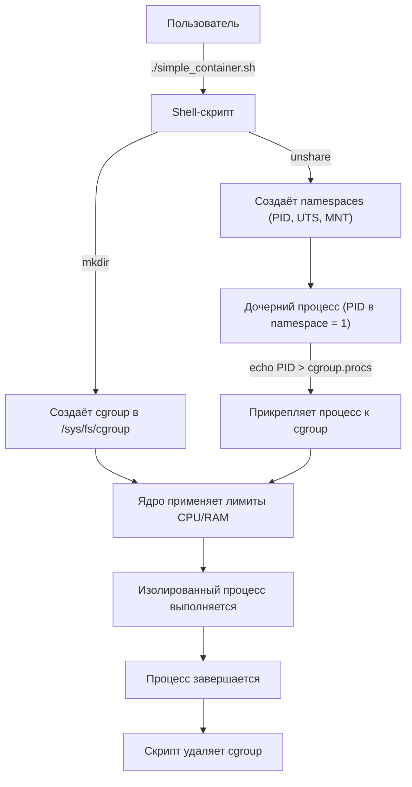
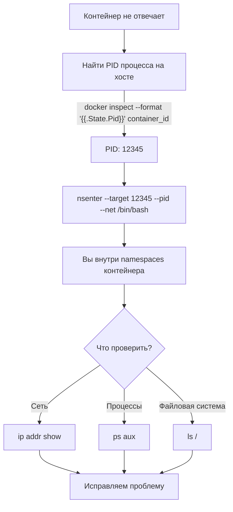

## **Реальная проблема**

<note type="quote">

«Контейнер говорит, что у него 8 ядер и 16 ГБ RAM, хотя сервер скромнее. Как он обманывает систему?»

«Один процесс в контейнере съедает весь CPU, и другие контейнеры на том же хосте начинают тормозить. Почему так происходит и как это предотвратить?»

</note>

Инженеры ежедневно используют Docker, но не всегда понимают, **как именно** работают изоляция и ограничения «под капотом». А когда что-то идёт не так (утечка памяти, зависший процесс, перегрузка диска), без знаний о `namespaces` и `cgroups` сложно диагностировать проблему.

## **Типовые задачи (чек-лист)**

-  ✅ Понять, почему процесс внутри контейнера видит свой «личный» PID 1, а не PID 1234 на хосте.

-  ✅ Ограничить контейнер по CPU и памяти, чтобы он не «душил» соседей.

-  ✅ Написать shell-скрипт, который создаёт изолированное окружение «вручную» (без Docker) -- для понимания, как работают контейнеры.

-  ✅ Диагностировать, какой контейнер потребляет слишком много ресурсов.

## **Краткое определение (простыми словами)**

**Пространства имён (namespaces)** -- это механизм Linux, который **изолирует** процессы.

Процесс в своём namespace видит только «свой мир»: свою файловую систему, свои сетевые интерфейсы, свои PID. Он не знает о существовании других процессов на том же хосте.

<note type="quote">

**Аналогия:** Представьте многоквартирный дом. У каждой квартиры -- свой вход, своя кухня, свои санузлы (namespaces). Жильцы не ходят в гости через стены.

</note>

**Контрольные группы (cgroups)** -- это механизм, который **ограничивает** ресурсы.

Вы можете сказать ядру: «этому контейнеру нельзя больше 2 ядер CPU и 1 ГБ RAM».

<note type="quote">

**Аналогия:** В том же доме у каждой квартиры -- свой счётчик на воду, газ, электричество. Нельзя использовать больше лимита, даже если очень хочется.

</note>

**Создание сценариев оболочки** -- написание shell-скриптов (`bash`, `sh`), которые автоматизируют работу с namespaces и cgroups, создавая изолированные окружения «вручную».

<note type="quote">

🎯 **Главная идея:** Контейнеры (Docker, Podman) -- это не магия. Это просто удобные обёртки над namespaces + cgroups. Вы можете сделать нечто похожее с помощью нескольких команд и bash-скрипта.

</note>

---

## **📚 Оглавление**

-  🧱 **1\. Пространства имён (namespaces): виды и назначение**

-  🎛️ **2\. Контрольные группы (cgroups): ограничение ресурсов**

-  🐚 **3\. Создание сценариев оболочки: пишем свой «docker run»**

-  🗺️ **4\. Схема взаимодействия: от команды до изолированного процесса**

-  📊 **5\. Сравнение: какие namespaces и cgroups использует Docker**

-  🔄 **6\. Жизненный цикл изолированного процесса**

-  💡 **7\. Ключевые выводы и чек-лист**

<note type="quote">

Наливайте кофе -- мы начинаем! ☕

</note>

---

## **🧱 1. Пространства имён (namespaces): виды и назначение**

### **Что такое namespace (ещё раз, но глубже)**

Namespace -- это абстракция, которая говорит ядру: «для этого процесса сделай вид, что глобального ресурса X не существует. Дай ему его личную копию».

### **Виды namespaces в Linux (8 штук, но основные -- 7)**

| **Тип**    | **Глобальный ресурс**                                      | **Что изолирует**                                            | **Зачем контейнеру**                                       |
|------------|------------------------------------------------------------|--------------------------------------------------------------|------------------------------------------------------------|
| **PID**    | ID процессов                                               | Процесс видит только своих потомков, не видит процессы хоста | Внутри контейнера свой PID 1                               |
| **NET**    | Сетевые интерфейсы (eth0, iptables)                        | Свой стек TCP/IP, свой loopback                              | У контейнера свой IP, свои порты                           |
| **MNT**    | Точки монтирования                                         | Своя корневая ФС (`/`), свои `/proc`, `/sys`                 | Контейнер видит только свой образ                          |
| **UTS**    | Имя хоста и домена                                         | Своё hostname                                                | Контейнер может называться `web-1`, не конфликтуя с хостом |
| **IPC**    | Межпроцессное взаимодействие (очереди сообщений, семафоры) | Свои IPC-ресурсы                                             | Процессы в контейнере не мешают процессам на хосте         |
| **USER**   | ID пользователей                                           | Можно быть root внутри, но обычным пользователем снаружи     | Безопасность (rootless-контейнеры)                         |
| **CGROUP** | Иерархия cgroups                                           | Своё представление о cgroups                                 | Для вложенных контейнеров                                  |
| **TIME**   | Системные часы                                             | Своя поправка времени (редко)                                | Специфичные сценарии                                       |

### **Как это выглядит в коде (shell)**

bash

```
# Создать новый процесс с изолированным PID namespace
sudo unshare --fork --pid --mount-proc /bin/bash

# Внутри этого bash:
echo $$  # Покажет 1 (процесс думает, что он первый)
ps aux  # Увидит только свои процессы, не процессы хоста
exit
```

### **Ключевая мысль**

<note type="quote">

Namespaces делают изоляцию: процесс внутри контейнера не видит и не мешает другим процессам на хосте.

</note>

---

## **🎛️ 2. Контрольные группы (cgroups): ограничение ресурсов**

### **Что такое cgroups (cgroups v2 -- современная версия)**

Cgroups -- это механизм, который позволяет:

-  **Ограничить** ресурс (CPU, RAM, диск, сеть).

-  **Приоритизировать** ресурс (дать одному контейнеру больше CPU).

-  **Подсчитать** использование ресурса (для мониторинга).

### **Основные подсистемы cgroups v2**

| **Подсистема** | **Что ограничивает**            | **Пример ограничения**            |
|----------------|---------------------------------|-----------------------------------|
| `cpu`          | Процессорное время              | `max = 200000 1000000` (20% ядра) |
| `memory`       | Оперативная память              | `max = 1073741824` (1 ГБ)         |
| `pids`         | Количество процессов            | `max = 100`                       |
| `io`           | Скорость чтения/записи диска    | `rbps = 10485760` (10 МБ/с)       |
| `cpuset`       | Привязка к конкретным ядрам CPU | `cpus = 0-3` (ядра 0,1,2,3)       |

### **Пример ручного ограничения через shell**

bash

```
# Создаём новую cgroup для контейнера
sudo mkdir /sys/fs/cgroup/mycontainer

# Ограничиваем память 500 МБ
echo 524288000 > /sys/fs/cgroup/mycontainer/memory.max

# Ограничиваем CPU до 50% одного ядра
echo 50000 100000 > /sys/fs/cgroup/mycontainer/cpu.max

# Запускаем процесс (PID 1234) и помещаем в cgroup
echo 1234 > /sys/fs/cgroup/mycontainer/cgroup.procs
```

### **Как Docker использует cgroups**

bash

```
# Посмотреть cgroups контейнера (на хосте)
docker inspect <container_id> | grep -i cgroup

# Найти путь к cgroup контейнера
CGROUP_PATH=$(docker inspect -f '{{.HostConfig.CgroupParent}}' <container_id>)

# Увидеть лимиты контейнера
cat /sys/fs/cgroup/$CGROUP_PATH/memory.max
```

### **Ключевая мысль**

<note type="quote">

Cgroups ограничивают ресурсы: процесс в контейнере не может съесть больше CPU/RAM, чем ему разрешено, даже если хочет.

</note>

---

## **🐚 3. Создание сценариев оболочки: пишем свой «docker run»**

### **Задача**

Написать bash-скрипт, который:

1. Создаёт новый PID namespace.

2. Ограничивает память через cgroup.

3. Запускает команду внутри изолированного окружения.

### **Скрипт** `simple_`[`container.sh`](http://container.sh)

bash

```
#!/bin/bash
# simple_container.sh - запускает команду в изолированном окружении
# Usage: sudo ./simple_container.sh /bin/bash

set -e

CMD=${1:-/bin/bash}
CGROUP_NAME="mycontainer_$$"
CGROUP_PATH="/sys/fs/cgroup/$CGROUP_NAME"

echo "🔧 Создаём cgroup: $CGROUP_NAME"
sudo mkdir -p "$CGROUP_PATH"

# Ограничения
echo "🔧 Ограничиваем память 200MB"
echo 209715200 | sudo tee "$CGROUP_PATH/memory.max" > /dev/null

echo "🔧 Ограничиваем CPU до 20%"
echo 20000 100000 | sudo tee "$CGROUP_PATH/cpu.max" > /dev/null

echo "🚀 Запускаем команду в изолированном namespace"
# unshare: новые PID, UTS, MNT namespaces
# --fork: создать дочерний процесс
# --mount-proc: смонтировать /proc внутри
sudo unshare --fork --pid --uts --mount-proc \
    bash -c "echo \$\$ > $CGROUP_PATH/cgroup.procs && exec $CMD"

# Очистка после завершения
echo "🧹 Удаляем cgroup"
sudo rmdir "$CGROUP_PATH"
```

### **Проверка**

bash

```
# Даём права на выполнение
chmod +x simple_container.sh

# Запускаем изолированный bash
sudo ./simple_container.sh /bin/bash

# Внутри изолированного bash:
echo $$  # Будет 1
cat /proc/self/cgroup  # Покажет mycontainer_XXXX
# Выходим
exit
```

### **Ключевая мысль**

<note type="quote">

С помощью 20 строк bash-скрипта можно создать примитивный контейнер, работающий как Docker (но без удобств).

</note>

---

## **🗺️ 4. Схема взаимодействия: от команды до изолированного процесса (Mermaid)**



### **Пояснение этапов**

| **Шаг** | **Что происходит**                     | **Инструмент**             |
|---------|----------------------------------------|----------------------------|
| 1       | Пользователь запускает скрипт          | `bash`                     |
| 2       | Скрипт создаёт новую cgroup            | `mkdir` в `/sys/fs/cgroup` |
| 3       | Скрипт устанавливает лимиты            | `echo` в файлы `*.max`     |
| 4       | `unshare` создаёт новые namespaces     | системный вызов ядра       |
| 5       | Новый процесс прикрепляется к cgroup   | `echo PID > cgroup.procs`  |
| 6       | Ядро применяет изоляцию и лимиты       | ядро Linux                 |
| 7       | Процесс выполняется, затем завершается | \-                         |
| 8       | Скрипт удаляет cgroup                  | `rmdir`                    |

### **Ключевая мысль**

<note type="quote">

Namespaces и cgroups работают независимо: одни изолируют «видимость», другие -- ограничивают «потребление». Скрипт объединяет их.

</note>

---

## **📊 5. Сравнение: какие namespaces и cgroups использует Docker по умолчанию**

### **Namespaces в Docker (по умолчанию)**

| **Namespace** | **Используется?**                       | **Зачем**                                                                    |
|---------------|-----------------------------------------|------------------------------------------------------------------------------|
| PID           | ✅ Да                                    | Свой PID 1                                                                   |
| NET           | ✅ Да                                    | Свой сетевой стек и IP                                                       |
| MNT           | ✅ Да                                    | Своя корневая ФС                                                             |
| UTS           | ✅ Да                                    | Свой hostname                                                                |
| IPC           | ✅ Да                                    | Изоляция очередей сообщений                                                  |
| USER          | ❌ Нет (обычный режим) / ✅ Да (rootless) | User namespace включается опционально                                        |
| CGROUP        | ❓ Не используется напрямую              | Docker использует cgroups на хосте, но не создаёт вложенный cgroup namespace |

### **Cgroups в Docker (что ограничивает по умолчанию)**

| **Ресурс** | **Ограничение по умолчанию** | **Как изменить**    |
|------------|------------------------------|---------------------|
| CPU        | Без ограничений              | `--cpus="2"`        |
| RAM        | Без ограничений              | `--memory="1g"`     |
| Диск (IO)  | Без ограничений              | `--device-read-bps` |
| PID        | Без ограничений              | `--pids-limit=100`  |

### **Проверка в реальном контейнере**

bash

```
# Запускаем контейнер с лимитами
docker run -d --name test --cpus="0.5" --memory="256m" nginx

# На хосте находим cgroup контейнера
CGROUP_PATH=$(docker inspect test -f '{{.HostConfig.CgroupParent}}')
# Путь будет: /docker/<container_id>

# Проверяем лимиты
cat /sys/fs/cgroup/$CGROUP_PATH/cpu.max
# Вывод: 50000 100000 (50% ядра)

cat /sys/fs/cgroup/$CGROUP_PATH/memory.max
# Вывод: 268435456 (256 МБ)
```

### **Ключевая мысль**

<note type="quote">

Docker автоматически настраивает namespaces и cgroups. Но вы можете вручную изменить параметры через флаги `--cpus`, `--memory` и другие.

</note>

---

## **🔄 6. Жизненный цикл изолированного процесса**

### **Текстовая блок-схема**

text

```
[Команда: docker run / наш скрипт]
    ↓
[Создание cgroup] → [Запись лимитов CPU, RAM, IO]
    ↓
[Создание namespaces] → [PID, NET, MNT, UTS, IPC]
    ↓
[Создание дочернего процесса внутри namespaces]
    ↓
[Прикрепление процесса к cgroup]
    ↓
[Запуск команды (bash, nginx, python)]
    ↓
[Процесс выполняется с изоляцией и лимитами]
    ↓
[Процесс завершается (exit / kill)]
    ↓
[Очистка cgroup (docker rm / rmdir)]
```

### **Состояния процесса с точки зрения хоста**

| **Состояние**    | **Что видит хост** | **Что видит процесс в контейнере** |
|------------------|--------------------|------------------------------------|
| PID на хосте     | 1234               | PID 1                              |
| CPU доступно     | 8 ядер             | 0\.5 ядра (если лимит)             |
| Память доступна  | 32 ГБ              | 256 МБ (если лимит)                |
| Сеть             | eth0, 10.0.0.1     | eth0, 172.17.0.2                   |
| Файловая система | /home/user/project | / (только образ контейнера)        |

### **Ключевая мысль**

<note type="quote">

Жизненный цикл изолированного процесса -- это обычный процесс Linux, который при рождении получает «особые права»: свой namespace и привязку к cgroup.

</note>

---

## **💡 7. Ключевые выводы и чек-лист**

### **Что важно запомнить**

| **Механизм**      | **Что делает**                   | **Команды для изучения**                |
|-------------------|----------------------------------|-----------------------------------------|
| **Namespaces**    | Изолируют «видение»              | `unshare`, `lsns`, `nsenter`            |
| **Cgroups**       | Ограничивают «потребление»       | `systemd-cgtop`, `cat /sys/fs/cgroup/*` |
| **Shell-скрипты** | Автоматизируют создание изоляции | `bash`, `unshare`, `echo`               |

### **Чек-лист «Вы освоили тему, если:»**

-  ✅ Вы знаете 5 основных namespaces (PID, NET, MNT, UTS, IPC).

-  ✅ Вы можете вручную создать cgroup и ограничить CPU/memory процесса.

-  ✅ Вы написали bash-скрипт, который запускает `/bin/bash` в новом PID namespace.

-  ✅ Вы понимаете разницу между `unshare` (создать namespace) и `nsenter` (войти в существующий).

-  ✅ Вы знаете, как посмотреть cgroups любого запущенного контейнера на хосте.

### **Что изучить дальше**

1. `nsenter` -- как залезть внутрь существующего namespace (диагностика контейнеров).

2. **Cgroups v2** -- современное API (вместо v1, которое считается устаревшим).

3. **Rootless-контейнеры** -- как работать без sudo (User namespace).

4. `bubblewrap` -- утилита для запуска изолированных приложений (используется в Flatpak).

---

## **🧪 Бонус: интерактивная Mermaid-диаграмма «Диагностика контейнера через nsenter»**

