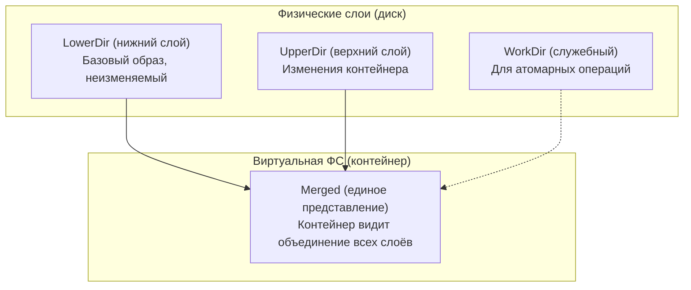
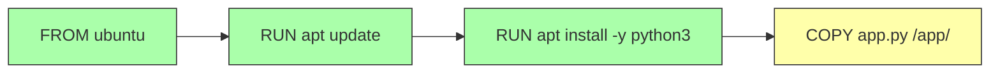
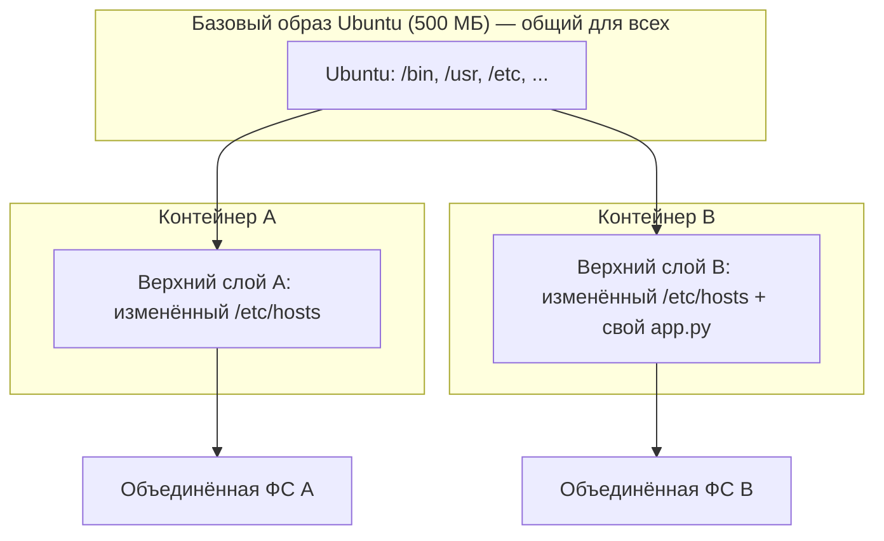
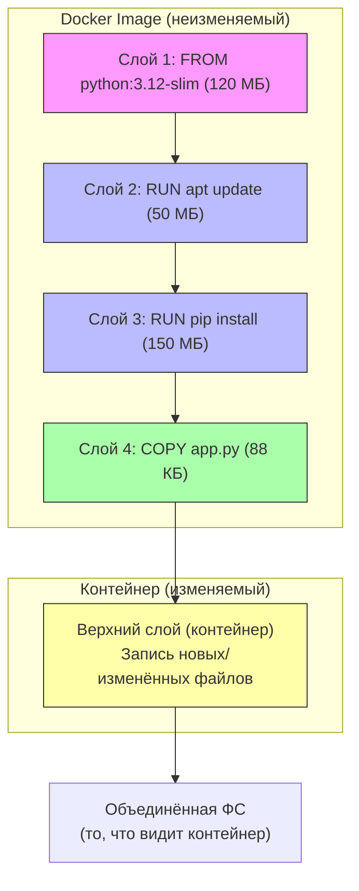
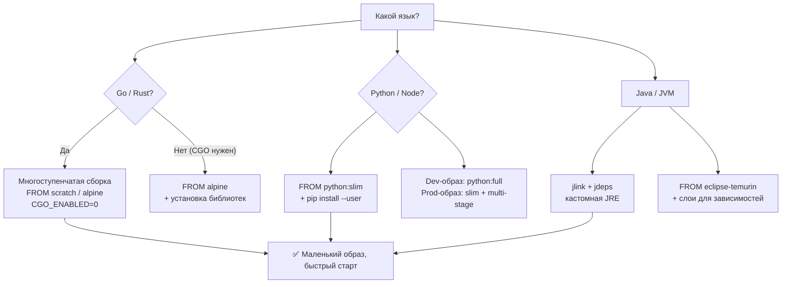

## **Объединённые файловые системы: как контейнеры экономят место и ускоряют запуск**

## **Реальная проблема**

<note type="quote">

«Я собрал 10 разных образов на основе Ubuntu. Почему они занимают 10 ГБ, хотя базовая ОС одна и та же? Разве нельзя её переиспользовать?»

</note>

<note type="quote">

«Я изменил одну строку в коде, пересобрал образ -- и он снова качает 500 МБ слоёв. Почему нельзя обновить только изменённый файл?»

</note>

Инженеры, которые не понимают устройство объединённых файловых систем (UnionFS), страдают от:

-  Огромных образов, которые долго пушить и пулить.

-  Медленного перестроения в CI/CD.

-  Путаницы с томами (volumes) и слоями (layers).

## **Типовые задачи (чек-лист)**

-  ✅ Собрать образ минимального размера, переиспользуя базовые слои.

-  ✅ Понять, почему `COPY` в Dockerfile лучше ставить ближе к концу.

-  ✅ Оптимизировать кэширование слоёв в CI/CD.

-  ✅ Выбрать язык программирования и архитектуру приложения, дружественные к контейнерам.

## **Краткое определение (простыми словами)**

**Объединённая файловая система (UnionFS)** -- это технология, которая позволяет **объединить несколько директорий (слоёв) в одну «виртуальную»**, при этом слои остаются физически раздельными.

<note type="quote">

**Аналогия:** Представьте стопку прозрачных плёнок. На каждой плёнке -- свои рисунки. Если положить их друг на друга, получится единая картинка. Если убрать верхнюю плёнку -- рисунок под ней проявится.

</note>

**Применительно к Docker:**

-  Базовый слой (Ubuntu, Alpine) -- неизменяемый.

-  Следующий слой -- установка пакетов (`apt install`).

-  Следующий -- добавление кода (`COPY`).

-  При запуске контейнера все слои «склеиваются» в единую файловую систему.

<note type="quote">

🎯 **Главная идея:** Слои кэшируются и переиспользуются. Если вы не меняли базовый слой -- он не будет скачиваться заново. Если вы меняете только код -- пересоберётся только последний слой.

</note>

---

## **📚 Оглавление**

-  🧩 **1\. Что такое объединённая файловая система (UnionFS)**

-  ⛓️ **2\. Слои (layers) в Docker: как они работают**

-  📝 **3\. Copy-on-Write (CoW): почему контейнеры не дублируют данные**

-  🐧 **4\. Основы Linux для контейнеров (файловая система, inode, монтирования)**

-  🐍 **5\. Языки программирования и контейнеризация (особенности Go, Python, Java, Node.js)**

-  🏗️ **6\. Архитектура приложения для контейнеров (12 факторов, stateless, health checks)**

-  🗺️ **7\. Схема объединения слоёв (Mermaid)**

-  📊 **8\. Сравнение UnionFS-реализаций (OverlayFS, AUFS, Overlay2)**

-  💡 **9\. Ключевые выводы и чек-лист**

<note type="quote">

Наливайте кофе -- мы начинаем! ☕

</note>

---

## **🧩 1. Что такое объединённая файловая система (UnionFS)**

### **Технологии UnionFS, которые используются в контейнерах**

| **ФС**        | **Где используется**                             | **Статус**                             |
|---------------|--------------------------------------------------|----------------------------------------|
| **OverlayFS** | Docker (по умолчанию с 2017), Podman, containerd | ✅ Актуальна, рекомендуется             |
| **Overlay2**  | Docker (улучшенная версия OverlayFS)             | ✅ Актуальна, используется по умолчанию |
| **AUFS**      | Старые версии Docker                             | ❌ Устарела, не входит в upstream Linux |
| **UnionFS**   | Оригинальная реализация                          | ❌ Историческая                         |

### **Как работает OverlayFS (самая популярная)**



### **Пример работы OverlayFS в командной строке**

bash

```
# Создаём директории для слоёв
mkdir -p lower upper work merged

# Кладём файл в нижний слой
echo "Hello from lower" > lower/hello.txt

# Монтируем OverlayFS
sudo mount -t overlay overlay \
  -o lowerdir=lower,upperdir=upper,workdir=work merged

# Смотрим объединённую ФС
cat merged/hello.txt  # Hello from lower

# Создаём файл в объединённой ФС (он попадёт в upper)
echo "Hello from merged" > merged/new.txt

# Файл появился в upper, но не в lower
ls upper/  # new.txt
```

### **Ключевая мысль**

<note type="quote">

OverlayFS «склеивает» несколько директорий в одну. Нижние слои -- только для чтения, изменения попадают в верхний слой.

</note>

---

## **⛓️ 2. Слои (layers) в Docker: как они работают**

### **Каждая инструкция в Dockerfile создаёт слой**

dockerfile

```
FROM ubuntu:22.04   # Слой 1 (базовый образ)
RUN apt update      # Слой 2 (изменения ФС после apt update)
RUN apt install -y python3  # Слой 3 (установка пакетов)
COPY app.py /app/   # Слой 4 (добавление файлов)
CMD ["python3", "/app/app.py"]  # Не создаёт слой (метаданные)
```

### **Кэширование слоёв**

-  **Зелёные слои** -- закэшированы (не изменились).

-  **Жёлтый слой** -- изменился (пересобирается) и все слои после него.



### **Почему порядок инструкций важен**

**Плохо (кэш ломается при каждом изменении кода):**

dockerfile

```
FROM node:18
COPY . /app          # Любое изменение в проекте — пересборка всего
RUN npm install
CMD ["node", "app.js"]
```

**Хорошо (кэш работает эффективно):**

dockerfile

```
FROM node:18
COPY package*.json ./   # Редко меняется
RUN npm install         # Будет закэширован
COPY . /app             # Меняется часто — пересборка только этого слоя
CMD ["node", "app.js"]
```

### **Ключевая мысль**

<note type="quote">

Каждая инструкция Dockerfile -- это слой. Чем реже меняется слой, тем эффективнее кэш. Самые изменяемые файлы (код) копируйте последними.

</note>

---

## **📝 3. Copy-on-Write (CoW): почему контейнеры не дублируют данные**

### **Что такое Copy-on-Write (копирование при записи)**

**Без CoW:** При запуске 10 контейнеров из одного образа каждый контейнер создаёт полную копию всех файлов -> 10× место на диске.

**С CoW:** Все контейнеры читают общие слои (базовый образ). При изменении файла в контейнере этот файл копируется в верхний слой (только для этого контейнера).



### **Как это выглядит на практике**

### **Пример в Docker**

bash

```
# Запускаем 10 контейнеров из образа ubuntu:latest
for i in {1..10}; do
  docker run -d --name test$i ubuntu:latest sleep infinity
done

# Смотрим использование диска (образ общий, занимает ~70 МБ)
docker system df
# Каждый контейнер добавляет очень мало (верхний слой пуст)
```

### **Ключевая мысль**

<note type="quote">

CoW экономит место и ускоряет запуск: контейнеры не копируют данные, пока не начнут их изменять.

</note>

---

## **🐧 4. Основы Linux для контейнеров (файловая система, inode, монтирования)**

### **Файловая система Linux: краткий ликбез**

| **Понятие**      | **Что это**                                                                           | **Значение для контейнеров**                                            |
|------------------|---------------------------------------------------------------------------------------|-------------------------------------------------------------------------|
| **Inode**        | Структура данных, описывающая файл (метаданные: права, размер, расположение на диске) | При копировании файла (CoW) меняется inode, но данные могут быть общими |
| **Hard link**    | Несколько имён файла, указывающих на один inode                                       | Используется в слоях для экономии места                                 |
| **Монтирование** | Прикрепление файловой системы к определённой директории                               | OverlayFS монтирует слои в `/var/lib/docker/overlay2`                   |
| **tmpfs**        | ФС в оперативной памяти (данные исчезают при перезагрузке)                            | Используется для `/tmp` в контейнерах                                   |

### **Где Docker хранит слои на диске**

bash

```
# Путь к данным Docker (Linux)
/var/lib/docker/overlay2/

# Структура
/var/lib/docker/overlay2/
├── l/                    # Символические ссылки на слои (короткие имена)
├── <layer_id1>/          # Директория слоя
│   ├── diff/             # Файлы слоя
│   ├── link              # Имя ссылки
│   └── lower             # Ссылка на родительский слой
└── <layer_id2>/...
```

### **Посмотреть слои контейнера**

bash

```
# Найти ID контейнера
docker ps

# Посмотреть слои (через docker inspect)
docker inspect <container_id> | jq '.[].GraphDriver.Data'

# Пример вывода:
# {
#   "LowerDir": "/var/lib/docker/overlay2/.../diff",
#   "MergedDir": "/var/lib/docker/overlay2/.../merged",
#   "UpperDir": "/var/lib/docker/overlay2/.../diff",
#   "WorkDir": "/var/lib/docker/overlay2/.../work"
# }
```

### **Ключевая мысль**

<note type="quote">

Контейнеры -- это процессы Linux, использующие OverlayFS для «склейки» слоёв. Всё, что вы видите как `/` в контейнере -- на самом деле объединение нескольких директорий на хосте.

</note>

---

## **🐍 5. Языки программирования и контейнеризация**

### **Сравнение языков с точки зрения контейнеров**

| **Язык**    | **Размер базового образа**            | **Скорость сборки**            | **Статическая линковка**      | **Особенности**                                |
|-------------|---------------------------------------|--------------------------------|-------------------------------|------------------------------------------------|
| **Go**      | 🔹 Маленький (Alpine \~10 МБ)         | ⚡ Очень быстрая                | ✅ Да (`CGO_ENABLED=0`)        | Лучший выбор для микросервисов                 |
| **Rust**    | 🔹 Маленький (Alpine \~10 МБ)         | 🐢 Медленная (компиляция)      | ✅ Да                          | Безопасность, производительность               |
| **Python**  | 🔸 Средний (slim \~120 МБ)            | ⚡ Быстрая                      | ❌ Нет (требует интерпретатор) | Проблемы с зависимостями (pip, venv)           |
| **Node.js** | 🔸 Средний (slim \~150 МБ)            | ⚡ Быстрая                      | ❌ Нет                         | Проблема с `node_modules` (сотни тысяч файлов) |
| **Java**    | 🔹 Средний (Eclipse Temurin \~200 МБ) | 🐢 Медленная (JIT, компиляция) | ❌ Нет (требует JVM)           | Тяжёлые старты, но хорошая производительность  |

### **Примеры Dockerfile для разных языков**

**Go (оптимальный):**

dockerfile

```
FROM golang:1.21-alpine AS builder
WORKDIR /app
COPY go.mod go.sum ./
RUN go mod download
COPY . .
RUN CGO_ENABLED=0 go build -o myapp .

FROM alpine:latest
RUN apk --no-cache add ca-certificates
COPY --from=builder /app/myapp /myapp
CMD ["/myapp"]
# Размер образа: ~15 МБ
```

**Python (с многоступенчатой сборкой):**

dockerfile

```
FROM python:3.12-slim AS builder
WORKDIR /app
COPY requirements.txt .
RUN pip install --user --no-cache-dir -r requirements.txt

FROM python:3.12-slim
WORKDIR /app
COPY --from=builder /root/.local /root/.local
COPY . .
ENV PATH=/root/.local/bin:$PATH
CMD ["python", "app.py"]
# Размер образа: ~120 МБ
```

**Node.js (с multi-stage и npm ci):**

dockerfile

```
FROM node:20-alpine AS builder
WORKDIR /app
COPY package*.json ./
RUN npm ci --only=production

FROM node:20-alpine
WORKDIR /app
COPY --from=builder /app/node_modules ./node_modules
COPY . .
CMD ["node", "app.js"]
```

### **Ключевая мысль**

<note type="quote">

Компилируемые языки (Go, Rust) дают самые маленькие образы и быстрое время запуска. Интерпретируемые (Python, Node) требуют больше места и осторожности с зависимостями.

</note>

---

## **🏗️ 6. Архитектура приложения для контейнеров (12 факторов, stateless, health checks)**

### **12 факторов (The Twelve-Factor App) -- ключевые для контейнеров**

| **Фактор**       | **Что значит**                        | **Как реализовать в контейнере**     |
|------------------|---------------------------------------|--------------------------------------|
| **Код и конфиг** | Конфигурация отдельно от кода         | Переменные окружения (`ENV`, `-e`)   |
| **Логи**         | Приложение пишет логи в stdout/stderr | Docker собирает логи (`docker logs`) |
| **Stateless**    | Не хранить состояние локально         | Использовать тома (volumes) или S3   |
| **Порт**         | Экспортировать сервис через порт      | `EXPOSE` + `-p`                      |
| **Здоровье**     | Проверка, жив ли процесс              | `HEALTHCHECK` в Dockerfile           |

### **Пример приложения, дружественного к контейнерам**

dockerfile

```
FROM node:20-alpine
WORKDIR /app
COPY package*.json ./
RUN npm ci --only=production
COPY . .

# Конфигурация через переменные окружения
ENV PORT=3000
ENV REDIS_URL=redis://localhost:6379

# Проверка здоровья
HEALTHCHECK --interval=30s --timeout=3s --start-period=5s --retries=3 \
  CMD node healthcheck.js || exit 1

# Приложение не хранит состояние локально
# Данные — в Redis/Postgres, файлы — в S3
# Логи — в stdout

EXPOSE 3000
CMD ["node", "server.js"]
```

### **Stateless vs Stateful (что подходит для контейнеров)**

| **Тип приложения**              | **Контейнеризация** | **Решение**                                          |
|---------------------------------|---------------------|------------------------------------------------------|
| **Stateless** (веб-сервер, API) | ✅ Отлично           | Можно масштабировать горизонтально                   |
| **Stateful** (БД, кэш)          | ⚠️ Сложно           | Использовать StatefulSet в K8s или отдельные сервисы |
| **Batch** (воркеры, кроны)      | ✅ Хорошо            | Запуск по требованию, автоматическое завершение      |

### **Ключевая мысль**

<note type="quote">

Контейнеры лучше всего подходят для stateless-приложений. Данные храните вне контейнера (volumes, БД, S3). Логи пишите в stdout, конфигурацию -- в переменные окружения.

</note>

---

## **🗺️ 7. Схема объединения слоёв (Mermaid)**



---

## **📊 8. Сравнение UnionFS-реализаций**

| **Характеристика**           | **OverlayFS (overlay2)** | **AUFS (устаревший)** | **OverlayFS (overlay)** |
|------------------------------|--------------------------|-----------------------|-------------------------|
| **Статус в Docker**          | ✅ По умолчанию           | ❌ Не рекомендуется    | ⚠️ Заменён на overlay2  |
| **Максимальное число слоёв** | 128                      | 127                   | 128                     |
| **Производительность**       | Отличная                 | Хорошая               | Отличная                |
| **Поддержка в ядре Linux**   | Встроена (с 3.18)        | Требует патчей        | Встроена                |
| **Работа с rename()**        | Есть ограничения         | Нормально             | Есть ограничения        |

### **Проверить, какая ФС используется в Docker**

bash

```
docker info | grep "Storage Driver"
# Вывод: Storage Driver: overlay2
```

### **Ключевая мысль**

<note type="quote">

OverlayFS (overlay2) -- стандарт де-факто. Не используйте AUFS на новых системах.

</note>

---

## **💡 9. Ключевые выводы и чек-лист**

### **Что важно запомнить**

| **Понятие**             | **Суть**                                                                 |
|-------------------------|--------------------------------------------------------------------------|
| **UnionFS / OverlayFS** | Объединяет несколько директорий (слоёв) в одну виртуальную ФС            |
| **Слои (layers)**       | Каждая инструкция Dockerfile -- слой. Слои кэшируются и переиспользуются |
| **Copy-on-Write (CoW)** | Контейнеры читают общие слои, копируют только изменённые файлы           |
| **12 факторов**         | Stateless, конфигурация через окружение, логи в stdout                   |
| **Go / Rust**           | Дают маленькие образы и быстрый старт                                    |

### **Чек-лист «Вы освоили тему, если:»**

-  ✅ Вы знаете разницу между `OverlayFS` и `AUFS`.

-  ✅ Вы можете объяснить, почему порядок инструкций в Dockerfile важен для кэширования.

-  ✅ Вы понимаете, как работает Copy-on-Write на примере двух контейнеров из одного образа.

-  ✅ Вы знаете, куда на хосте Docker сохраняет слои (`/var/lib/docker/overlay2/`).

-  ✅ Вы можете написать оптимальный Dockerfile для Go, Python или Node.js.

-  ✅ Вы помните про 12 факторов и stateless-архитектуру.

### **Что изучить дальше**

1. **OverlayFS internals** -- как работают `lowerdir`, `upperdir`, `workdir`.

2. **Docker volumes vs bind mounts** -- где и как хранить данные.

3. **Multi-stage builds** -- как уменьшить размер образов.

4. **Distroless images** -- образы без shell и пакетных менеджеров (Google).

---

## **🧪 Бонус: интерактивная Mermaid-диаграмма «Выбор стратегии сборки образа»**

---



Надеюсь, этот материал поможет вам не только понять теорию, но и оптимизировать ваши Dockerfile и архитектуру приложений. Если нужен разбор следующей темы (например, **сети в Docker** или **хранение данных (volumes, bind mounts)**) -- просто напишите.