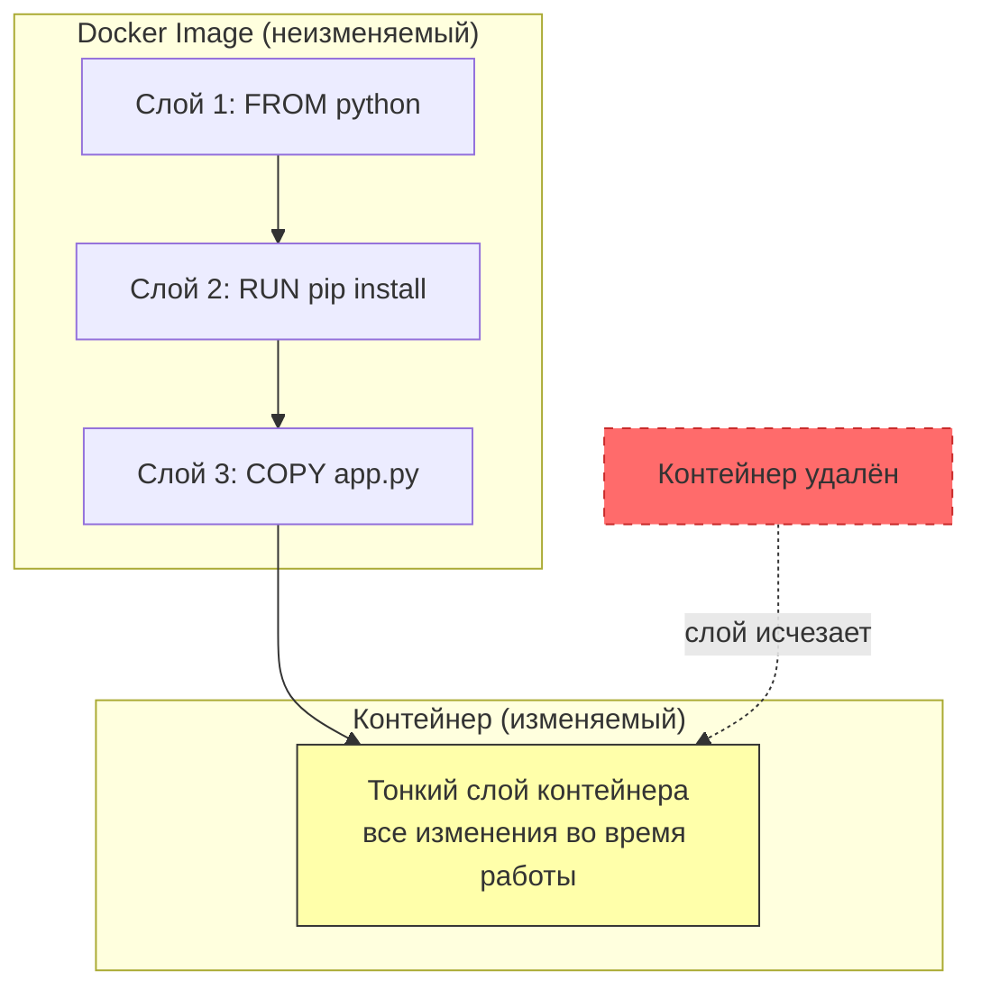
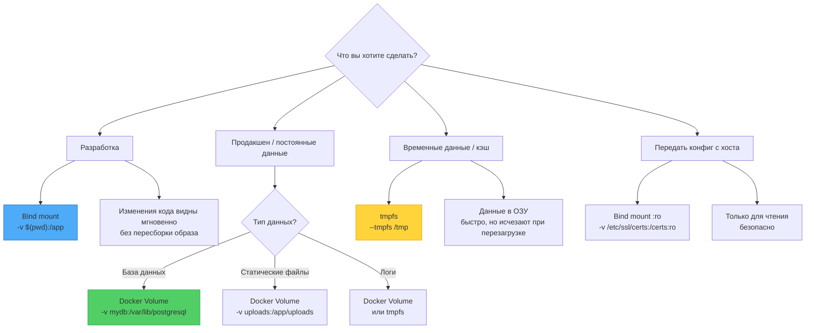
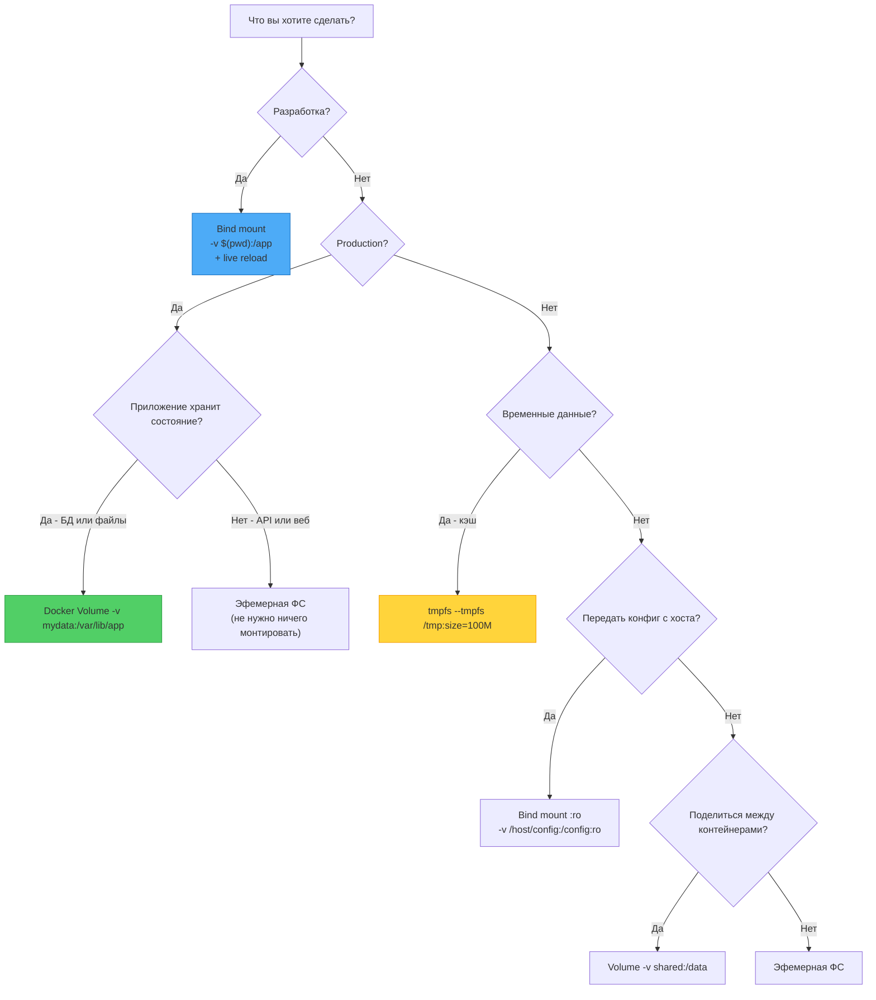

## **Работа с данными в контейнерах: эфемерность, тома и bind-монтирования**

## **Реальная проблема**

<note type="quote">

«Я запустил PostgreSQL в контейнере, наполнил его данными, а на следующий день контейнер перезапустился -- и все данные исчезли. Где моя база?»

</note>

<note type="quote">

«Мы храним логи в контейнере, а он пересоздаётся каждый час. Как нам сохранить их на диск хоста?»

</note>

Новички в Docker часто попадают в ловушку: они думают, что контейнер -- это как виртуальная машина, где данные живут вечно. Но на самом деле **контейнеры по своей природе эфемерны** (временны). Когда контейнер удаляется, все изменения, сделанные внутри его файловой системы, исчезают навсегда.

## **Типовые задачи (чек-лист)**

-  ✅ Понять, почему данные в контейнере исчезают после перезапуска.

-  ✅ Настроить постоянное хранение для баз данных и других stateful-приложений.

-  ✅ Организовать обмен файлами между контейнерами.

-  ✅ Сохранять логи и кэш на диск хоста, не засоряя образ.

-  ✅ Различать `volumes`, `bind mounts` и `tmpfs` и выбирать подходящий тип монтирования.

## **Краткое определение (простыми словами)**

**Эфемерная файловая система контейнера** -- это временное хранилище, которое живёт ровно столько, сколько живёт контейнер. При перезапуске или удалении контейнера все изменения (созданные файлы, установленные пакеты, изменённые конфиги) **теряются навсегда**.

**Тома (volumes)** -- это постоянное хранилище, управляемое Docker. Данные в томах живут независимо от контейнера. Том можно подключить к нескольким контейнерам одновременно.

**Bind mounts** -- это прямая привязка папки или файла с хоста внутрь контейнера. Контейнер видит и может изменять файлы на вашем компьютере.

<note type="quote">

**Аналогия:** Контейнер -- это номер в гостинице. Эфемерная ФС -- это мини-бар: вы положили туда свои продукты, но после выезда их выбросят. Том -- это камера хранения: вы оставили вещи, они будут ждать вас в следующий приезд. Bind mount -- это ваша собственная квартира напротив гостиницы: вы можете ходить туда и обратно и забирать вещи домой.

</note>

🎯 **Главная идея:** По умолчанию контейнеры не сохраняют данные. Чтобы данные пережили перезапуск контейнера, их нужно вынести в том или bind mount. Выбор между volume и bind mount -- это выбор между удобством и контролем.

---

## **📚 Оглавление**

-  🧊 **1\. Эфемерная файловая система (Ephemeral Container Filesystem)**

-  📦 **2\. Docker Volumes (тома)**

-  🔗 **3\. Bind Mounts**

-  🗺️ **4\. Сравнительная карта: когда что использовать**

-  📊 **5\. Таблица сравнения всех трёх типов**

-  🔄 **6\. Жизненный цикл данных в контейнере**

-  🛠️ **7\. Практические примеры**

-  💡 **8\. Ключевые выводы и чек-лист**

<note type="quote">

Наливайте кофе -- мы начинаем! ☕

</note>

---

## **🧊 1. Эфемерная файловая система (Ephemeral Container Filesystem)**

### **Почему контейнер не сохраняет данные**

Контейнер состоит из:

-  **Неизменяемых слоёв образа** (read-only) -- от `FROM` до последней инструкции в Dockerfile.

-  **Тонкого слоя для записи** (container layer) -- все изменения, сделанные во время работы контейнера, попадают сюда.

Когда контейнер удаляется, этот **тонкий слой удаляется вместе с ним**.



### **Пример исчезновения данных**

bash

```
# Запускаем контейнер и создаём файл
docker run -it --name test ubuntu bash
root@abc123:/# echo "важные данные" > /data.txt
root@abc123:/# cat /data.txt
важные данные
root@abc123:/# exit

# Контейнер остановлен, но ещё существует
docker start test
docker exec test cat /data.txt
важные данные  # Файл всё ещё здесь

# Удаляем контейнер
docker rm test

# Создаём новый контейнер из того же образа
docker run -it ubuntu cat /data.txt
cat: /data.txt: No such file or directory  # Данных нет!
```

### **Когда эфемерность -- это хорошо**

| **Сценарий**                  | **Почему эфемерность полезна**               |
|-------------------------------|----------------------------------------------|
| **CI/CD-раннеры**             | Каждый билд начинается с чистого состояния   |
| **Без состояния (stateless)** | Веб-серверы, API, воркеры                    |
| **Тестирование**              | После тестов не нужно чистить мусор          |
| **Песочницы**                 | Вредоносный код умирает вместе с контейнером |

### **Ключевая мысль**

<note type="quote">

Контейнеры -- граждане «без прописки». Они не помнят, что было в прошлой жизни. Если данные важны, вынесите их в том.

</note>

---

## **📦 2. Docker Volumes (тома)**

### **Что такое том**

**Volume** -- это специальная директория внутри файловой системы Docker, которая:

-  Управляется Docker (`docker volume create`, `docker volume inspect`).

-  Хранится в `/var/lib/docker/volumes/` на хосте.

-  Живёт независимо от контейнера (можно удалить контейнер -- том останется).

-  Может быть подключен к нескольким контейнерам одновременно.

### **Создание и использование тома**

bash

```
# Создать том
docker volume create mydata

# Посмотреть список томов
docker volume ls

# Узнать, где на хосте хранится том
docker volume inspect mydata
# Вывод: "Mountpoint": "/var/lib/docker/volumes/mydata/_data"

# Подключить том к контейнеру
docker run -d --name app -v mydata:/app/data nginx

# Или через --mount (более явный синтаксис)
docker run -d --name app --mount source=mydata,target=/app/data nginx
```

### **Преимущества томов перед bind mounts**

| **Характеристика**        | **Тома (Volumes)**                                                    | **Bind Mounts**                             |
|---------------------------|-----------------------------------------------------------------------|---------------------------------------------|
| **Управление**            | Docker                                                                | Вы сами                                     |
| **Резервное копирование** | `docker run --rm -v mydata:/data alpine tar czf /backup.tar.gz /data` | Вручную                                     |
| **Переносимость**         | Том можно перенести между хостами (`docker volume export/import`)     | Зависит от структуры папок хоста            |
| **Безопасность**          | Доступ только через Docker                                            | Любой процесс на хосте может изменить файлы |
| **Производительность**    | Высокая (нативная ФС)                                                 | Высокая (но с оверхедом на проверку прав)   |
| **Windows/macOS**         | Работает из коробки                                                   | Требует шаринга дисков (медленно)           |

### **Обмен данными между контейнерами через том**

bash

```
# Создаём том
docker volume create shared-data

# Контейнер-писатель
docker run -d --name writer -v shared-data:/data alpine \
  sh -c "while true; do echo $(date) >> /data/log.txt; sleep 5; done"

# Контейнер-читатель
docker run -it --rm --name reader -v shared-data:/data alpine \
  cat /data/log.txt
```

### **Тома с драйверами (для облаков)**

Docker поддерживает плагины для томов, позволяющие хранить данные в облаке:

bash

```
# AWS EBS
docker volume create --driver=rexray/ebs --name my-ebs-volume

# NFS
docker volume create --driver local --opt type=nfs --opt o=addr=192.168.1.100 \
  --opt device=:/exported/path my-nfs-volume
```

### **Резервное копирование тома**

bash

```
# Создать резервную копию
docker run --rm -v mydata:/source -v backup:/backup alpine \
  tar czf /backup/mydata-backup.tar.gz -C /source .

# Восстановить из резервной копии
docker run --rm -v mydata:/target -v backup:/backup alpine \
  tar xzf /backup/mydata-backup.tar.gz -C /target
```

### **Ключевая мысль**

<note type="quote">

Тома -- это «правильный» способ хранения данных в Docker. Они управляются Docker, переносимы, безопасны и поддерживают драйверы для облачных хранилищ. Используйте тома по умолчанию для всех stateful-приложений.

</note>

---

## **🔗 3. Bind Mounts**

### **Что такое bind mount**

**Bind mount** -- это прямая привязка любой папки или файла с хоста в контейнер. Контейнер видит и может изменять файлы на вашем компьютере (или на сервере).

bash

```
# Привязать папку проекта
docker run -it -v /home/user/project:/app node bash

# Привязать один файл (например, конфиг)
docker run -it -v /home/user/config.yaml:/app/config.yaml:ro node bash
```

### **Когда bind mount незаменим**

| **Сценарий**             | **Почему bind mount**                                                         |
|--------------------------|-------------------------------------------------------------------------------|
| **Разработка**           | Редактируете код на хосте -> изменения сразу видны в контейнере (live reload) |
| **Передача конфигов**    | Нужно дать контейнеру доступ к `~/.aws/credentials` или `~/.ssh`              |
| **Доступ к логам хоста** | Привязать `/var/log` хоста, чтобы контейнер анализировал логи                 |
| **Сокет Docker**         | `-v /var/run/docker.sock:/var/run/docker.sock` (⚠️ опасно!)                   |

### **Пример: live reload для разработки**

bash

```
# Структура проекта
~/myapp/
├── index.html
├── server.js
└── package.json

# Запускаем Node.js с live reload (nodemon)
docker run -it \
  -v "$(pwd):/app" \
  -w /app \
  -p 3000:3000 \
  node:18-alpine \
  sh -c "npm install && npx nodemon server.js"
```

Теперь меняем `index.html` в редакторе на хосте -- и сервер внутри контейнера сразу видит изменения.

### **Bind mount с флагом** `:ro` **(read-only)**

bash

```
# Контейнер может читать, но не может писать
docker run -v /home/user/config.yaml:/config.yaml:ro alpine cat /config.yaml

# Если контейнер попытается записать — будет ошибка
docker run -v /home/user/config.yaml:/config.yaml:ro alpine touch /config.yaml
# touch: /config.yaml: Read-only file system
```

### **Опасность bind mount: перезапись файлов в образе**

Если вы привязываете папку хоста к папке, которая уже есть в образе (например, `/usr/bin`), вы **перезатрёте** содержимое образа.

bash

```
# ОПАСНО! Перезатрёт /usr/bin внутри контейнера
docker run -v /tmp/empty:/usr/bin alpine ls /usr/bin
# ls: /usr/bin: No such file or directory
```

**Правило:** Всегда монтируйте в пустые директории или в специальные папки для данных (`/data`, `/app/data`), а не в системные.

### **Ключевая мысль**

<note type="quote">

Bind mount -- это мост между хостом и контейнером. Он идеален для разработки и доступа к конфигам хоста, но не для хранения данных production-приложений (лучше использовать тома).

</note>

---

## **🗺️ 4. Сравнительная карта: когда что использовать**



---

## **📊 5. Таблица сравнения всех трёх типов**

| **Характеристика**                         | **Эфемерная ФС**   | **Volume**               | **Bind Mount**                | **tmpfs**                 |
|--------------------------------------------|--------------------|--------------------------|-------------------------------|---------------------------|
| **Сохранность при удалении контейнера**    | ❌ Исчезает         | ✅ Сохраняется            | ✅ Сохраняется                 | ❌ Исчезает                |
| **Сохранность при перезапуске контейнера** | ✅ Сохраняется      | ✅ Сохраняется            | ✅ Сохраняется                 | ❌ Исчезает                |
| **Управляется Docker**                     | ✅ Да               | ✅ Да                     | ❌ Нет                         | ❌ Нет                     |
| **Можно поделить между контейнерами**      | ❌ Нет              | ✅ Да                     | ✅ Да                          | ❌ Нет                     |
| **Скорость**                               | Высокая            | Высокая                  | Высокая                       | ⚡ **Очень высокая** (RAM) |
| **Переносимость между хостами**            | ❌ Нет              | ✅ Да (экспорт/импорт)    | ❌ Нет (пути могут отличаться) | ❌ Нет                     |
| **Резервное копирование**                  | ❌ Не нужно         | ✅ `docker volume backup` | ❌ Вручную                     | ❌ Не нужно                |
| **Использование в production**             | ❌ Только stateless | ✅ **Да**                 | ⚠️ Осторожно                  | ⚠️ Для кэша               |
| **Использование в разработке**             | ✅ Да               | 🟡 Редко                 | ✅ **Да** (live reload)        | 🟡 Редко                  |

### **Резюме по выбору**

| **Если вам нужно...**                             | **Используйте...** |
|---------------------------------------------------|--------------------|
| Хранить базу данных или важные файлы в production | **Volume**         |
| Разрабатывать приложение с live reload            | **Bind mount**     |
| Передать конфигурацию с хоста (только чтение)     | **Bind mount :ro** |
| Обменяться файлами между контейнерами             | **Volume**         |
| Временные файлы (сессии, кэш) с высокой скоростью | **tmpfs**          |
| CI/CD раннер, где после каждого билда всё чисто   | **Эфемерная ФС**   |

---

## **🔄 6. Жизненный цикл данных в контейнере**

### **Текстовая блок-схема**

text

```
[Контейнер запущен]
         │
         ▼
[Приложение пишет в /data]
         │
         ├──────► [Эфемерная ФС]   →   [Данные живут, пока жив контейнер]
         │                                   При удалении контейнера → ПОТЕРЯ
         │
         ├──────► [Volume]          →   [Данные живут вечно]
         │                                   При удалении контейнера → ОСТАЮТСЯ
         │                                   При удалении тома → ПОТЕРЯ
         │
         ├──────► [Bind mount]      →   [Данные на хосте]
         │                                   При удалении контейнера → ОСТАЮТСЯ
         │                                   При удалении папки на хосте → ПОТЕРЯ
         │
         └──────► [tmpfs]           →   [Данные в ОЗУ]
                                         При остановке контейнера → ПОТЕРЯ
```

### **Команды для управления жизненным циклом**

bash

```
# Удалить контейнер, но сохранить том
docker rm my-container

# Удалить контейнер И том (осторожно!)
docker rm -v my-container

# Удалить неиспользуемые тома
docker volume prune

# Удалить конкретный том
docker volume rm mydata
```

---

## **🛠️ 7. Практические примеры**

### **Пример 1. PostgreSQL с постоянным томом**

bash

```
# Создаём том для данных
docker volume create pgdata

# Запускаем PostgreSQL с томом
docker run -d \
  --name postgres \
  -e POSTGRES_PASSWORD=secret \
  -v pgdata:/var/lib/postgresql/data \
  postgres:15

# Создаём базу данных
docker exec -it postgres psql -U postgres -c "CREATE DATABASE myapp;"

# Останавливаем и удаляем контейнер
docker stop postgres && docker rm postgres

# Запускаем новый контейнер с тем же томом
docker run -d \
  --name postgres-new \
  -e POSTGRES_PASSWORD=secret \
  -v pgdata:/var/lib/postgresql/data \
  postgres:15

# Проверяем — база данных на месте!
docker exec -it postgres-new psql -U postgres -c "\l"
# myapp | postgres | UTF8 | ...   (есть!)
```

### **Пример 2. Разработка Node.js с bind mount**

dockerfile

```
# Dockerfile
FROM node:18-alpine
WORKDIR /app
COPY package*.json ./
RUN npm install
CMD ["npm", "run", "dev"]
```

bash

```
# Запуск с bind mount
docker run -it \
  -p 3000:3000 \
  -v "$(pwd):/app" \
  -v /app/node_modules \
  myapp
```

Обратите внимание: `-v /app/node_modules` -- это анонимный том, который сохраняет `node_modules`, установленные внутри контейнера, и не перезаписывает их папкой с хоста.

### **Пример 3. Обмен данными между контейнерами**

bash

```
# Создаём общий том
docker volume create shared

# Контейнер 1: пишет логи
docker run -d --name logger -v shared:/logs alpine \
  sh -c "while true; do echo 'log entry' >> /logs/app.log; sleep 10; done"

# Контейнер 2: читает логи
docker run -it --rm --name reader -v shared:/logs alpine \
  tail -f /logs/app.log
```

### **Пример 4. tmpfs для кэша**

bash

```
# Запускаем Nginx с кэшем в оперативной памяти
docker run -d \
  --name nginx-cache \
  --tmpfs /var/cache/nginx:rw,noexec,nosuid,size=100M \
  -p 80:80 \
  nginx
```

### **Ключевая мысль**

<note type="quote">

В production используйте тома. В разработке -- bind mounts. Для кэша и временных данных -- tmpfs. Эфемерная ФС подходит только для stateless-приложений.

</note>

---

## **💡 8. Ключевые выводы и чек-лист**

### **Что важно запомнить**

| **Тип**          | **Суть**                                 | **Команда**                     |
|------------------|------------------------------------------|---------------------------------|
| **Эфемерная ФС** | Данные живут, пока жив контейнер         | По умолчанию                    |
| **Volume**       | Постоянное хранилище, управляемое Docker | `docker volume create`          |
| **Bind mount**   | Прямая привязка папки хоста              | `-v /host/path:/container/path` |
| **tmpfs**        | Данные в оперативной памяти              | `--tmpfs /path`                 |

### **Чек-лист «Вы освоили работу с данными, если:»**

-  ✅ Вы понимаете, почему после удаления контейнера исчезают файлы.

-  ✅ Вы можете создать том и подключить его к контейнеру.

-  ✅ Вы используете bind mount для разработки (live reload).

-  ✅ Вы знаете разницу между `-v myvolume:/data` и `-v /host/data:/data`.

-  ✅ Вы можете поделиться томом между двумя контейнерами.

-  ✅ Вы знаете, как сделать резервную копию тома.

-  ✅ Вы никогда не монтируете `/` хоста в контейнер.

-  ✅ Вы понимаете, почему `:ro` полезен для конфигов.

### **Что изучить дальше**

1. **Docker volume drivers** -- NFS, EBS, S3 как бэкенд для томов.

2. **Docker Compose volumes** -- декларативное описание томов.

3. **Kubernetes Volumes** -- PersistentVolume, PersistentVolumeClaim, StorageClass.

4. **CSI (Container Storage Interface)** -- стандарт для томов в K8s.

---

## **🧪 Бонус: интерактивная Mermaid-диаграмма «Выбор типа хранилища»**



---

Надеюсь, этот материал поможет вам уверенно работать с данными в контейнерах. Если нужен разбор следующей темы (например, **Docker Compose: сети, переменные окружения, volumes** или **мониторинг контейнеров**) -- просто напишите.