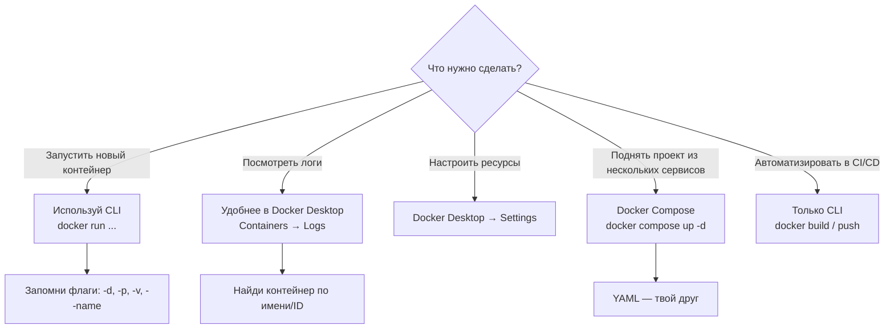

## **🐳 Docker Desktop: ваш персональный конвейер для веб-разработки**

## **Реальная проблема**

<note type="quote">

«На моей машине всё работает, а у коллеги -- нет».

«Я потратил 3 часа на установку PostgreSQL, Redis и Elasticsearch для нового проекта, а через месяц они понадобились снова -- и всё забыл».

</note>

Каждый разработчик хотя бы раз сталкивался с этим: разные версии Node.js, конфликтующие порты, грязная файловая система после экспериментов. Настроить окружение для нового проекта -- целый квест.

## **Типовые задачи (чек-лист)**

-  ✅ Установить Docker Desktop за 10 минут и убедиться, что он работает.

-  ✅ Настроить зеркало для ускоренной загрузки образов.

-  ✅ Собрать и запустить простой веб-проект (React/Node.js) внутри контейнера.

-  ✅ Использовать Docker Compose для поднятия полного стека (фронтенд + база данных).

-  ✅ Понять, как работать с контейнерами через интерфейс Docker Desktop.

## **Краткое определение (простыми словами)**

**Docker Desktop** -- это приложение для Windows и macOS, которое даёт вам «пульт управления» контейнерами. Оно включает:

-  Движок Docker (запускает контейнеры)

-  Графический интерфейс (можно тыкать мышкой)

-  Интеграцию с WSL 2 (на Windows) или HyperKit (на macOS)

<note type="quote">

**Аналогия:** Docker Desktop -- это как панель управления автомобилем. Движок (Docker Engine) под капотом, а вы видите скорость, расход топлива и можете нажимать кнопки.

</note>

🎯 **Главная идея:** Docker Desktop позволяет разработчику не задумываться о среде выполнения -- контейнеры работают одинаково на любом компьютере.

---

## **📚 Оглавление**

-  💻 **1\. Установка Docker Desktop**

-  ⚙️ **2\. Настройка и проверка**

-  🚀 **3\. Запуск первого контейнера**

-  🌐 **4\. Веб-разработка с Docker: проект на Node.js**

-  🧩 **5\. Docker Compose: поднимаем полный стек**

-  🖱️ **6\. Управление через Docker Desktop (GUI)**

-  📊 **7\. Сравнение: CLI vs GUI**

-  🔄 **8\. Жизненный цикл контейнера для разработки**

-  💡 **9\. Ключевые выводы и чек-лист**

<note type="quote">

Наливайте кофе -- мы начинаем! ☕

</note>

---

## **💻 1. Установка Docker Desktop**

### **Системные требования**

| **ОС**      | **Требования**                                                                                    |
|-------------|---------------------------------------------------------------------------------------------------|
| **Windows** | Windows 10/11 Pro, Enterprise или Education (версия 1607 или новее), включённый Hyper-V или WSL 2 |
| **macOS**   | macOS 10.15 (Catalina) или новее, процессор Intel или Apple Silicon                               |
| **Linux**   | Docker Desktop доступен, но чаще используют `docker-ce` напрямую                                  |

### **Пошаговая установка на Windows**

**Шаг 1. Скачать установщик**

-  Перейдите на официальный сайт: <https://www.docker.com/get-started>

-  Нажмите **"Get Docker Desktop"**

-  Выберите версию для Windows

**Шаг 2. Запустить установку**

-  Запустите `Docker Desktop Installer.exe`

-  Отметьте галочкой **"Install required components for WSL 2"** (если доступно)

-  Нажмите **Ok** и дождитесь завершения

**Шаг 3. Перезагрузка**

-  При запросе на перезагрузку системы нажмите **Restart**

**Шаг 4. Запуск Docker Desktop**

-  Найдите Docker Desktop в меню Пуск

-  При первом запуске может быть предложено войти в учётную запись -- можно нажать **"Skip for now"**

### **Альтернатива: установка через командную строку (Windows)**

powershell

```
# Если у вас установлен winget (Windows 10/11)
winget install Docker.DockerDesktop
```


### **Ключевая мысль**

<note type="quote">

Установка Docker Desktop занимает 5-10 минут. Главное -- включить WSL 2 на Windows, это даст лучшую производительность.

</note>

---

## **⚙️ 2. Настройка и проверка**

### **Проверка установки**

Откройте терминал (PowerShell, cmd или bash) и выполните:

bash

```
# Проверить версию Docker
docker --version
# Пример вывода: Docker version 27.0.3, build abc123

# Проверить, что движок работает
docker ps
# Вывод: список контейнеров (скорее всего пустой, но без ошибок)

# Запустить тестовый контейнер
docker run hello-world
```


Если вы видите приветственное сообщение от `hello-world` -- Docker работает корректно.

### **Настройка зеркала для ускорения (актуально для России и Китая)**

По умолчанию Docker скачивает образы из Docker Hub. Скорость может быть низкой. Исправляется добавлением зеркала.

**Через GUI:**

1. Нажмите правой кнопкой на иконку Docker в трее

2. Выберите **Settings** -> **Docker Engine**

3. Добавьте строку `"registry-mirrors"` в конфиг

**Пример конфига** `daemon.json`**:**

json

```
{
  "registry-mirrors": [
    "https://mirror.gcr.io",
    "https://dockerhub.timeweb.cloud"
  ]
}
```

1. Нажмите **Apply & Restart**

### **Настройка ресурсов (особенно важно для Windows)**

Docker Desktop может потреблять много памяти. Ограничьте его, чтобы система не тормозила.

**Через GUI:**

-  Settings -> Resources -> Advanced

-  Установите **Memory**: 4-8 ГБ (в зависимости от вашего ПК)

**Через** `.wslconfig` **(только Windows с WSL 2):**

ini

```
[wsl2]
memory=8GB
processors=4
```

Сохраните файл `.wslconfig` в домашней директории (`C:\Users\ВашеИмя\.wslconfig`).

### **Ключевая мысль**

<note type="quote">

Проверка `docker run hello-world` -- золотой стандарт. Если он прошёл, можно работать.

</note>

---

## **🚀 3. Запуск первого контейнера**

### **Базовые команды, которые нужно знать**

| **Команда**           | **Что делает**                                  |
|-----------------------|-------------------------------------------------|
| `docker pull <образ>` | Скачать образ (но не запускать)                 |
| `docker run <образ>`  | Скачать (если нет локально) и запустить         |
| `docker ps`           | Список запущенных контейнеров                   |
| `docker ps -a`        | Список всех контейнеров (включая остановленные) |
| `docker stop <id>`    | Остановить контейнер                            |
| `docker rm <id>`      | Удалить контейнер                               |
| `docker images`       | Список образов на диске                         |

### **Запускаем веб-сервер Nginx**

bash

```
# Запустить Nginx в фоне, пробросить порт 8080 на 80 внутри контейнера
docker run -d -p 8080:80 --name my-nginx nginx

# -d : detached (в фоне)
# -p : проброс порта (хост:контейнер)
# --name : даём контейнеру понятное имя
```


После выполнения откройте браузер и перейдите по адресу [`http://localhost:8080`](http://localhost:8080) -- вы увидите приветственную страницу Nginx.

### **Управление контейнером**

bash

```
# Посмотреть логи
docker logs my-nginx

# Остановить
docker stop my-nginx

# Запустить снова
docker start my-nginx

# Удалить (только после остановки)
docker rm my-nginx
```

### **Ключевая мысль**

<note type="quote">

Контейнер -- это не виртуальная машина. Он запускается за секунду и потребляет минимум ресурсов.

</note>

---

## **🌐 4. Веб-разработка с Docker: проект на Node.js**

Теперь создадим реальный проект, который можно разрабатывать в контейнере.

### **Структура проекта**

text

```
my-node-app/
├── package.json
├── server.js
└── Dockerfile
```

### **Шаг 1. Создаём простое Node.js приложение**

`package.json`**:**

json

```
{
  "name": "my-node-app",
  "version": "1.0.0",
  "description": "Docker demo",
  "main": "server.js",
  "scripts": {
    "start": "node server.js"
  }
}
```

`server.js`**:**

javascript

```
const http = require('http');

const server = http.createServer((req, res) => {
  res.statusCode = 200;
  res.setHeader('Content-Type', 'text/plain');
  res.end('Hello, Docker!\n');
});

const port = 3000;
server.listen(port, () => {
  console.log(`Server running at http://localhost:${port}/`);
});
```


### **Шаг 2. Пишем Dockerfile**

dockerfile

```
# Используем официальный образ Node.js
FROM node:18-alpine

# Рабочая директория внутри контейнера
WORKDIR /app

# Копируем package.json и устанавливаем зависимости
COPY package*.json ./
RUN npm install

# Копируем исходный код
COPY . .

# Открываем порт
EXPOSE 3000

# Команда запуска
CMD ["node", "server.js"]
```


### **Шаг 3. Собираем и запускаем**

bash

```
# Собрать образ
docker build -t my-node-app .

# Запустить контейнер с пробросом порта
docker run -p 3000:3000 my-node-app
```

Откройте [`http://localhost:3000`](http://localhost:3000) -- увидите **Hello, Docker!**

### **Шаг 4. Режим разработки (с автоматическим обновлением)**

Чтобы не пересобирать образ при каждом изменении кода, используем **монтирование тома** (bind mount):

bash

```
docker run -p 3000:3000 -v "$(pwd):/app" my-node-app
```

Теперь изменения в файлах на хосте сразу видны внутри контейнера.

### **Ключевая мысль**

<note type="quote">

Dockerfile -- это рецепт сборки образа. Docker-образ -- это упакованное приложение. Docker-контейнер -- это запущенный экземпляр образа.

</note>

---

## **🧩 5. Docker Compose: поднимаем полный стек**

Когда проект сложнее одного контейнера (фронтенд + база данных + кэш), на помощь приходит **Docker Compose**.

### **Пример: приложение с Node.js и PostgreSQL**

`docker-compose.yml`**:**

yaml

```
version: '3.8'

services:
  app:
    build: .
    ports:
      - "3000:3000"
    environment:
      - DB_HOST=postgres
      - DB_USER=postgres
      - DB_PASSWORD=example
    depends_on:
      - postgres
    volumes:
      - .:/app

  postgres:
    image: postgres:15-alpine
    environment:
      - POSTGRES_PASSWORD=example
      - POSTGRES_DB=mydb
    ports:
      - "5432:5432"
    volumes:
      - postgres_data:/var/lib/postgresql/data

volumes:
  postgres_data:
```


### **Запуск через Compose**

bash

```
# Запустить все сервисы в фоне
docker compose up -d

# Посмотреть логи
docker compose logs -f

# Остановить всё
docker compose down

# Остановить и удалить тома (потерять данные БД)
docker compose down -v
```


### **Почему Compose важен для веб-разработки?**

-  Одна команда поднимает всё окружение проекта.

-  Новый разработчик клонирует репозиторий и пишет `docker compose up` -- всё работает.

-  Продакшен-окружение идентично локальному.

### **Ключевая мысль**

<note type="quote">

Docker Compose -- это оркестратор для локальной разработки. Он превращает `docker run ...` с 20 флагами в понятный YAML-файл.

</note>

---

## **🖱️ 6. Управление через Docker Desktop (GUI)**

Docker Desktop даёт графический интерфейс для всего, что можно сделать через CLI. Это особенно удобно для новичков .

### **Основные разделы Docker Desktop**

| **Раздел**     | **Что можно делать**                                                                    |
|----------------|-----------------------------------------------------------------------------------------|
| **Containers** | Просматривать запущенные/остановленные контейнеры, смотреть логи, останавливать/удалять |
| **Images**     | Список образов, удаление ненужных                                                       |
| **Volumes**    | Управление томами данных                                                                |
| **Settings**   | Настройка ресурсов, зеркал, автозапуска                                                 |

### **Как смотреть логи контейнера через GUI**

1. Откройте Docker Desktop

2. Перейдите в раздел **Containers**

3. Кликните на контейнер

4. Перейдите на вкладку **Logs** -- увидите вывод консоли в реальном времени

### **Удаление неиспользуемых ресурсов (очистка места)**

Docker со временем накапливает «мусор»: остановленные контейнеры, неиспользуемые образы, тома.

**Через GUI:**

-  Troubleshoot -> Clean / Purge Data

**Через CLI:**

bash

```
# Удалить всё неиспользуемое (контейнеры, образы, сети)
docker system prune -a

# Удалить также неиспользуемые тома (осторожно!)
docker system prune -a --volumes
```

### **Ключевая мысль**

<note type="quote">

Docker Desktop -- это не замена CLI, а дополнение. Для быстрых задач (посмотреть логи, остановить контейнер) GUI удобнее. Для автоматизации -- CLI.

</note>

---

## **📊 7. Сравнение: CLI vs GUI**

| **Задача**                       | **CLI**                             | **GUI**                        |
|----------------------------------|-------------------------------------|--------------------------------|
| Запустить контейнер              | `docker run -d -p 80:80 nginx`      | Сложно (нужно заполнять форму) |
| Посмотреть логи                  | `docker logs -f <id>`               | Клик -> вкладка Logs           |
| Остановить контейнер             | `docker stop <id>`                  | Клик на кнопку Stop            |
| Удалить образ                    | `docker rmi <id>`                   | Клик на корзину                |
| Настроить ресурсы                | Правка `.wslconfig` / `daemon.json` | Settings -> Resources          |
| Понять, что происходит (новичку) | Тяжело                              | Легко                          |

**Вердикт:** Используйте **CLI для работы**, **GUI для мониторинга и обучения**.

---

## **🔄 8. Жизненный цикл контейнера для разработки**

### **Текстовая блок-схема**

text

```
[Разработчик пишет код]
         ↓
[Собирает образ: docker build]
         ↓
[Запускает контейнер: docker run / compose up]
         ↓
[Тестирует, отлаживает, смотрит логи]
         ↓
[Останавливает: docker stop / Ctrl+C]
         ↓
[Удаляет контейнер: docker rm / compose down]
         ↓
[Повторяет цикл]
```

### **Распространённые ошибки и их решение**

| **Проблема**                         | **Решение**                                                                               |
|--------------------------------------|-------------------------------------------------------------------------------------------|
| `port is already allocated`          | Остановите контейнер, который использует этот порт: `docker ps`, затем `docker stop <id>` |
| `permission denied` (Linux)          | Добавьте пользователя в группу `docker`: `sudo usermod -aG docker $USER`                  |
| Медленная загрузка образов           | Настройте зеркало (см. раздел 2)                                                          |
| Docker не запускается на Windows     | Включите WSL 2 или Hyper-V в "Включение или отключение компонентов Windows"               |
| Контейнер падает сразу после запуска | Посмотрите логи: `docker logs <id>`                                                       |

### **Ключевая мысль**

<note type="quote">

Разработка с Docker -- это цикл: код -> сборка -> запуск -> тестирование -> остановка. Благодаря контейнерам вы не засоряете хост-систему и всегда можете начать с чистого листа.

</note>

---

## **💡 9. Ключевые выводы и чек-лист**

### **Что важно запомнить**

| **Понятие**               | **Суть**                                                 |
|---------------------------|----------------------------------------------------------|
| **Docker Desktop**        | Приложение с движком и GUI для Windows/macOS             |
| **Образ (image)**         | Шаблон для создания контейнера                           |
| **Контейнер (container)** | Запущенный экземпляр образа                              |
| **Dockerfile**            | Инструкция по сборке образа                              |
| **docker-compose.yml**    | Описание многоконтейнерного приложения                   |
| **Volume**                | Данные, которые живут дольше контейнера                  |
| **Bind mount**            | Прямая привязка папки хоста в контейнер (для разработки) |

### **Чек-лист «Вы освоили тему, если:»**

-  ✅ Установили Docker Desktop и `docker run hello-world` работает.

-  ✅ Настроили зеркало для ускорения загрузки.

-  ✅ Собрали образ из Dockerfile и запустили контейнер с пробросом порта.

-  ✅ Использовали bind mount для разработки без пересборки.

-  ✅ Написали `docker-compose.yml` и подняли стек из двух сервисов.

-  ✅ Находите логи и останавливаете контейнеры через Docker Desktop.

### **Что изучить дальше**

1. **Docker Hub** -- как публиковать свои образы.

2. **Многоступенчатая сборка (multi-stage)** -- уменьшение размера образов.

3. **Сети в Docker** -- как контейнеры общаются друг с другом.

4. **Docker в CI/CD** -- автоматическая сборка и тестирование.

---

## **🧪 Бонус: интерактивная Mermaid-диаграмма «Выбор инструмента для работы с Docker»**


---

Надеюсь, этот материал поможет вам быстро начать работу с Docker Desktop и использовать контейнеры в повседневной веб-разработке. Если нужен разбор следующей темы (например, **сети в Docker** или **хранение данных**) -- просто напишите.