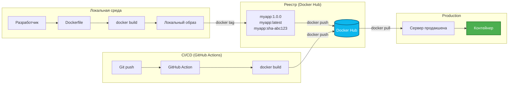
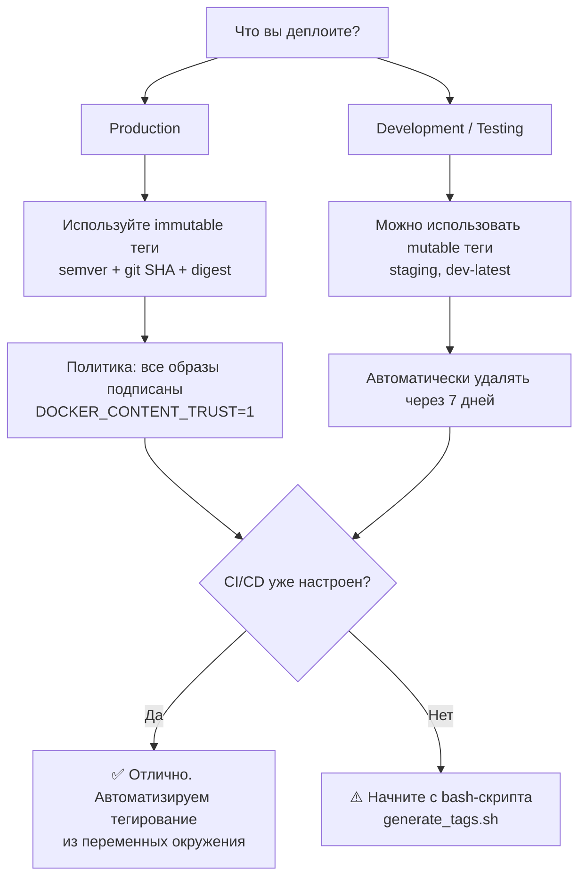

## **🏠 Docker Hub: ваш центральный узел для хранения и поставки контейнеров**

## **Реальная проблема**

<note type="quote">

«Мы собрали образ, всё работает локально. Но как передать его коллеге? Записать на флешку? Отправить архив по почте? А если у нас 20 микросервисов и 3 окружения?»

</note>

<note type="quote">

«Вчера всё работало, сегодня прод упал. Оказывается, кто-то запушил новый образ с тегом `latest`, и CI/CD подхватил его автоматически. Почему нельзя зафиксировать версию?»

</note>

Инженеры, которые не понимают, как устроен реестр контейнеров, сталкиваются с:

-  Непредсказуемыми деплоями из-за мутабельных тегов.

-  Огромными счетами за хранение (или лимитами на pulls).

-  Уязвимостями в образах, которые тянутся из базовых слоёв.

-  Невозможностью откатиться к предыдущей версии, потому что тег перезаписали.

## **Типовые задачи (чек-лист)**

-  ✅ Создать Docker-образ, подписать его и отправить в Docker Hub.

-  ✅ Настроить тегирование образов так, чтобы можно было однозначно определить версию.

-  ✅ Обеспечить безопасность: кто может пушить, кто -- пулить, какие образы считаются доверенными.

-  ✅ Настроить автоматическую сборку и сканирование уязвимостей.

-  ✅ Очищать старые образы, чтобы не платить за хранение.

## **Краткое определение (простыми словами)**

**Docker Hub** -- это «GitHub для контейнеров». Сервис, где вы можете:

-  Хранить свои Docker-образы (бесплатно -- публично, за деньги -- приватно).

-  Скачивать готовые образы от других (например, `nginx`, `postgres`, `node`).

-  Автоматически собирать образы из GitHub/Bitbucket.

-  Сканировать образы на уязвимости.

<note type="quote">

**Аналогия:** Docker Hub -- это как App Store, но не для приложений, а для «упаковок» приложений (контейнеров).

</note>

**Реестр контейнеров (container registry)** -- общее название для любого хранилища образов: Docker Hub, GitHub Container Registry (GHCR), Amazon ECR, Google Artifact Registry.

🎯 **Главная идея:** Реестр -- это «точка истины» для ваших артефактов. Если образ не в реестре -- его не существует для инфраструктуры.

---

## **📚 Оглавление**

-  🏛️ **1\. Что такое Docker Hub и как он устроен**

-  🚀 **2\. Создание и публикация образов**

-  🏷️ **3\. Тегирование образов: стратегии и антипаттерны**

-  🔒 **4\. Безопасность: контроль доступа, подпись, сканирование**

-  🧹 **5\. Жизненный цикл образов: хранение, лимиты, очистка**

-  🔄 **6\. Интеграция с CI/CD**

-  🗺️ **7\. Схема работы с реестром (Mermaid)**

-  📊 **8\. Сравнение реестров: Docker Hub vs альтернативы**

-  💡 **9\. Ключевые выводы и чек-лист**

<note type="quote">

Наливайте кофе -- мы начинаем! ☕

</note>

---

## **🏛️ 1. Что такое Docker Hub и как он устроен**

### **Основные компоненты Docker Hub**

| **Компонент**                 | **Что это**                                         | **Пример**                            |
|-------------------------------|-----------------------------------------------------|---------------------------------------|
| **Репозиторий**               | Коллекция образов одного приложения                 | `library/nginx`, `mycompany/backend`  |
| **Тег (tag)**                 | Метка конкретной версии образа                      | `latest`, `1.2.3`, `sha-a1b2c3d`      |
| **Официальный образ**         | Образ, поддерживаемый Docker или производителем ПО  | `nginx`, `postgres`, `ubuntu`, `node` |
| **Верифицированный издатель** | Коммерческая организация, подтвердившая подлинность | `docker/`, `bitnami/`, `redhat/`      |
| **Публичный репозиторий**     | Доступен всем (только чтение)                       | `library/ubuntu`                      |
| **Приватный репозиторий**     | Доступен только вам и вашей команде                 | `mycompany/internal-api`              |

### **Структура имени образа**

text

```
[registry-host]/[namespace]/[repository]:[tag]
```

| **Компонент**   | **Значение**                               | **Пример**                                                                                                              |
|-----------------|--------------------------------------------|-------------------------------------------------------------------------------------------------------------------------|
| `registry-host` | Адрес реестра (по умолчанию -- Docker Hub) | [`docker.io`](http://docker.io), [`ghcr.io`](http://ghcr.io), [`myregistry.company.com`](http://myregistry.company.com) |
| `namespace`     | Пользователь или организация               | `library` (официальные), `myusername`, `netflix`                                                                        |
| `repository`    | Имя приложения                             | `nginx`, `backend`, `frontend`                                                                                          |
| `tag`           | Версия                                     | `latest`, `1.2.3`, `2024-01-15`                                                                                         |

**Примеры:**

bash

```
docker pull nginx                    # docker.io/library/nginx:latest
docker pull myuser/myapp:1.0.0       # docker.io/myuser/myapp:1.0.0
docker pull ghcr.io/myorg/backend:v2 # GitHub Container Registry
```

### **Планы и лимиты Docker Hub**

| **План** | **Публичные репозитории** | **Приватные репозитории** | **Pulls (за 6 часов)**                      | **Цена**               |
|----------|---------------------------|---------------------------|---------------------------------------------|------------------------|
| **Free** | ∞                         | 1                         | 200 (аутентифицированный) / 100 (анонимный) | Бесплатно              |
| **Pro**  | ∞                         | ∞                         | 5 000                                       | \~\$5/мес              |
| **Team** | ∞                         | ∞                         | 5 000+                                      | \~\$9/мес/пользователь |

<note type="quote">

**Важно:** Анонимные pulls (без `docker login`) строго лимитированы. Если ваш CI/CD тянет образы из Docker Hub -- **обязательно** используйте аутентификацию .

</note>

### **Ключевая мысль**

<note type="quote">

Docker Hub -- это реестр по умолчанию. Если не указать другой хост в `docker pull`, запрос пойдёт именно туда.

</note>

---

## **🚀 2. Создание и публикация образов**

### **Пошаговый процесс**

**Шаг 1. Создайте Dockerfile**

dockerfile

```
FROM node:18-alpine
WORKDIR /app
COPY package*.json ./
RUN npm ci --only=production
COPY . .
EXPOSE 3000
CMD ["node", "server.js"]
```

**Шаг 2. Соберите образ**

bash

```
docker build -t myapp:1.0.0 .
```

**Шаг 3. Залогиньтесь в Docker Hub**

bash

```
docker login
# Введите username и password (или токен доступа)
```

<note type="quote">

**Безопасность:** Используйте **токен доступа (access token)**, а не пароль. Токен можно ограничить по правам (только read, только push) и отозвать при компрометации.

</note>

**Шаг 4. Привяжите тег к вашему репозиторию**

bash

```
docker tag myapp:1.0.0 myusername/myapp:1.0.0
```

**Шаг 5. Отправьте образ в реестр**

bash

```
docker push myusername/myapp:1.0.0
```

### **Полный пример (все команды вместе)**

bash

```
# Сборка
docker build -t myusername/myapp:1.0.0 .

# Пуш
docker push myusername/myapp:1.0.0

# Теперь образ доступен по адресу:
# https://hub.docker.com/r/myusername/myapp
```

### **Автоматическая сборка из GitHub (Docker Hub Builds)**

Docker Hub умеет автоматически собирать образы при каждом пуше в GitHub/Bitbucket.

**Настройка:**

1. В Docker Hub перейдите в **Create Repository** -> выберите **Build**

2. Подключите GitHub-аккаунт

3. Выберите репозиторий и ветку

4. Укажите, какой Dockerfile использовать

5. Настройте правила тегирования (например, `main` -> `latest`, `v*` -> `{version}`)

**Пример правил:**

| **Источник**      | **Тег**               |
|-------------------|-----------------------|
| Ветка `main`      | `latest`              |
| Ветка `release/*` | `release-{sourceref}` |
| Тег `v1.*`        | `1.x`                 |

### **Ключевая мысль**

<note type="quote">

`docker tag` не копирует образ, а просто создаёт дополнительный указатель (алиас). `docker push` отправляет слои только один раз, даже если вы пушите несколько тегов.

</note>

---

## **🏷️ 3. Тегирование образов: стратегии и антипаттерны**

### **🚫 Антипаттерн: тег** `latest`

bash

```
docker push myapp:latest   # ПЛОХО!
```

**Почему это опасно:**

-  `latest` мутабельный (может указывать на разные образы в разное время).

-  Два разработчика могут запушить `latest` с интервалом в 30 секунд -- непонятно, кто победил .

-  В прод-деплое `myapp:latest` сегодня -- это один код, завтра -- другой.

-  Невозможно откатиться, потому что «предыдущий latest» перезаписан.

<note type="quote">

**Запомните:** `latest` -- это не «стабильная версия». Это «последний собранный, который может быть битым».

</note>

### **✅ Правильная стратегия: три тега (Three-Tag Strategy)**

**Каждый образ получает три тега:**

| **Тип тега**             | **Пример**              | **Мутабельность**                         | **Назначение**                        |
|--------------------------|-------------------------|-------------------------------------------|---------------------------------------|
| **Семантическая версия** | `1.4.2`                 | Неизменяемый (immutable)                  | Релизы, changelog, общение с бизнесом |
| **Git SHA**              | `sha-a1b2c3d`           | Неизменяемый                              | Прямая связь с коммитом, отладка      |
| **Окружение**            | `production`, `staging` | Мутабельный (указывает на текущий деплой) | Удобство для мониторинга и дашбордов  |

**Как это выглядит в коде:**

bash

```
# Собираем образ
docker build -t myapp:build .

# Привязываем три тега
docker tag myapp:build myusername/myapp:1.4.2
docker tag myapp:build myusername/myapp:sha-a1b2c3d
docker tag myapp:build myusername/myapp:production

# Пушим все три
docker push myusername/myapp:1.4.2
docker push myusername/myapp:sha-a1b2c3d
docker push myusername/myapp:production
```

### **Почему Git SHA важен?**

Когда прод упал, а на мониторинге висит тег `production`, вы не знаете, какой код там на самом деле. С SHA всё просто:

bash

```
# Узнаём тег образа в проде
kubectl describe pod myapp-1234 | grep Image:
# Image: myusername/myapp:sha-a1b2c3d

# Идём в GitHub и смотрим коммит a1b2c3d
# Находим, кто и когда менял код
```

### **Лучшая практика: digest (абсолютная ссылка)**

Самый надёжный способ сослаться на образ -- использовать **digest** (хэш содержимого) :

bash

```
docker pull myapp@sha256:3e8a1c7f9d2b4e5a6c7d8e9f0a1b2c3d4e5f6a7b8c9d0e1f2a3b4c5d6e7f8a9b
```

**Преимущества:**

-  Digest неизменяем: он всегда указывает на один и тот же образ.

-  Даже если тег `latest` перезапишут, ссылка по digest останется верной.

-  Идеально для GitOps и автоматических систем.

### **Автоматизация тегирования (bash-скрипт)**

bash

```
#!/bin/bash
# generate_tags.sh

VERSION=$(node -p "require('./package.json').version")
GIT_SHA=$(git rev-parse --short=7 HEAD)
BRANCH=$(git rev-parse --abbrev-ref HEAD)
REGISTRY="myusername"
REPO="myapp"

# Базовые теги
TAGS=("$VERSION" "sha-$GIT_SHA")

# Добавляем теги окружений
if [[ "$BRANCH" == "main" ]]; then
    TAGS+=("production" "latest")
elif [[ "$BRANCH" == "develop" ]]; then
    TAGS+=("staging")
fi

# Собираем и пушим
for TAG in "${TAGS[@]}"; do
    docker build -t "$REGISTRY/$REPO:$TAG" .
    docker push "$REGISTRY/$REPO:$TAG"
done
```

### **Ключевая мысль**

<note type="quote">

Теги должны быть **детерминированными** (один тег -> один образ) для продакшена и **удобными** (`staging`) для разработки. `latest` используйте только локально, никогда -- в CI/CD и проде .

</note>

---

## **🔒 4. Безопасность: контроль доступа, подпись, сканирование**

### **4\.1 Контроль доступа (RBAC)**

Docker Hub позволяет управлять доступом на уровне организации :

| **Роль**      | **Что может делать**                                                               |
|---------------|------------------------------------------------------------------------------------|
| **Owner**     | Полный контроль: управление счетами, приглашение участников, удаление репозиториев |
| **Admin**     | Всё, кроме управления счетами                                                      |
| **Member**    | Push/pull, управление тегами в своих репозиториях                                  |
| **Read-only** | Только pull                                                                        |

**Настройка:**

1. Docker Hub -> Organizations -> выберите организацию

2. Teams -> создайте команду (например, `devs`, `ci`, `security`)

3. Добавьте участников и назначьте права на репозитории

### **4\.2 Content Trust (подпись образов)**

**Docker Content Trust (DCT)** -- механизм, который гарантирует, что образ подписан доверенным лицом и не был изменён при передаче .

**Как включить:**

bash

```
export DOCKER_CONTENT_TRUST=1
```

**Что происходит после включения:**

-  `docker push` требует подписи образа.

-  `docker pull` скачивает только подписанные образы .

-  Неподписанные образы становятся «невидимыми» .

**При первом пуше с DCT создаются ключи:**

text

```
Enter passphrase for new root key with id a1d96fb:
Enter passphrase for new repository key with id docker.io/myuser/myapp:
```

| **Ключ**                                | **Где хранится**   | **Назначение**                         | **Что при потере**                                   |
|-----------------------------------------|--------------------|----------------------------------------|------------------------------------------------------|
| **Root key**                            | Локально (клиент)  | Корень доверия, создаётся один раз     | ❌ Очень плохо -- нужно обращаться в поддержку Docker |
| **Repository key (targets + snapshot)** | Локально           | Подпись тегов в конкретном репозитории | Можно восстановить, если есть root key               |
| **Timestamp key**                       | На сервере реестра | Гарантия свежести метаданных           | Автоматически пересоздаётся                          |

**Резервное копирование ключей:**

bash

```
# Найти ключи
ls ~/.docker/trust/

# Скопировать их в безопасное место (лучше офлайн)
cp -r ~/.docker/trust /backup/location/
```

### **4\.3 Сканирование уязвимостей**

Docker Hub автоматически сканирует образы на известные CVE (Common Vulnerabilities and Exposures) .

**Как включить:**

1. Docker Hub -> Репозиторий -> **Settings**

2. Включите **Vulnerability Scanning**

3. Выберите частоту: при каждом пуше или по расписанию

**Альтернативы для CLI:**

bash

```
# Docker Scout (бесплатно, встроено в Docker Desktop)
docker scout cves myapp:1.0.0

# Вывод покажет:
# - Количество уязвимостей по критичности
# - Какие пакеты их вызывают
# - Есть ли исправления
```

### **4\.4 Политики развёртывания (только доверенные реестры)**

В production-среде можно запретить использование образов из непроверенных источников. Пример политики для Docker Build (Rego):

rego

```
package docker

default allow := false

# Разрешить локальную сборку
allow if input.local

# Разрешить доверенные реестры
allow if {
  input.image.host in ["docker.io", "ghcr.io", "dhi.io"]
}

# Для Docker Hub — только официальные образы и образы своей организации
allow if {
  input.image.host == "docker.io"
  startswith(input.image.repo, "myorg/")
}
```

### **Ключевая мысль**

<note type="quote">

Подпись образов (Content Trust) -- единственный способ гарантировать, что в проде запускается именно тот код, который вы собрали, а не подменённая версия. Включайте `DOCKER_CONTENT_TRUST=1` в CI/CD .

</note>

---

## **🧹 5. Жизненный цикл образов: хранение, лимиты, очистка**

### **Проблема: разрастание образов (image sprawl)**

Каждый push создаёт новый слой. Через месяц у вас 200 образов, 90% из которых не используются, но занимают место и увеличивают счёт.

### **Стратегии очистки**

| **Стратегия**     | **Что делает**                        | **Как автоматизировать**                                            |
|-------------------|---------------------------------------|---------------------------------------------------------------------|
| **По времени**    | Удалять образы старше N дней          | Cron job, выполняющий `docker system prune -a --filter "until=30d"` |
| **По количеству** | Хранить только последние N версий     | Скрипт, удаляющий теги, кроме последних 10                          |
| **По тегам**      | Удалять все `-dev` теги старше недели | Retention policy в Docker Hub (Pro/Team)                            |
| **Untagged**      | Удалять образы без тегов              | `docker image prune -a`                                             |

### **Очистка через Docker Hub GUI**

1. Репозиторий -> **Tags**

2. Выберите старые теги

3. Нажмите **Delete**

### **Очистка через скрипт (CLI)**

bash

```
#!/bin/bash
# delete_old_tags.sh - удаляет все теги, кроме последних N

REPO="myusername/myapp"
KEEP=10  # храним последние 10 версий

# Получаем список тегов, сортируем по дате (новые сверху)
TAGS=$(skopeo list-tags docker://$REPO | jq -r '.Tags | sort_by(. | sub("^[^0-9]*"; "") | split(".") | map(tonumber)) | reverse | .[]')

COUNT=0
for TAG in $TAGS; do
  COUNT=$((COUNT+1))
  if [ $COUNT -gt $KEEP ]; then
    echo "Удаляем $REPO:$TAG"
    docker run --rm -v ~/.docker/config.json:/root/.docker/config.json \
      regclient/regctl tag delete $REPO:$TAG
  fi
done
```

### **Ключевая мысль**

<note type="quote">

Регулярная очистка реестра -- не опция, а необходимость. Автоматизируйте её, иначе однажды вы упрётесь в лимиты или получите счёт на тысячи долларов.

</note>

---

## **🔄 6. Интеграция с CI/CD**

### **GitHub Actions + Docker Hub**

yaml

```
name: Build and Push to Docker Hub

on:
  push:
    branches: [ main ]
    tags: [ 'v*' ]

jobs:
  build:
    runs-on: ubuntu-latest
    steps:
      - uses: actions/checkout@v4

      - name: Log in to Docker Hub
        uses: docker/login-action@v3
        with:
          username: ${{ secrets.DOCKER_USERNAME }}
          password: ${{ secrets.DOCKER_TOKEN }}

      - name: Extract metadata (tags, labels)
        id: meta
        uses: docker/metadata-action@v5
        with:
          images: myusername/myapp
          tags: |
            type=semver,pattern={{version}}
            type=sha,prefix=sha-,format=short
            type=raw,value=latest,enable={{is_default_branch}}

      - name: Build and push
        uses: docker/build-push-action@v5
        with:
          context: .
          push: true
          tags: ${{ steps.meta.outputs.tags }}
          labels: ${{ steps.meta.outputs.labels }}
```

### **GitLab CI + Docker Hub**

yaml

```
# .gitlab-ci.yml
variables:
  DOCKER_REGISTRY: docker.io
  DOCKER_IMAGE: myusername/myapp

before_script:
  - docker login -u $DOCKER_USERNAME -p $DOCKER_TOKEN

build:
  stage: build
  script:
    - VERSION=${CI_COMMIT_TAG:-$CI_COMMIT_SHORT_SHA}
    - docker build -t $DOCKER_REGISTRY/$DOCKER_IMAGE:$VERSION .
    - docker push $DOCKER_REGISTRY/$DOCKER_IMAGE:$VERSION
  only:
    - main
    - tags
```

### **Ключевая мысль**

<note type="quote">

Интеграция CI/CD с реестром -- основа GitOps. Каждый успешный билд автоматически становится доступным для деплоя. Используйте токены доступа, а не пароли.

</note>

---

## **🗺️ 7. Схема работы с реестром (Mermaid)**



---

## **📊 8. Сравнение реестров: Docker Hub vs альтернативы**

| **Характеристика**              | **Docker Hub**          | **GitHub Container Registry (GHCR)**     | **Amazon ECR**       | **Google Artifact Registry** |
|---------------------------------|-------------------------|------------------------------------------|----------------------|------------------------------|
| **Бесплатный план**             | 1 приватный репозиторий | ∞ приватных (с ограничением на storage)  | 0 (плата за storage) | 0 (плата за storage)         |
| **Плата за storage**            | Включено в план         | \$0.06/ГБ/мес                            | \~\$0.10/ГБ/мес      | \~\$0.10/ГБ/мес              |
| **Плата за egress (трафик)**    | Лимиты pulls            | Бесплатно (если тащить в GitHub Actions) | Платно               | Платно                       |
| **Автоматическое сканирование** | ✅ (Docker Scout)        | ✅ (GitHub Advanced Security)             | ✅ (Inspector)        | ✅ (On-Demand)                |
| **Подпись образов**             | ✅ (DCT)                 | ✅ (Sigstore/cosign)                      | ✅ (Notary V2)        | ✅ (Sigstore)                 |
| **Интеграция с CI**             | Любой                   | Лучшая (нативная)                        | AWS-native           | GCP-native                   |

### **Когда что выбирать?**

| **Сценарий**                                       | **Рекомендация**                               |
|----------------------------------------------------|------------------------------------------------|
| Open-source проект, публичные образы               | **Docker Hub** (бесплатно, узнаваемость)       |
| Закрытый проект, код в GitHub                      | **GHCR** (удобно, бесплатный egress в Actions) |
| Инфраструктура в AWS                               | **ECR** (низкая задержка, IAM-интеграция)      |
| Инфраструктура в GCP                               | **Artifact Registry**                          |
| Строгие требования к безопасности (подпись, audit) | **ECR + Notary** или **GHCR + Sigstore**       |

### **Ключевая мысль**

<note type="quote">

Docker Hub -- отличный старт, но для серьёзных проектов стоит рассмотреть GHCR или ECR: они лучше интегрируются с вашим CI/CD и не имеют лимитов на pulls.

</note>

---

## **💡 9. Ключевые выводы и чек-лист**

### **Что важно запомнить**

| **Понятие**       | **Суть**                                                             |
|-------------------|----------------------------------------------------------------------|
| **Docker Hub**    | Реестр по умолчанию. Бесплатен для публичных репозиториев.           |
| **Теги**          | `latest` -- антипаттерн. Используйте семантические версии + Git SHA. |
| **Content Trust** | Подпись образов. Включите `DOCKER_CONTENT_TRUST=1` в CI/CD.          |
| **Сканирование**  | Проверяйте образы на CVE перед деплоем.                              |
| **Очистка**       | Автоматически удаляйте старые образы, иначе счёт вырастет.           |

### **Чек-лист «Вы освоили тему, если:»**

-  ✅ Вы залогинились в Docker Hub и запушили свой образ.

-  ✅ Вы понимаете разницу между `myapp:latest` и `myapp:1.0.0`.

-  ✅ Вы знаете, как посмотреть digest образа: `docker inspect myapp:1.0.0 | grep Digest`.

-  ✅ Вы настроили автоматическую сборку из GitHub в Docker Hub.

-  ✅ Вы включили Vulnerability Scanning для своего репозитория.

-  ✅ Вы знаете, как включить Content Trust и для чего нужны root/repository-ключи.

### **Что изучить дальше**

1. **Sigstore/cosign** -- подпись образов без централизованного ключа.

2. **SBOM (Software Bill of Materials)** -- что внутри вашего образа.

3. **Private registry** -- как поднять свой реестр (Harbor, Nexus, GitLab Registry).

4. **OCI Artifacts** -- хранение в реестре не только контейнеров (Helm-чарты, WASM-модули).

---

## **🧪 Бонус: интерактивная Mermaid-диаграмма «Выбор стратегии тегирования»**



---

Надеюсь, этот материал поможет вам навести порядок в ваших образах и реестрах. Если нужен разбор следующей темы (например, **GitHub Container Registry vs Docker Hub** или **сборка образов в CI/CD**) -- просто напишите.