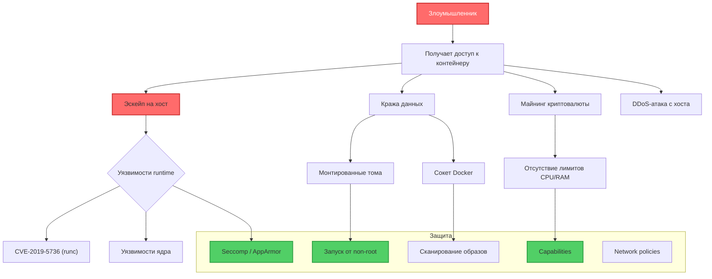
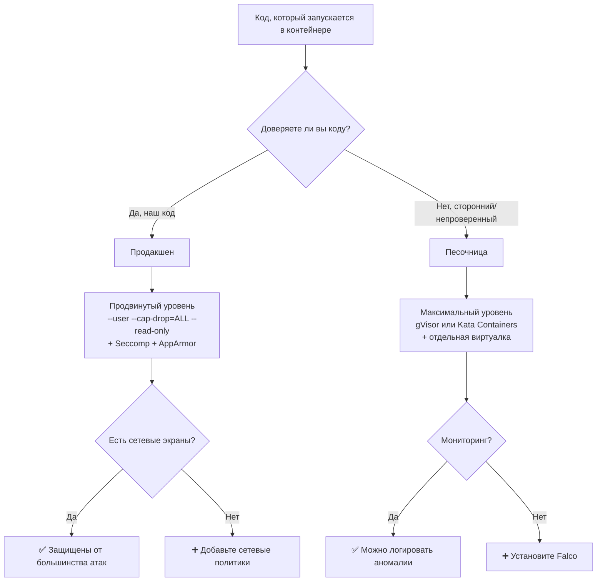

 ---
order: 7
title: >-
  Безопасность контейнеров: интерфейс командной строки, безопасность во время
  выполнения, объемы, сети.
---

## **Безопасность контейнеров: как не подставить свою инфраструктуру**

## **Реальная проблема**

<note type="quote">

«Мы запустили контейнер с PostgreSQL, а через неделю кто-то залил майнер криптовалюты. Как? Мы же ничего не устанавливали!»

</note>

<note type="quote">

«Разработчик запустил контейнер с пробросом сокета Docker (`/var/run/docker.sock`), и теперь злоумышленник из контейнера управляет всеми контейнерами на хосте».

</note>

Инженеры часто забывают, что контейнер -- **не виртуальная машина**. Он разделяет ядро с хостом, и неправильная конфигурация может привести к компрометации всей системы. Каждый день появляются CVE, связанные с `runc`, `containerd` или образами из непроверенных источников.

## **Типовые задачи (чек-лист)**

-  ✅ Запускать контейнеры с минимальными привилегиями (не от root).

-  ✅ Проверять образы на уязвимости перед запуском.

-  ✅ Защитить сети контейнеров от несанкционированного доступа.

-  ✅ Обеспечить безопасность томов (volumes), чтобы контейнер не украл данные хоста.

-  ✅ Настроить аудит и мониторинг действий внутри контейнера.

## **Краткое определение (простыми словами)**

**Безопасность контейнеров** -- это набор практик и инструментов, которые не дают злоумышленнику:

-  Выбраться из контейнера на хост (escape).

-  Украсть данные других контейнеров или хоста.

-  Использовать ресурсы хоста для своих целей (майнинг, DDoS).

<note type="quote">

**Аналогия:** Контейнер -- это не тюремная камера с бетонными стенами. Это скорее офисная перегородка. Хорошо, если никто не пытается через неё перелезть. Но если пытается -- нужны дополнительные замки и сигнализации.

</note>

🎯 **Главная идея:** Контейнеры изолированы, но не герметичны. Безопасность достигается не одним «волшебным флагом», а комбинацией ограничений на всех уровнях: CLI, runtime, сеть, данные.

---

## **📚 Оглавление**

-  🐚 **1\. Безопасность CLI (командной строки)**

-  🏃 **2\. Безопасность во время выполнения (runtime)**

-  💾 **3\. Безопасность томов (volumes)**

-  🌐 **4\. Безопасность сетей**

-  🧠 **5\. Инструменты для аудита и мониторинга**

-  🗺️ **6\. Карта угроз и векторов атак (Mermaid)**

-  📊 **7\. Сравнение: уровни безопасности контейнеров**

-  🔄 **8\. Жизненный цикл безопасного контейнера**

-  💡 **9\. Ключевые выводы и чек-лист**

<note type="quote">

Наливайте кофе -- мы начинаем! ☕

</note>

---

## **🐚 1. Безопасность CLI (командной строки)**

### **Проблема: флаги по умолчанию небезопасны**

`docker run` без дополнительных флагов даёт контейнеру слишком много прав. Разберём, какие флаги **обязательны** для безопасности.

### **Таблица критических флагов безопасности**

| **Флаг**                           | **Что делает**                            | **Риск без него**                                                                    | **Пример**                                 |
|------------------------------------|-------------------------------------------|--------------------------------------------------------------------------------------|--------------------------------------------|
| `--user`                           | Запускает процесс от не-root пользователя | Процесс в контейнере имеет root-привилегии на хосте (через namespace, но это опасно) | `--user 1000:1000`                         |
| `--read-only`                      | Корневая ФС только для чтения             | Злоумышленник может установить вредоносное ПО внутрь контейнера                      | `--read-only`                              |
| `--cap-drop=ALL`                   | Удаляет все capabilities                  | Контейнер получает полный набор возможностей ядра (около 40)                         | `--cap-drop=ALL`                           |
| `--cap-add`                        | Добавляет только нужные capabilities      | --                                                                                   | `--cap-add=NET_ADMIN`                      |
| `--security-opt=no-new-privileges` | Запрещает повышение привилегий            | Процесс может вызвать `setuid` и стать root                                          | `--security-opt=no-new-privileges`         |
| `--security-opt=seccomp=...`       | Ограничивает системные вызовы             | Контейнер может вызывать опасные syscalls (`clone`, `reboot`)                        | `--security-opt=seccomp=./my-seccomp.json` |
| `--pids-limit`                     | Ограничивает число процессов              | Fork bomb или утечка процессов                                                       | `--pids-limit=100`                         |

### **Пример безопасного запуска**

bash

```
# НЕБЕЗОПАСНО (так делают новички)
docker run -it ubuntu bash

# БЕЗОПАСНО (минимальные привилегии)
docker run -it \
  --user 1000:1000 \
  --read-only \
  --cap-drop=ALL \
  --cap-add=NET_ADMIN \
  --security-opt=no-new-privileges \
  --pids-limit=100 \
  ubuntu bash
```

### **Что такое capabilities и зачем их удалять**

**Capabilities** -- это «разрешения», которые ядро даёт процессу. Вместо полного root (`uid=0`) вы даёте только точечные права.

| **Capability**     | **Что разрешает**                       | **Опасно ли**                         |
|--------------------|-----------------------------------------|---------------------------------------|
| `CAP_SYS_ADMIN`    | Монтирование ФС, управление namespaces  | 🔴 **Крайне опасно** (эскейп)         |
| `CAP_NET_ADMIN`    | Настройка сетевых интерфейсов, iptables | 🟡 Умеренно (если не нужно -- убрать) |
| `CAP_SYS_PTRACE`   | Отладка других процессов                | 🔴 Опасно (можно украсть данные)      |
| `CAP_DAC_OVERRIDE` | Обход прав доступа к файлам             | 🔴 Опасно                             |
| `CAP_CHOWN`        | Смена владельца файлов                  | 🟡 Умеренно                           |

**Правило:** Удаляйте всё (`--cap-drop=ALL`), затем добавляйте только необходимое (`--cap-add=...`).

### **Проверка capabilities у контейнера**

bash

```
# Запустить контейнер
docker run -d --name test ubuntu sleep infinity

# Проверить capabilities процесса внутри
docker exec test capsh --print

# Или снаружи (на хосте)
PID=$(docker inspect -f '{{.State.Pid}}' test)
cat /proc/$PID/status | grep Cap
```

### **Ключевая мысль**

<note type="quote">

Безопасный запуск контейнера начинается с CLI. Флаги `--user`, `--cap-drop=ALL`, `--read-only` и `--security-opt=no-new-privileges` должны быть в каждом `docker run` в продакшене.

</note>

---

## **🏃 2. Безопасность во время выполнения (runtime)**

### **Проблема: уязвимости в runtime**

Даже если вы правильно запустили контейнер, сам Docker/containerd/runc могут иметь уязвимости. Самые громкие:

-  **CVE-2019-5736 (runc)** -- эскейп через перезапись `/proc/self/exe`.

-  **CVE-2024-21626 (runc)** -- утечка файловых дескрипторов.

### **Что делает runtime для безопасности**

| **Механизм**      | **Назначение**                                                        | **Как проверить** |
|-------------------|-----------------------------------------------------------------------|-------------------|
| **Seccomp**       | Фильтрует системные вызовы                                            | `docker info      |  grep "Security Options"` |
| **AppArmor**      | Ограничивает возможности процессов (по пути, по профилю)              | `apparmor_status` |
| **SELinux**       | Mandatory Access Control (MAC) -- более жёсткая альтернатива AppArmor | `getenforce`      |
| **gVisor / Kata** | Замена runtime на более изолированный                                 | --                |

### **Seccomp (Secure Computing Mode)**

Seccomp позволяет запретить контейнеру вызывать опасные системные вызовы.

**Пример: запрещаем** `unshare` **(создание новых namespaces)**

json

```
{
  "defaultAction": "SCMP_ACT_ALLOW",
  "architectures": ["SCMP_ARCH_X86_64"],
  "syscalls": [
    {
      "names": ["unshare"],
      "action": "SCMP_ACT_ERRNO"
    }
  ]
}
```

**Применение:**

bash

```
docker run --security-opt seccomp=./my-seccomp.json ubuntu
```

**Готовые профили:**

-  Docker по умолчанию -- хороший, но не самый строгий.

-  `docker/default.json` -- блокирует \~40 опасных syscalls.

-  Можно найти более строгие профили в сообществе.

### **AppArmor (Linux)**

AppArmor ограничивает, к каким файлам и сетям имеет доступ процесс.

**Пример профиля (упрощённо):**

text

```
#include <tunables/global>
profile my-container flags=(attach_disconnected,mediate_deleted) {
  # Разрешить чтение из /usr
  /usr/** r,
  
  # Запретить запись в /etc
  deny /etc/** w,
  
  # Запретить выполнение из /tmp
  deny /tmp/* x,
}
```

**Применение:**

bash

```
sudo apparmor_parser -r -W my-container-profile
docker run --security-opt apparmor=my-container ubuntu
```

### **Замена runtime на более безопасный**

| **Runtime**         | **Уровень изоляции**           | **Производительность** | **Когда использовать**                  |
|---------------------|--------------------------------|------------------------|-----------------------------------------|
| **runc**            | Базовая (namespaces + cgroups) | Высокая                | По умолчанию, доверенные контейнеры     |
| **gVisor**          | Пользовательское ядро (Sentry) | Средняя                | Мультитенантные среды, недоверенный код |
| **Kata Containers** | Легковесная ВМ                 | Ниже средней           | Максимальная изоляция                   |

**Пример запуска с gVisor (через containerd):**

bash

```
# Установить gVisor
sudo apt install runsc

# Запустить контейнер с gVisor
docker run --runtime=runsc -it ubuntu bash
```

### **Ключевая мысль**

<note type="quote">

Runtime-безопасность -- это многоуровневый щит: seccomp (фильтр syscalls) + AppArmor/SELinux (ограничение доступа) + выбор runtime (runc vs gVisor vs Kata).

</note>

---

## **💾 3. Безопасность томов (volumes)**

### **Проблема: контейнер получил доступ к данным хоста**

Самая частая ошибка:

bash

```
docker run -v /:/host ubuntu bash  # НИКОГДА ТАК НЕ ДЕЛАЙТЕ
```

Теперь контейнер может читать и писать всё, что есть на хосте: SSH-ключи, `/etc/shadow`, базы данных, Docker-сокет.

### **Безопасные практики для томов**

| **Практика**                                       | **Как реализовать**                            | **Почему безопасно**                                   |
|----------------------------------------------------|------------------------------------------------|--------------------------------------------------------|
| **Используйте именованные тома, а не bind mounts** | `docker volume create mydata`                  | Тома управляются Docker, у них строже права            |
| **Монтируйте только конкретные поддиректории**     | `-v /data/db:/var/lib/mysql`                   | Контейнер не видит весь диск                           |
| **Используйте** `:ro` **(read-only)**              | `-v /config:/config:ro`                        | Контейнер не может изменить конфиг                     |
| **Избегайте монтирования сокета Docker**           | `-v /var/run/docker.sock:/var/run/docker.sock` | 🔴 **ОПАСНО!** Контейнер получает root-доступ к Docker |

### **Почему монтирование сокета Docker -- это катастрофа**

bash

```
docker run -v /var/run/docker.sock:/var/run/docker.sock alpine sh
# Внутри контейнера:
apk add docker-cli
docker ps  # Увидит ВСЕ контейнеры на хосте
docker run --privileged -v /:/host alpine sh  # Эскейп за секунду
```

**Что делать, если нужен доступ к Docker API:**

-  Используйте `docker-proxy` с аутентификацией.

-  Или запускайте отдельный контейнер с ограниченными правами (например, `docker:dind` с `--privileged` -- всё равно небезопасно).

### **Пример безопасного монтирования тома**

bash

```
# Создаём том
docker volume create app-data

# Запускаем контейнер с read-only монтированием конфига
docker run \
  -v app-data:/var/lib/app \
  -v ./config.yaml:/app/config.yaml:ro \
  myapp
```

### **Ключевая мысль**

<note type="quote">

Никогда не монтируйте `/`, `/etc`, `/var/run/docker.sock` в контейнер. Для доступа к конфигурации используйте `:ro`. Для данных -- именованные тома.

</note>

---

## **🌐 4. Безопасность сетей**

### **Проблема: контейнеры видят друг друга и хост**

По умолчанию все контейнеры в одной bridge-сети могут общаться друг с другом. Это удобно, но небезопасно, если в сети есть недоверенные контейнеры.

### **Сетевые политики и изоляция**

| **Уровень**                | **Механизм**                    | **Назначение**                                            |
|----------------------------|---------------------------------|-----------------------------------------------------------|
| **Пользовательские сети**  | Создание отдельных bridge-сетей | Разделение контейнеров по группам (frontend, backend, db) |
| **Драйвер** `none`         | Полная изоляция сети            | Контейнер без сети (только loopback)                      |
| **iptables / nftables**    | Правила на хосте                | Запретить межконтейнерное общение                         |
| **Network Policies (K8s)** | Правила на уровне подов         | Кто с кем может общаться                                  |

### **Пример изоляции сетей**

bash

```
# Создаём две изолированные сети
docker network create frontend
docker network create backend

# Запускаем nginx в frontend
docker run -d --name web --network frontend nginx

# Запускаем postgres в backend (не доступен из frontend)
docker run -d --name db --network backend postgres

# Запускаем app с двумя сетями (мост между frontend и backend)
docker run -d --name app --network frontend --network backend myapp
```

### **Запрещаем межконтейнерное общение (политика iptables)**

bash

```
# На хосте запретить контейнерам из сети bridge общаться друг с другом
sudo iptables -I DOCKER-USER -i docker0 -o docker0 -j DROP
```

### **Проброс портов: опасность** `-p 0.0.0.0:80:80`

bash

```
# НЕБЕЗОПАСНО (слушает на всех интерфейсах, включая публичный)
docker run -p 80:80 nginx

# БЕЗОПАСНО (слушает только localhost)
docker run -p 127.0.0.1:80:80 nginx

# Ещё безопаснее (не открывать наружу, если не нужно)
# Использовать внутренний прокси (Traefik, Nginx)
```

### **Docker socket proxy (безопасный доступ к Docker API)**

Вместо монтирования сокета используйте proxy-контейнер:

bash

```
docker run -d \
  --name docker-proxy \
  -v /var/run/docker.sock:/var/run/docker.sock \
  tecnativa/docker-socket-proxy \
  -e AUTH=0 -e POST=0
```

Теперь другие контейнеры подключаются к прокси, а не к сокету напрямую, и прокси фильтрует опасные запросы.

### **Ключевая мысль**

<note type="quote">

Сети по умолчанию небезопасны. Создавайте отдельные сети для разных групп контейнеров, не открывайте порты на `0.0.0.0` без необходимости, используйте `127.0.0.1` для локального доступа.

</note>

---

## **🧠 5. Инструменты для аудита и мониторинга**

### **Сканирование образов перед запуском**

| **Инструмент**   | **Что делает**                             | **Команда**                      |
|------------------|--------------------------------------------|----------------------------------|
| **Docker Scout** | Встроен в Docker Desktop, сканирует слои   | `docker scout cves myapp:latest` |
| **Trivy**        | Быстрое сканирование ОС и языковых пакетов | `trivy image myapp:latest`       |
| **Clair**        | Сканирование через API (интеграция в CI)   | `clair-scanner myapp.tar`        |
| **Grype**        | Альтернатива Trivy, интеграция с Syft      | `grype myapp:latest`             |

**Пример использования Trivy:**

bash

```
# Установка
sudo apt install trivy

# Сканирование образа
trivy image --severity CRITICAL myapp:latest

# Вывод: список CVE с указанием пакета и версии
```

### **Мониторинг во время выполнения**

| **Инструмент** | **Что делает**                                          |
|----------------|---------------------------------------------------------|
| **Falco**      | Правила безопасности для runtime (обнаружение аномалий) |
| **Sysdig**     | Глубокий анализ системных вызовов                       |
| **Tracee**     | Отслеживание подозрительных событий (от Aqua Security)  |

**Пример Falco rule (обнаружение shell внутри контейнера):**

yaml

```
- rule: Run shell in container
  desc: Detect shell execution in a container
  condition: >
    container.id != host and
    proc.name in (bash, sh, zsh, dash)
  output: "Shell (%proc.name) was run in container %container.id"
  priority: WARNING
```

**Запуск Falco:**

bash

```
docker run -d --name falco \
  -v /var/run/docker.sock:/var/run/docker.sock \
  -v /proc:/host/proc:ro \
  falcosecurity/falco:latest
```

### **Аудит действий пользователей**

bash

```
# Включить аудит Docker-демона
# /etc/docker/daemon.json
{
  "log-driver": "syslog",
  "log-opts": {
    "syslog-facility": "daemon",
    "tag": "docker/{{.Name}}"
  }
}
```

### **Ключевая мысль**

<note type="quote">

Сканируйте образы до деплоя (Trivy, Docker Scout). Мониторьте контейнеры во время выполнения (Falco). Логируйте действия (syslog).

</note>

---

## **🗺️ 6. Карта угроз и векторов атак (Mermaid)**



---

## **📊 7. Сравнение: уровни безопасности контейнеров**

| **Уровень**      | **Компоненты**                                                  | **Риск эскейпа** | **Скорость работы** |
|------------------|-----------------------------------------------------------------|------------------|---------------------|
| **Минимальный**  | `docker run` без флагов, образ из Docker Hub                    | 🔴 Высокий       | ⚡ Высокая           |
| **Базовый**      | `--user`, `--cap-drop=ALL`, `--read-only`, seccomp по умолчанию | 🟡 Средний       | ⚡ Высокая           |
| **Продвинутый**  | \+ AppArmor/SELinux, + сканирование образов, + отдельные сети   | 🟢 Низкий        | ⚡ Высокая           |
| **Максимальный** | \+ gVisor/Kata, + Falco, + подпись образов (DCT)                | 🟢 Очень низкий  | 🐢 Средняя/Низкая   |

### **Что выбрать для разных сценариев**

| **Сценарий**               | **Рекомендуемый уровень** | **Почему**                               |
|----------------------------|---------------------------|------------------------------------------|
| Локальная разработка       | Минимальный               | Удобство важнее безопасности             |
| CI/CD (прогон тестов)      | Базовый                   | Тесты не должны ломать хост              |
| Продакшен (доверенный код) | Продвинутый               | Баланс безопасности и производительности |
| Мультитенантная среда      | Максимальный              | Нельзя доверять арендаторам              |

---

## **🔄 8. Жизненный цикл безопасного контейнера**

### **Текстовая блок-схема**

text

```
[1. Сборка образа]
       ↓
   Сканирование уязвимостей (Trivy, Docker Scout)
       ↓
   Подпись образа (DOCKER_CONTENT_TRUST=1)
       ↓
   Push в приватный реестр
       ↓
[2. Запуск контейнера]
       ↓
   Минимальные capabilities (--cap-drop=ALL + --cap-add)
       ↓
   Non-root user (--user)
       ↓
   Read-only ФС (--read-only)
       ↓
   Лимиты ресурсов (--memory, --cpus, --pids-limit)
       ↓
   Изолированная сеть (пользовательская bridge)
       ↓
[3. Во время выполнения]
       ↓
   Мониторинг (Falco, аудит syscalls)
       ↓
   Логирование (docker logs → централизованный сбор)
       ↓
[4. Завершение]
       ↓
   Остановка и удаление контейнера
       ↓
   Очистка томов (если не нужны)
```

---

## **💡 9. Ключевые выводы и чек-лист**

### **Что важно запомнить**

| **Сфера**   | **Главное правило**                                                           |
|-------------|-------------------------------------------------------------------------------|
| **CLI**     | `--cap-drop=ALL`, `--user`, `--read-only`, `--security-opt=no-new-privileges` |
| **Runtime** | Seccomp + AppArmor/SELinux. Рассмотрите gVisor для недоверенного кода         |
| **Volumes** | Никогда не монтируйте `/`, `/etc`, `docker.sock`. Используйте `:ro`           |
| **Сети**    | Изолируйте сети, не открывайте порты на `0.0.0.0`, используйте `127.0.0.1`    |
| **Аудит**   | Сканируйте образы (Trivy), мониторьте runtime (Falco)                         |

### **Чек-лист «Ваш контейнер безопасен, если:»**

-  ✅ Вы не запускаете контейнер от root (`--user`).

-  ✅ Вы удалили все capabilities и добавили только нужные (`--cap-drop=ALL`).

-  ✅ Корневая ФС смонтирована как `--read-only` (для данных -- отдельный том).

-  ✅ Вы не монтируете `/var/run/docker.sock`.

-  ✅ Вы используете пользовательские сети и не открываете лишние порты.

-  ✅ Образ проверен через `docker scout cves` или Trivy.

-  ✅ В продакшене включён Seccomp и AppArmor.

-  ✅ У контейнера есть лимиты на CPU, RAM и количество процессов.

-  ✅ Логи контейнера собираются и анализируются.

### **Что изучить дальше**

1. **gVisor и Kata Containers** -- альтернативные runtime для максимальной изоляции.

2. **Falco rules** -- написание своих правил безопасности.

3. **SBOM (Software Bill of Materials)** -- что внутри образа.

4. **Docker Bench Security** -- скрипт для проверки безопасности Docker-хоста.

---

## **🧪 Бонус: интерактивная Mermaid-диаграмма «Выбор уровня безопасности»**



---

Надеюсь, этот материал поможет вам сделать ваши контейнеры по-настоящему безопасными. Если нужен разбор следующей темы (например, **Docker Compose: сети, переменные окружения, volumes** или **оркестрация контейнеров**) -- просто напишите.